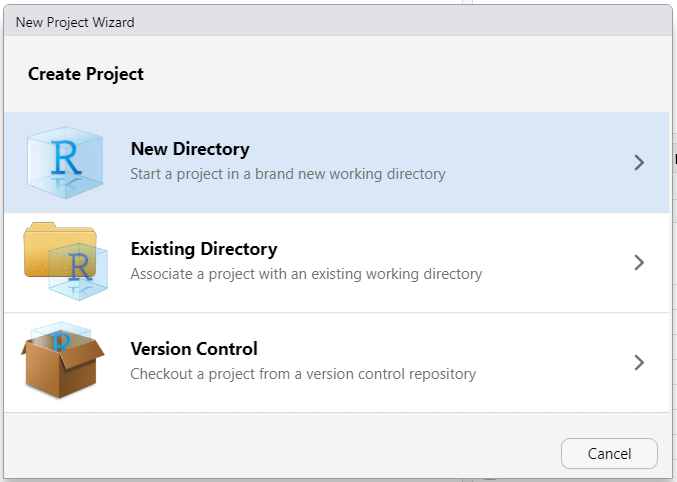
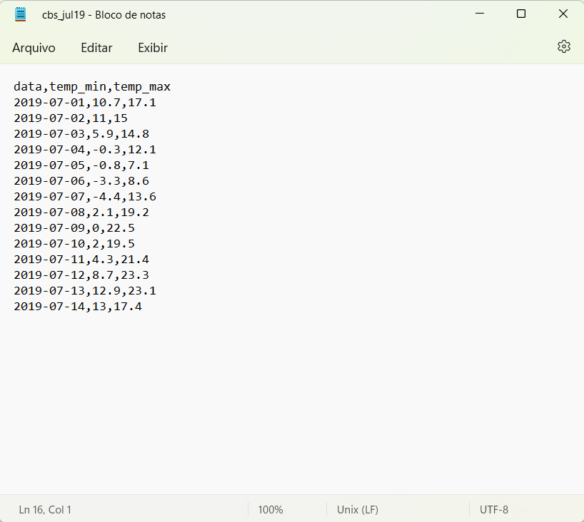

# Começando com o R {#comeco}

Neste capítulo, vamos iniciar com o uso do R e do RStudio.

## A interface do RStudio

O RStudio possui uma interface simples mas bastante funcional para trabalhar com códigos do R.

São quatro janelas principais como pode ser visto na Figura \@ref(fig:rstudio).

```{r rstudio, echo=FALSE, out.width="99%", fig.cap="Interface do RStudio"}
knitr::include_graphics("image/rstudio.png")
```

* **Source (Editor)** (canto superior esquerdo): local para editar scripts, que são sequências de comandos que podem ser salvos e utilizados repetidamente. Os comandos desta janela são executados clicando no botão *Run* ou pelo atalho do teclado <button>Ctrl</button>+<button>Enter</button>. Caso o editor não esteja aparecendo, clique em *File -> New File -> R Script*, ou pelo atalho <button>Ctrl</button>+<button>Shift</button>+<button>N</button>

* **Console** (canto inferior esquerdo): local para digitar e executar os comandos, assim como obter o resultado destes. Também mostra o resutado dos comando executados a partir do editor.

* **Environment (Ambiente)** (canto superior direito): local que mostra as variáveis definidas, entre outros.

* **Files/Plots/Packages/Help/Viewer** (canto inferior direito): local multiuso com várias abas, que mostra e configura várias opções, como arquivos, gráficos, pacotes, ajuda e visualização.


## Criar um projeto no RStudio

Um projeto do RStudio mantem todos os arquivos relevantes para a análise, como banco de dados, scripts, resultados e figuras. É uma excelente maneira de evitar ter de lidar com caminhos e diretórios. 

Para começar um novo projeto, clique em *File -> New Project* e siga os passos nas janelas conforme aparecerem:

```{r rstudio-project, echo=FALSE, out.width="80%"}

```

```{r rstudio-project2, echo=FALSE, out.width="80%"}
knitr::include_graphics("image/rstudio-project2.png")
```

```{r rstudio-project3, echo=FALSE, out.width="80%"}
knitr::include_graphics("image/rstudio-project3.png")
```

Dê um bom nome para seu novo projeto e cuide do local em que este será salvo. 


## Primeiros códigos

Após o projeto criado, vamos digitar os primeiros códigos na janela do Script. Tente digitar o seguinte:

```r
1 + 1
```

Em seguida, posicione o cursor na linha que acabou de digitar, aperte o botao *Run* ou <button>Ctrl</button> + <button>Enter</button> e veja o resultado.

```{r}
1 + 1
```

Esta foi uma operação muito simples, então vamos ver alguns códigos mais interessantes.
 
 
Para criar um objeto e atribuir um valor a ele, primeiro precisamos dar um nome^[dê preferência para nomes simples mas com algum significado] ao objeto, seguido do símbolo de atribuição `<-` (atalho: <button>Alt</button> + <button>-</button> ) ^[O símbolo de igualdade `=` também pode ser utilizado para atribuição, mas o símbolo `<-` é preferido pela maioria dos programadores em R.] e do valor que desejamos atribuir ao objeto:

```{r}
x <- 10 # leia-se: x recebe o valor 10
```

Neste exemplo, o objeto denominado `x`recebeu o valor 10. Notem que ao executar este comando, o objeto recém criado aparece na janela *Environment*, confirmando a criação do objeto.

Este exemplo também mostrou como usar um comentário, que é um texto não interpretado pelo programa. Os comentários são bastante úteis para explicar as linhas de código. Os comentários são escritos após o símbolo `#`. Para comentar uma ou várias linhas, selecione o texto e aperte <button>Ctrl</button>+<button>Shift</button>+<button>C</button>. 

Para verificar o valor que está atribuído a um objeto, basta digitar o nome do objeto^[a função `print` é chamada]:

```{r}
x
```

Um objeto pode ter seu valor modificado ou copiado com uma nova atribuição:

```{r}
y <- x
x <- x * 2
z <- x + y

y
x
z
```

Observe que a ordem de execução dos comandos é importante no resultado.

Um dos objetos mais útil na programação em R é o vetor, que pode ser entendido como uma série de valores armazenada em um objeto. Para criar um vetor, utilizamos a função `c()`:


```{r}
primos6 <- c(2, 3, 5, 7, 11, 13)
primos6
```

A função `str` nos mostra a estrutura do vetor: 

```{r}
str(primos6)
```

indicando que o objeto `primos6` é um vetor numérico (`num`).


Uma parte do vetor pode ser extraída como uso de colchetes `[ ]`:

```{r}
primos6[3] # acessa o terceiro elemento do vetor
primos6[4:6] # acessa do 4° ao 6° elemento do vetor
```


As operações com vetores são aplicadas a todos os elementos dele:

```{r}
primos6^2
```


Calcular a média dos valores deste vetor com a função `mean`:

```{r}
mean(primos6)
```

Muitas funções são disponibilizadas em pacotes. Para acessar uma função de um pacote usamos a sintaxe `pacote::função`. Por exemplo, para acessar as funções `first` e `last` do pacote `dplyr`:

```{r}
dplyr::first(primos6)
dplyr::last(primos6)
```

Alternativamente, é possível carregar o pacote com a função `library` e depois usar as funções diretamente:

```{r}
library(dplyr)
first(primos6)
last(primos6)
```

Para criar uma gráfico, podemos usar várias das funções base do R para esse fim. Neste exemplo, a função `hist` cria um gráfico do tipo histograma para um conjunto de 10.000 valores gerados aleatoriamente pela função `rnorm`.

```{r include=FALSE}
set.seed(21102015)
```

```{r histo, out.width="90%"}
r <- rnorm(10000)
hist(r)
```

Na seção \@ref(graf) veremos como utilizar o pacote `ggplot2` para criar gráficos mais elaborados.


## Criar uma função no R

Funções são usadas para dividir o código em partes mais simples, mas fáceis de manter e de entender. As funções também são facilmente reutilizadas. 

Para criar uma função no R, a sintaxe é a seguinte:


```r
nome_funcao <- function (argumentos) {
declaração
}
```
Como exemplo, vamos criar uma função que simula o lançamento dado: `dado6`


```{r}
dado6 <- function(n) {
  sample(1:6, size = n, replace = TRUE)
}
```

Esta função retorna n valores entre 1 e 6 com substituição.


Para utilizar a função recém criada, chamamos ela pelo nome e passamos um valor para os argumentos: 

```{r include=FALSE}
set.seed(21102015)
```

```{r}
dado6(n = 1)
dado6(n = 3)
```

 


## *Data-frame*

O *data frame* é uma estrutura bidimensional em que cada componente forma uma coluna e o conteúdo de cada componente forma as linhas. Em um *data frame*, é importante que todas as colunas tenham o mesmo comprimento, de modo que a estrutura de dados resulte em um formato retangular. Também podemos imaginá-lo como um agrupamento de vetores de mesmo tamanho.

Para criá-lo, usamos a função `data.frame`


```{r}
df <- data.frame(
  x = c("a", "b", "c"),
  y = c(16, 32, 64)
)
df
```


Idem ao anterior, mas com os vetores sendo criado anteriormente e separadamente

```{r}
x <- c("a", "b", "c")
y <- c(16, 32, 64)
df <- data.frame(x, y)
df
```
 


O pacote `tibble` foi criado como uma atualização^[Principais diferenças [aqui](https://tibble.tidyverse.org/articles/digits.html)] do *data-frame*, e pode ser utilizado de maneira similar:


```{r}
tb <- tibble::tibble(
  x = c("a", "b", "c"),
  y = c(16, 32, 64)
)
tb
```
 
  


O *data-frame* é o formato adequado para armazenar os dados no formato *Tidy Data*, junto com o *tibble* (seção \@ref(tidydata))

### *Data-frames* nativos no R

Existe uma grande quantidade de *data-frames* pré instalados no R que não necessitam de importação. Alguns dos nossos exemplos irão usar alguns destes *data-frames*, por exemplo, o *data-frame* `iris`, que contém as medidas, em centímetros, do comprimento e largura das pétalas e sépalas de três espécies de plantas: *Iris setosa*, *I. versicolor* e *I. virginica*.


## Importando dados para o R

É muito comum que os dados que utilizaremos em nossas análises estejam armazenadas em fontes externas ao R, como arquivos de texto (\*.csv, \*.tsv, \*.txt), planilhas (\*.xlsx, \*.ods) ou mesmo grandes bases de dados da internet. A importação consiste na leitura destas fontes para um *data-frame* no R.

Apesar de existirem vários pacotes e funções para importação de arquivos, vamos apresentar aqueles que fazem parte do *tidyverse*

### Importar arquivos .csv

Os arquivos \*.csv (*comma-separated values*) estão entre os mais populares para distribuição de dados. É um arquivo de texto, cujos valores são delimitador por vírgula. 

O pacote `readr` possui a função `read_csv` para importação destes arquivos, cujo delimitador entre valores é a vírgula e o separador de decimal é o ponto. Outra função semelhante, `read_csv2` importa arquivos .csv cujo delimitador entre valores é o ponto e vírgula e o separador de decimal é a vírgula^[Para uso mais geral, use a função `read_delim`], mais comum em alguns países como o Brasil.

O arquivo [cbs_jul19.csv](data/cbs_jul19.csv) (Figura \@ref(fig:csv)) contém as temperaturas mínimas e máximas diárias para a cidade de Curitibanos-SC registradas nos primeiros 15 dias do mês de julho de 2019. 

(ref:figcsv) Arquivo \*.csv cujo delimitador entre valores é a vírgula e o separador de decimal é o ponto.

```{r csv, echo=FALSE, out.width="90%", fig.cap="(ref:figcsv)"}

```

Os mesmos dados, mas em um arquivo ([cbs2_jul19.csv](data/cbs2_jul19.csv) - Figura  \@ref(fig:csv2)) cujo delimitador de valores é o ponto e vírgula e o separador de decimal é a vírgula:

(ref:figcsv2) Arquivo \*.csv cujo delimitador entre valores é o ponto e vírgula e o separador de decimal é a vírgula

```{r csv2, echo=FALSE, out.width="90%", fig.cap="(ref:figcsv2)"}
knitr::include_graphics("image/csv2.png")
```


A importação com a função `read_csv` é feita como no exemplo abaixo:

```r
temperaturas <- readr::read_csv("cbs_jul19.csv")
temperaturas
```

```{r, echo=FALSE}
temperaturas <- readr::read_csv("data/cbs_jul19.csv")
temperaturas
```
 


E com a função `csv2`:

```r
temperaturas <- readr::read_csv2("cbs2_jul19.csv")
temperaturas
```

```{r, echo=FALSE}
temperaturas <- readr::read_csv2("data/cbs2_jul19.csv")
temperaturas
```
 


### Importando arquivos do Excel

Para importar arquivos do Excel, existem a função `read_excel` do pacote `readxl`.

O arquivo [bflor.xlsx](data/bflor.xlsx) contám dados de um experimento que será estudado no capítulo (\@ref(anova1)). 

```r
bflor <- readxl::read_excel("/bflor.xlsx")
bflor
```

```{r, echo=FALSE}
bflor <- readxl::read_excel("data/bflor.xlsx")
bflor
```

 


## O operador *pipe*: `%>%`

O operador *pipe* `%>%` é uma ferramenta muito útil para expressar uma sequência de ações sobre um objeto.  Foi introduzido pela primeira vez no pacote `magrittr` com o objetivo de facilitar a programação e melhorar e legibilidade do código. Sempre carregue o pacote `magrittr` antes de usar o *pipe*.

```{r}
library(magrittr)
```

No exemplo abaixo, as duas linhas de código são equivalentes: aplica-se a função `f` ao objeto `x`.

```r
f(x)
x %>% f() # O pipe passa o objeto x para dentro da função f
```
Veja abaixo o *pipe* em ação: 

```{r}
x <- c(1, 2, 3, 5, 8, 13, 21) # criar um vetor x
x %>% add(2) # somar 2 a cada elemento do vetor x
x %>% "+"(2) # equivalente à operação anterior
x %>%
  "*"(3) %>%
  "+"(1) %>%
  "^"(2) # várias operações aplicadas sequencialmente ao vetor x
x %>% sum() # soma os elementos do vetor
```


No caso de uma função com vários argumentos, o *pipe* passa o objeto para a primeira posição da função, o argumento mais à esquerda:

```{r include=FALSE}
set.seed(21102015)
```

```{r}
sample(x, size = 1)
x %>% sample(size = 1) # idem ao anterior com o pipe passando o objeto x para a função sample
```
No caso de ser necessário que o objeto seja passado para outro argumento à direita, que não seja o primeiro, utilizamos um `.` como marcador: 

```{r}
iris %>%
  lm(Petal.Length ~ Species, data = .) # o objeto iris é passado para o argumento data com um .
```


## Organização dos dados: *Tidy data* {#tidydata}

Para facilitar as análises, é importante que os dados estejam organizados em um formato consistente, chamado de *Tidy Data* (@tidy-data). As regras gerais para este formato são:

1. Cada variável deve estar em uma coluna;
2. Cada observação deve estar em uma linha;
3. Cada valor deve ter sua própria célula.

Uma função bastante útil para organizar os dados no fomato *tidy* é a função `tidyr::pivot_longer`^[O formato *Tidy Data* também é conhecido como *Formato Longo*.].


Considere o conjunto de dados presente nesta planilha do Excel: [liquido.xlsx](data/liquido.xlsx) (Figura \@ref(fig:liquido))

(ref:liquido) Exemplo de dados não organizados no formato *tidy* em uma planilha do Excel.

```{r liquido, echo=FALSE, fig.cap="(ref:liquido)"}
knitr::include_graphics("image/liquido_xlsx.png")
```

Os dados foram digitados de modo que os valores da variável tempo estão espalhados por 4 colunas. A variável repetição (implícita) está em uma linha (cabeçalho das colunas) e o nome das colunas (Tempo) está em uma célula mesclada.

Ao importar este arquivo com a função `readxl::read_excel` temos como resultado:

```r
messy_data <- readxl::read_excel("liquido.xlsx")
messy_data
```

```{r, echo=FALSE}
messy_data <- readxl::read_excel("data/liquido.xlsx")
messy_data
```

Observamos que a primeira linha (células mescladas) da planilha bagunçou ainda mais o resultado. Vamos importar novamente exlcuindo a primeira linha com o argumento `skip = 1`.

```r
messy_data <- readxl::read_xlsx("liquido.xlsx", skip = 1)
messy_data
```

```{r, echo=FALSE}
messy_data <- readxl::read_xlsx("data/liquido.xlsx", skip = 1)
messy_data
```

Para transformar o *data-frame* no formato *tidy*, utilizamos a função `tidyr::pivot_longer`:

```{r}
tidy_data <- tidyr::pivot_longer(messy_data, cols = 2:5, names_to = "rep", values_to = "tempo")
tidy_data
```

* `cols`: colunas a serem transformadas para o formato *tidy*;
* `names_to`: nome da nova coluna criada a partir das informações armazenadas originalmente nos cabeçalhos das colunas;
* `values_to`: nome da nova coluna criada a partir dos valores armazenados nas células.

 


:::{.rmdnote}
O caminho inverso também pode ser feito, transformando um *data-frame* do formato longo para o formato *wide* com a função `tidyr::pivot_wider`
::: 


```{r include=FALSE}
tidyr::pivot_wider(tidy_data, names_from = "rep", values_from = "tempo")
```


