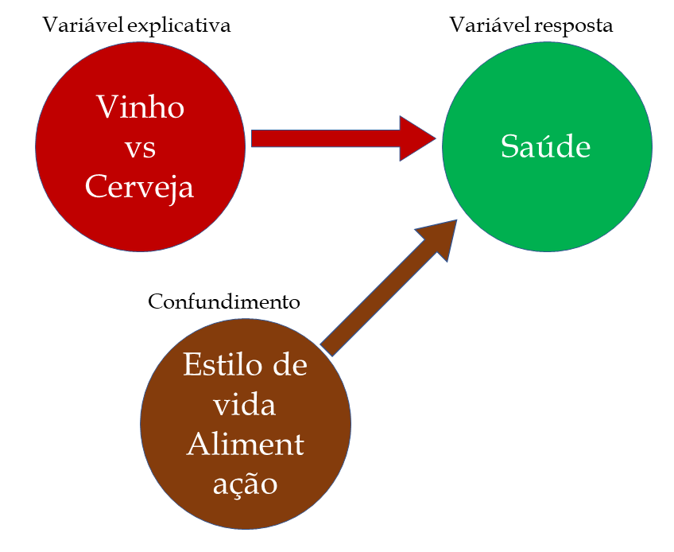

# Alguns conceitos básicos

## População e amostra

**População**

É a coleção inteira de indivíduos ou objetos a ser considerada ou estudada. Em geral, há infinitos objetos em uma população ou, então, tantos que não podemos olhar para todos eles.

**Amostra**

É um subconjunto da população inteira, uma pequena seleção de indivíduos ou objetos extraídos da coleção inteira. A seleção de uma amostra envolve a utilização de procedimentos específicos.

(\#fig:popam)População vs Amostra

## Variável

É uma característica de um indivíduo em uma população de interesse. Pode assumir valores diferentes para indivíduos diferentes. Esta característica pode ser observada ou mensurada nos indivíduos que compõem a amostra ou população.

:::{.example #var1 name="Nível de potássio em bananas"}
 
Muitos estudos de pesquisa sugerem que as bananas podem ser uma cura natural para diferentes doenças. As bananas tem alto teor de ferro, que pode ajudar as pessoas que sofrem de anemia, e há um antiácido nas bananas que pode ajudar aos que sofrem de azia. Um novo estudo se refere ao nível de potássio em uma banana típica. Cem bananas são selecionadas de todas as partes do mundo e mede-se e registra-se cuidadosamente o nível de potássio em cada uma delas. Descreva a população, a amostra e a variável nesse problema.

*SOLUÇÃO*

A população consiste em todas as bananas em todo o mundo. Embora essa população não seja infinita, certamente não podemos examinar cada banana unitariamente.

A amostra são as 100 bananas selecionadas aleatoriamente. Esse é um sub-conjunto ou seleção (ou, bem, um cacho) da população.

A variável nesse problema é o nível de potássio. Essa característica será cuidadosamente medida para cada banana, e os dados serão resumidos ou usados para se tirar uma conclusão.

:::

### Tipos de variáveis

* Qualitativa ou Categórica: Posiciona um indivíduo em um de diversos grupos ou categorias. Também podemos dizer que expressa uma qualidade do indivíduo.
  * Nominais: São puramente qualitativas e não ordenadas, como a cor de uma flor, gênero de um mamífero, formato de uma folha, etc.
  * Ordinais: Podem ser colocados em ordem, como a escalas de Likert (por exemplo, classifique de 0 a 5, com 0 para realmente não gosto e 5 para realmente gosto), comportamento de um animal (agressivo, neutro, submissivo), etc.

* Quantitativa ou Numérica: Assume valores numéricos e operações aritméticas (adição e cálculo de médias) fazem sentido.
  * Contínuas: Podem assumir qualquer valor em um intervalo, como o comprimento do caule de uma planta, temperatura corporal de um primata, etc.
  * Discretas: Podem assumir apenas um número limitado de valores, como o número de pétalas de uma flor, número de filhotes de uma ave, etc.
  

:::{.example #var2 name="Tipos e variáveis"}

Dados de um estudo podem conter valores de muitas variáveis para cada um dos sujeitas do estudo. Quais das seguintes variáveis são categóricas e quais são quantitativas?

1. Gênero
1. Idade
1. Cor
1. Fumante
1. Pressão sanguínea sistólica
1. Nível de cálcio no sangue

*SOLUÇÃO*

Categóricas: gênero (masculino ou feminino), cor (asiática, negra, branca, outra), fumante (sim ou não).

Quantitativas: idade (em anos), pressão sanguínea (milímetros de mercúrio), nível de cálcio (microgramas por mililitro).

:::

Em algumas situações, variáveis categóricas podem ser transformadas em variáveis quantitativas e vice-versa.

### Variáveis derivadas

 A maior parte das variáveissão obtidas por meio de medidas e observações diretas. No entanto, há uma importante classe de variáveis denominadas derivadas, que são baseadas em duas ou mais medições obtidas independentemente. Alguns exemplos são: razão, porcentagem, índice e taxa.

## Estatística descritiva vs Estatística inferencial

* Estatística descritiva: Utiliza métodos gráficos e numéricos para descrever, organizar e resumir dados. É uma Análise exploratória.

* Estatística inferencial: Utiliza técnicas e métodos para a análise de um conjunto de dados pequeno e específico para se extrair uma conclusão sobre uma coleção maior, mais geral, de dados. Os procedimentos da inferência estatística nos permitem usar os dados para tirar conclusões e avaliar riscos.

:::{.example #estat name="Descritiva vs Inferencial"}

Determine se cada um dos seguintes problemas é uma estatística descritiva ou inferencial.

a. O Departamento de Transporte mantém registros referentes a todos os caminhões parados para inspeção. Um relatório sobre essas inspeções lista, por carga, a proporção de todos os caminhões parados.
a. Um pesquisador obtém uma amostra aleatória de corujas selvagens e mede o quanto elas podem virar o pescoço. Os dados são usados para se concluir que uma coruja pode virar seu pescoço mais de 120 graus a partir da posição de frente.
a. Uma instalação de pesquisa da Marinha faz vários testes para verificar a integridade estrutural de um novo submarino. Um relatório do laboratório afirma que a embarcação pode suportar pressão a profundidades de, no máximo, 800 pés (243,84 m).
a. Um inspetor de segurança seleciona uma amostra de prédios de apartamentos e verifica as escadas de incêndio em cada um deles. A proporção de escadas quebradas na amostra é usada para estimar a proporção de escadas quebradas em toda a cidade.

*SOLUÇÃO*

a. Descritivo
a. Inferencial
a. Inferencial
a. Inferencial

:::

## Estudo observacional vs Estudo experimental

* Estudo observacional: Observamos a resposta para variáveis específicas para cada individuo. O objetivo de um estudo observacional é descrever algum grupo ou situação.
* Estudo experimental: Investigamos os efeitos de certas condições sobre indivíduos ou objetos na amostra. Os indivíduos são associados aleatoriamente a grupos específicos e certos fatores são sistematicamente controlados, ou impostos, para se investigar ou isolar efeitos específicos. O pesquisador impõe deliberadamente algum tratamento aos indivíduos para observar suas respostas.

:::{.example #obs name="Um estudo observacional"}

Um estudo acompanhou 130 mil pessoas, que bebiam cerveja, vinho ou licor, durante 12 anos. Foram documentados os casos de infarto do miocárdio. O estudo mostrou que ocorriam 35% menos mortes por infarto entre os que tomavam vinho (tinto ou branco) comparado aos que bebiam cerveja.

<!-- -->

::: 

:::{.example #exp name="Um estudo experimental"}

Um agrônomo afirma que um novo fertilizante orgânico, em comparação com a marca líder, aumenta a produção e o tamanho dos tomates. Para o teste dessa afirmativa, pês de tomate são associados aleatoriamente a um de dois grupos: m grupo é cultivado com o fertilizante líder e o outro grupo, com o novo produto. No tempo da colheita, registram-se o tamanho e o peso de cada tomate, juntamente com o total de tomates por pé. Os dados coletados desse experimento são usados para comparar os dois fertilizantes.
 
<!-- -->

::: 

### Confundimento

O confundimento ocorre quando vários fatores juntos contribuem para um efeito, mas nenhuma causa única pode ser isolada.

Estudos observacionais falham, em geral, porque a variável explicativa se confunde com variáveis ocultas.

*Voltando ao exemplo do vinho…*

As pessoas que preferem vinho são diferentes daquelas que bebem cerveja. Os bebedores de vinho, como um grupo, são mais ricos e mais bem educados, comem mais frutas e vegetais e menos frituras. Sua dieta contém menos gordura e menos colesterol.

A variável explicativa (Qual tipo de bebida alcoólica você bebe com mais frequência?) é confundida com muitas variáveis ocultas (educação, riqueza, alimnetação e outras).

*Voltando ao exemplo do tomate…*

Suponha que os pés de tomate em um dos grupos sejam regados com mais frequência e/ou expostos a mais luz do sol.

Se os pés de tomate que receberam o novo fertilizante forem sujeitos a essas condições diferentes (favoráveis) de crescimento, uma diferença na produção não poderá ser atribuída ao novo produto.

:::{.example #aqglobal name="Aquecimento global"}
 

Registros instrumentais mostram um aumento nas temperaturas médias globais da superfície aérea e do oceano da ordem de 0,5°C durante o século XX. Essa tendência é também evidente na redução da extensão da capa de neve, da taxa acelerada do aumento do nível do mar e dos tempos de chegada e acasalamento de pássaros migratórios, que estão ocorrendo mais cedo. Esse aquecimento global coincide com mudanças dramáticas na composição do gás atmosférico devido à atividade humana, por exemplo, a queima de combustíveis fósseis.

Os registros do clima estão sujeitos a um grande e incerto nível de variabilidade.

a. A evidência do aquecimento global é experimental ou observacional?
a. Qual variável explicativa influencia a mudança climática?
a. Qual variável oculta pode estar confundida com essa variável explicativa?

*SOLUÇÃO*

a. Observacional.
a. Explicativa: atividade humana.
a. Oculta: variabilidade natural no ambiente (por exemplo, idades glaciais anteriores).

O Comitê da Ciência da Mudança Climática afirma: *“Por causa do grande e ainda incerto nível de variabilidade natural inerente ao registro do clima…, uma ligação de causalidade entre o lançamento de gases do efeito estufa na atmosfera e as mudanças climáticas observadas durante o século XX não pode ser estabelecida sem equívocos.”*

:::
