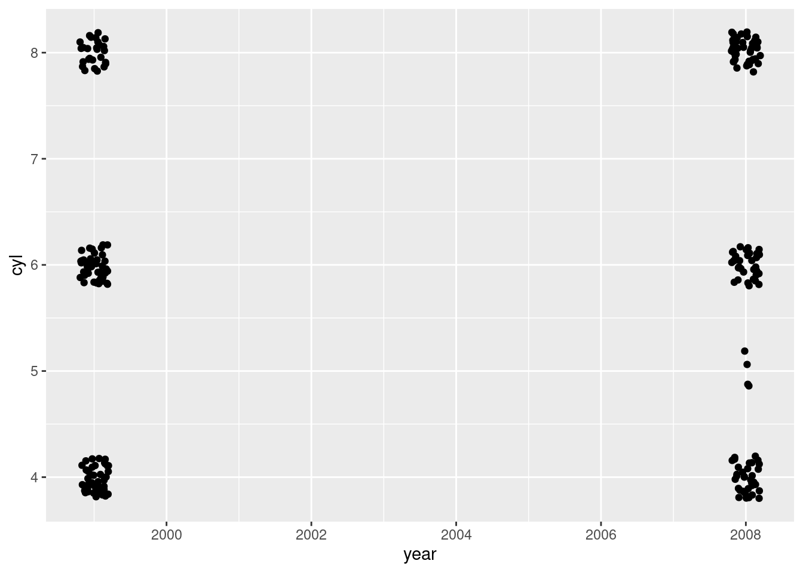
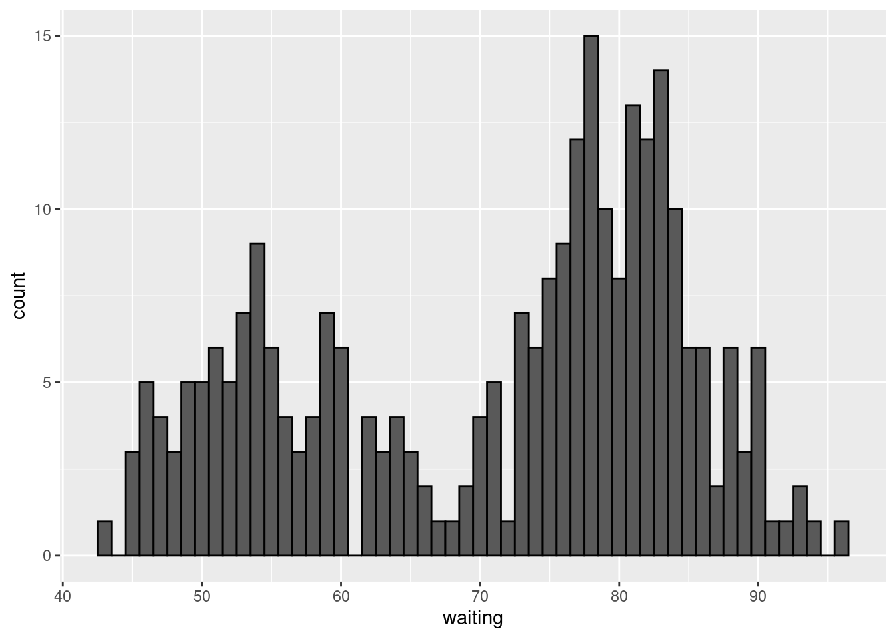
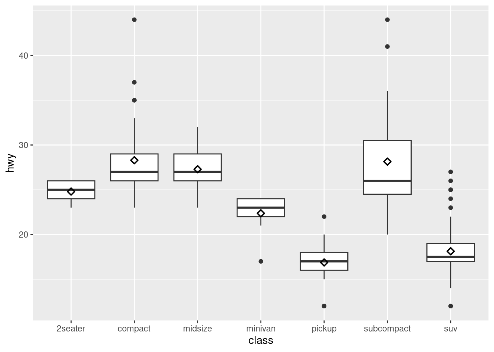

# Gráficos estatísticos {#graf}

> Uma imagem vale mais que mil palavras

Os gráficos estatísticos são utilizados para fazer uma representação visual dos dados. São elaborados para serem vistos por você e por outras pessoas, por isso, sempre haverá um certo nível de subjetividade na interpretação do gráfico.

Não há (muitas) regras na elaboração dos gráficos, pelo contrário, temos liberdade para elaborá-los das forma que melhor nos convém. No entanto, existem guias gerais bem estabelecidas que facilitam o processo de escolha do tipo de gráfico mais adequado para o seu conjunto de dados. Em outras palavras, uma boa metodologia aplicada na construção dos gráficos é extremamente útil para seu correto entendimento e interpretação, seja qual for o público alvo.

A Figura \@ref(fig:bad) vemos um exemplo de um gráfico ruim. Há uma quantidade considerável de poluição visual; as barras são difíceis de comparar devido à perspectiva “3D”; os rótulos estão duplicados, na legenda e no eixo vertical; as sombras não acrescentam nenhuma informação; a escolha das cores não foi muito bem feita.

(ref:bad) Um gráfico com poluição visual e de gosto duvidoso.

<div class="figure">

<p class="caption">(\#fig:bad)(ref:bad)</p>
</div>

## O pacote `ggplot2` 

O pacote `ggplot2` foi criado por *Hadley Wickham* baseado em um conceito denominado "Gramática de Gráficos" (*Grammar of Graphics*). 

De um modo geral, a criação de gráficos com o `ggplot2` executa o mapeamento (`mapping`) dos dados para propriedades estéticas (`aes`) e geométricas (`geom_*`). Ainda, podem ser executadas transformações estatísticas (`stat_*`) e divisões (`facet_*`).
Todas essas camadas combinadas irão resultar no gráfico final.


O primeiro passo é chamar a funçao `ggplot` (sem o número 2 no final!). O argumento `data` recebe o conjunto de dados (*data.frame*) que contém os valores. Para este primeiro exemplo, vamos utilizar o conjunto de dados [*gapminder*](#gapminder). 
Ainda, vamos mapear o eixo *x* para a variável *gdpPercap* (do inglês, PIB per capita, em US Dollar) e o eixo *y* para a variável *lifeExp* (do inglês, expectativa de vida ao nascer, em anos). Fica assim:

(ref:tg1) "Pano de fundo" para um gráfico criado com o `ggplot2`


```r
library(gapminder) # carregar os dados gapminder
ggplot(
  data = gapminder,
  mapping = aes(x = gdpPercap, y = lifeExp)
)
```

<div class="figure">

<p class="caption">(\#fig:g1)(ref:tg1)</p>
</div>

Ops, o gráfico resultante está vazio! O que aconteceu? Esta função cria apenas o "pano de fundo" para o gráfico, uma vez que ainda não definimos nenhuma geometria para preenchê-lo.

Para completar o gráfico, basta digitar o sinal de adição `+` e chamar alguma função do tipo `geom_*`, por exemplo, `geom_point` para um gráfico de pontos ^[também conhecido como gráfico de dispersão]. Na prática, estamos adicionando (`+`) mais uma camada ao gráfico.

(ref:tg2) Gráfico de dispersão entre o PIB per capita (USS$) e a expectativa de vida ao nascer (anos).


```r
ggplot(
  data = gapminder,
  mapping = aes(x = gdpPercap, y = lifeExp)
) +
  geom_point()
```

<div class="figure">

<p class="caption">(\#fig:g2)(ref:tg2)</p>
</div>

Em geral, todos os gráficos produzidos com o `ggplot` seguem praticamente a mesma receita:

```r
ggplot(
  data = <data>,
  mapping = aes(x = <variável x>, 
                y = <variável y>,
                <...> = <...>)
) +
  geom_*(<...>) +
  <...>
```


Para simplificar ainda mais o código, é possível suprimir o nome dos argumentos `data` e `mapping`, pois são argumentos muito comuns em todos os gráficos criados com o `ggplot2`. Por isso, de agora em diante, neste livro, estes nomes não serão mais escritos.

(ref:ident) Outro código que produz um gráfico idêntico ao da Figura \@ref(fig:g2)


```r
ggplot(
  gapminder,
  aes(x = gdpPercap, y = lifeExp)
) +
  geom_point()
```

<div class="figure">

<p class="caption">(\#fig:g3b)(ref:ident)</p>
</div>


### Criando gráficos do `ggplot` como objetos

Uma forma bastante conveniente de trabalhar com os gráficos é armazenar em objetos.


```r
p <- ggplot(
  gapminder,
  aes(x = gdpPercap, y = lifeExp)
)
```

Neste código, criamos um objeto denominado `p` ^[ `p` é um nome comum para objetos do `ggplot`, mas é recomendável denominar os objetos com nomes mais descritivos quando nencessário] que contém as informações básicas do gráfico. Na sequência, podemos adicionar mais elementos neste mesmo gráfico apenas adicionando (`+`) alguma função ao objeto.

(ref:ob0) Adicionando uma camada `geom_point()` ao objeto `p`


```r
p +
  geom_point()
```

<div class="figure">

<p class="caption">(\#fig:ob0)(ref:ob0)</p>
</div>

(ref:ob1) Adicionando uma camada `geom_smooth()` ao objeto `p`


```r
p +
  geom_smooth()
```

```
## `geom_smooth()` using method = 'gam' and formula 'y ~ s(x, bs = "cs")'
```

<div class="figure">

<p class="caption">(\#fig:ob1)(ref:ob1)</p>
</div>

(ref:ob2) Adicionando várias camadas ao objeto `p`


```r
p +
  geom_point() +
  geom_smooth()
```

```
## `geom_smooth()` using method = 'gam' and formula 'y ~ s(x, bs = "cs")'
```

<div class="figure">

<p class="caption">(\#fig:ob2)(ref:ob2)</p>
</div>


### Personalizando os eixos

Muitas vezes precisamos personalizar os eixos do gráfico para aprimorar a visualização.
A função `labs` permite alterar vários argumentos, como visto no exemplo a seguir:

(ref:labs) Personalizando o gráfico alterando o rótulo dos eixos e adicionando título e subtítulo.


```r
p +
  geom_point() +
  labs(
    x = "PIB per capita (US$)",
    y = "Expectativa de vida ao nascer (anos)",
    title = "Economia vs Expectativa de Vida",
    subtitle = "Cada ponto representa um país e um ano",
    caption = "Fonte: Gapminder"
  )
```

<div class="figure">

<p class="caption">(\#fig:unnamed-chunk-3)(ref:labs)</p>
</div>

* `x` altera o rótulo do eixo *x*
* `y` altera o rótulo do eixo *y*
* `title` adiciona um título na parte superior
* `subtitle` adiciona um subtítulo logo abaixo do título
* `caption` rótulo que aparece no canto inferior direito


### Mapeando atributos estéticos {#aes}

Nesta seção, vamos estudar mais sobre os atributos estéticos. Em nosso primeiro gráfico, já utilizamos dois atributos de posição cartesiana: os eixos *x* e *y*. 
Entre vários outros atributos estéticos, vamos trabalhar com `color` e `fill`, que alteram [cores](#cores).


(ref:tcolor) Mapeamento de cores diferentes para cada continente.


```r
ggplot(
  gapminder,
  aes(
    x = gdpPercap,
    y = lifeExp,
    color = continent
  )
) +
  geom_point() +
  scale_x_log10()
```

<div class="figure">

<p class="caption">(\#fig:gcolor)(ref:tcolor)</p>
</div>

Vejam que ao mapear `color` para uma variável, foram atribuídas cores aos pontos, uma cor diferente para cada continente. Também foi adicionada uma legenda explicativa. 

Na figura seguinte, vamos adicionar mais uma camada ao gráfico, a linha ajustada com `geom_smooth`.


```r
ggplot(
  gapminder,
  aes(
    x = gdpPercap,
    y = lifeExp,
    color = continent
  )
) +
  geom_point() +
  geom_smooth(method = "lm", formula = y ~ x) +
  scale_x_log10()
```


Veja que foi criada uma linha de ajuste para cada continente. Isso acontece porque foi mapeado o atributo `color` para os continentes. No entanto, a faixa do interval de confiança não acompanhou as cores, permanecendo na cor cinza. Isso acontece porque, para o `ggplot`, há dois tipos de objetos: `color` serve para linhas e pontos e `fill` serve para preenchimento de áreas e políogonos. Assim, para colorir a faixa do intervalo de confiança, os continentes deve ser mapeada para o atributo `fill`, como no exemplo a seguir.


```r
ggplot(
  gapminder,
  aes(
    x = gdpPercap,
    y = lifeExp,
    color = continent,
    fill = continent
  )
) +
  geom_point() +
  geom_smooth(method = "lm", formula = y ~ x) +
  scale_x_log10()
```


### Mapeando atributos em cada `geom_*`

Mas cinco linhas ajustadas podem ser demais. Queremos ajustar apenas uma! E ainda queremos manter os pontos coloridos para cada continente. Para resolver esta situação, podemos mapear os atributos dentro de cada geometria.

Por padrão, as funções `geom_*` herdam seus mapeamentos da funçao `ggplot`. Podemos alterar este comportamento mapeando a estética apenas dentro da função `geom_*` que queremos que se aplique.


```r
ggplot(
  gapminder,
  aes(
    x = gdpPercap,
    y = lifeExp
  )
) +
  geom_point(aes(color = continent)) +
  geom_smooth(method = "lm", formula = y ~ x) +
  scale_x_log10()
```


Também é possível mapear variáveis numéricas, por exemplo, o logaritmo da população em cada país e ano. Quando fazemos isso, a escala de cor produzida é um gradiente contínuo. A função `scale_color_viridis_c()` especifica a utilização da paleta de cor *viridis*.


```r
ggplot(
  gapminder,
  aes(
    x = gdpPercap,
    y = lifeExp
  )
) +
  geom_point(aes(color = log(pop))) +
  geom_smooth(method = "lm", formula = y ~ x) +
  scale_x_log10() +
  scale_color_viridis_c()
```


### Definindo atributos estéticos

Em algumas situações nós apenas queremos definir atributos estéticos, como cores, em vez de mapeá-los para alguma variável. Para isso, devemos definir estes atributos fora da função `aes()`. 


```r
p <- ggplot(
  data = gapminder,
  mapping = aes(
    x = gdpPercap,
    y = lifeExp
  )
)


p + 
  geom_point(color = "purple") +
  scale_x_log10()
```


```r
p + 
  geom_point(shape = 8, size = 2, color = "tomato") +
  scale_x_log10()
```


```r
p + 
  geom_point(alpha = 0.3) +
  geom_smooth(color = "orange", size = 8, method = "lm", formula = y ~ x) +
  scale_x_log10()
```


## Gráfico de barras

O gráfico de barras, que também pode ser chamado de gráfico de colunas, é um gráfico em que a altura das barras é proporcional ao valor por elas representado. 
Quando ordenado, também pode ser chamado de [Gráfico de Pareto](https://pt.wikipedia.org/wiki/Diagrama_de_Pareto)

Este tipo de gráfico é utilizado para representar os dados quando uma das variáveis é categórica ou numérica discreta. ^[Uma variável numérica contínua pode ser representada desde que esteja dividida em classes.]

A maior parte dos exemplos de gráficos de barras utilizará o conjunto de dados [*mpg*](#mpg).

### Gráfico de barras para uma variável

No `ggplot2`, as geometrias deste tipo de gráfico são: `geom_bar` ou `geom_col`. A diferença entre elas é que `geom_bar` tem como padrão a função `stat_count` que representa o número de casos em cada grupo (contagem) e `geom_col` tem como padrão a função `stat_identity` que mantém os dados como estão e pode ser usada para representa valores numéricos de outra variável. 

Quando há apenas uma variável categórica, a altura das barras é proprocional ao número (contagem) de indivíduos em cada categoria. Neste caso, usamos `geom_bar`, cuja função padrão é `stat_count`, que realiza a contagem das observações em cada classe.

(ref:bar) Número de automóveis (contagem) em cada classe.


```r
ggplot(mpg, aes(x = class)) +
  geom_bar()
```

<div class="figure">

<p class="caption">(\#fig:unnamed-chunk-11)(ref:bar)</p>
</div>

Para ordenar as barras, precisamos organizar o *data.frame* original. Para isso, utilizamos algumas funções auxiliares presentes no pacote `tidyverse` ^[É preciso instalar e carregar o pacote `tidyverse` com os comandos `install.packages("tidyverse")` e `library(tidyverse)`]. Adicionamos uma coluna adicional contendo a contagem de cada grupo e depois procedemos com a reordenação com a função `fct_reorder`. Observem também a utilização do operador `%>%` (*pipe*) que também é carregado junto com o pacote `tidyverse`. Por fim, a geometria é alterada para `geom_col`.

(ref:barord) Número de automóveis (contagem) em cada classe. As categorias estão ordenadas em ordem crescente (menor para maior).


```r
mpg %>%
  count(class) %>%
  ggplot(aes(x = fct_reorder(class, n), y = n)) +
  geom_col()
```

<div class="figure">

<p class="caption">(\#fig:unnamed-chunk-12)(ref:barord)</p>
</div>

Por padrão, o ordenamento é crescente, ou seja, do menor para o maior. Para inverter, adicionamos o argumento `.desc=TRUE` à função `fct_reorder`, que faz o ordenamento decrescente.

(ref:bardesc) Número de automóveis (contagem) em cada classe. As categorias estão ordenadas em ordem decrescente.


```r
mpg %>%
  count(class) %>%
  ggplot(aes(x = fct_reorder(class, n, .desc = TRUE), y = n)) +
  geom_col()
```

<div class="figure">

<p class="caption">(\#fig:unnamed-chunk-13)(ref:bardesc)</p>
</div>


No caso de uma variável numérica discreta, o código é essencialmente o mesmo, assim como suas variações. 

(ref:barnum) Número de automóveis com 4, 5, 6 ou 8 cilindros.


```r
ggplot(mpg, aes(x = cyl)) +
  geom_bar()
```

<div class="figure">

<p class="caption">(\#fig:unnamed-chunk-14)(ref:barnum)</p>
</div>


Por existir uma ordem natural na variável discreta, a ordenação pelo tamanho das barras não é recomendada (na maioria dos casos).

### Gráfico de barras para duas variáveis

O gráfico de barras também pode representar a relação entre duas variáveis, sendo uma delas categórica ou numérica discreta (eixo *x*) e a outra numérica (eixo *y*). 

Neste primeiro exemplo, vamos plotar a relação entre uma variável categórica (*class*) e outra numérica contínua (*displ*).
Aqui, é necessário definir uma função para resumir os dados, uma vez que a função padrão (`stat_count`) não é adequada. Uma opção muito comum é representar a média de cada grupo. Isso é possível com os argumentos `stat = "summary"`e `fun = "mean"` dentro da geometria `geom_bar`. Assim, calculamos a média da variável *displ* em cada classe.

(ref:displ) Cilindradas (média) dos motores de automóveis em cada classe.


```r
ggplot(mpg, aes(x = class, y = displ)) +
  geom_bar(stat = "summary", fun = "mean")
```

<div class="figure">

<p class="caption">(\#fig:unnamed-chunk-15)(ref:displ)</p>
</div>

Para plotar este mesmo gráfico com ordenação das colunas, devemos trabalhar no *data.frame* original. Assim, definimos uma nova variável (`media_displ`) calculada a partir das médias do agrupamento das classes de automóveis. A função `fct_reorder` faz a ordenação crescente das médias. A geometria deve ser modificada para `geom_col`.

(ref:displord) Cilindradas (média) dos motores de automóveis em cada classe. As classes estão ordenadas segundo a média da cilindrada dos motores.


```r
mpg %>%
  group_by(class) %>%
  summarise(media_displ = mean(displ)) %>%
  ggplot(aes(x = fct_reorder(class, media_displ), y = media_displ)) +
  geom_col()
```

<div class="figure">

<p class="caption">(\#fig:unnamed-chunk-16)(ref:displord)</p>
</div>

### Gráfico de barras para três variáveis.

É possível mapear uma terceira variável categórica ou numérica discreta em um gráfico de barras. A terceira variável é passada para o argumento `fill`, que atribui uma cor diferente para cada nível.
Devemos explicitá-la como fatorizada, por isso a necessidade de usar a função `factor`.

Nestes exemplo, vamos utilizar o conjunto de dados [*ToothGrowth*](#tooth).

A opção `position = "dodge"` evita a sobreposição das barras ajustando-as lado a lado. Uma variação é `position = "dodge2"` que adiciona um pequeno espaço entre as barras.

(ref:toothbar) Comprimento de odontoblastos de porquinhos da Índia submetidos a diferentes tipos de suplementos e doses de vitamina C. 


```r
ggplot(ToothGrowth, aes(x = supp, y = len, fill = factor(dose))) +
  geom_bar(stat = "summary", fun = "mean", position = "dodge") +
  scale_fill_viridis_d()
```

<div class="figure">

<p class="caption">(\#fig:unnamed-chunk-17)(ref:toothbar)</p>
</div>

Invertendo as variáveis do eixo *x* e do elemento `fill`:

(ref:toothbar2) Comprimento de odontoblastos de porquinhos da Índia submetidos a diferentes doses e tipos de suplementos de vitamina C. 


```r
ggplot(ToothGrowth, aes(x = (dose), y = len, fill = supp)) +
  geom_bar(stat = "summary", fun = "mean", position = "dodge") +
  scale_fill_viridis_d()
```

<div class="figure">

<p class="caption">(\#fig:unnamed-chunk-18)(ref:toothbar)</p>
</div>

## Gráficos de dispersão

São utilizados para mostrar a relação entre duas variáveis numéricas contínuas. Para isso, são utilizados pontos que representam cada observação. A geometria para este tipo de gráfico é `geom_point`. Veja este exemplo com os dados do conjunto [*iris*](#iris).

(ref:disp1) Relação entre o comprimento e largura de flores de espécies de *Iris.* Este é um gráfico de dispersão em que cada ponto representa um par de valores.


```r
ggplot(iris, aes(x = Petal.Length, y = Petal.Width)) +
  geom_point()
```

<div class="figure">

<p class="caption">(\#fig:unnamed-chunk-19)(ref:disp1)</p>
</div>

Quando é bem clara a distinção entre as variáveis, sendo uma a variável preditora (independente) e a outra a variável resposta (dependente), estas devem ser organizadas da seguinte forma: a variável preditora é mapeada no eixo *x* e a variável resposta é mapeada para o eixo *y*. Veja este exemplo com dados do conjunto [*BOD*](#bod)

(ref:disp2) Relação entre a demanda bioquímica de oxigênio (BOD) e o tempo na avaliação da qualidade da água. Neste exemplo, o tempo é usado como um preditor para a demanda bioquímica do oxigênio. Por isso, o tempo está mapeado no eixo *x* e a BOD está mapeada no eixo *y*.


```r
ggplot(BOD, aes(x = Time, y = demand)) +
  geom_point()
```

<div class="figure">

<p class="caption">(\#fig:unnamed-chunk-20)(ref:disp2)</p>
</div>

### Linha de tendência

É bastante comum que seja traçada uma linha para os valores preditos baseados em algum modelo estatístico
Pra isso, utilizaremos a função `geom_smooth`, que já realiza o ajuste estatístico do modelo linear. Vamos definir o método (`method = "lm"`) para `lm` de modelo linear (ou *linear model* em inglês). O argumento `se = FALSE` impede de traçar o intervalo de confiança. 

(ref:tg3) Relação entre o comprimento e largura de flores de espécies de *Iris*. Neste gráfico existe uma linha de tendência linear ajustada por `geom_smooth`.


```r
ggplot(iris, aes(x = Petal.Length, y = Petal.Width)) +
  geom_point() +
  geom_smooth(method = "lm", formula = y ~ x)
```

<div class="figure">

<p class="caption">(\#fig:unnamed-chunk-21)(ref:tg3)</p>
</div>


Por padrão, é adicionado uma região de confiança de 95% para a regressão. A probabilidade pode ser alterada modificando o argumento `level`, ou pode ser suprimida com o argumento `se = FALSE`.


(ref:tg3a) Relação entre o comprimento e largura de flores de espécies de *Iris*. A linha de tendência linear é acompanhada de um intervalo de confiança de 99%. O nível de confiança é ajustado pelo argumento `level`.


```r
iris_disp_plot <- ggplot(iris, aes(x = Petal.Length, y = Petal.Width)) +
  geom_point()

iris_disp_plot + 
  geom_smooth(method = "lm", formula = y ~ x, level =0.99)
```

<div class="figure">

<p class="caption">(\#fig:unnamed-chunk-22)(ref:tg3a)</p>
</div>

(ref:tg3b) Relação entre o comprimento e largura de flores de espécies de *Iris.* O intervalo de confiança é suprimido com o argumento `se = FALSE`.


```r
iris_disp_plot + 
  geom_smooth(method = "lm", formula = y ~ x, se = FALSE)
```

<div class="figure">

<p class="caption">(\#fig:unnamed-chunk-23)(ref:tg3b)</p>
</div>

Neste mesmo exemplo, é possível ajustar uma linha para cada espécie de *Iris*, mapeando as espécies para a cor.


(ref:dispgrupo) Relação entre o comprimento e largura de flores de espécies de *Iris.* As linhas de tendência são ajustadas para cada espécie que foram mapeadas para `color`.


```r
ggplot(iris, aes(x = Petal.Length, y = Petal.Width, color = Species)) +
  geom_point() +
  geom_smooth(method = "lm", formula = y ~ x)
```

<div class="figure">

<p class="caption">(\#fig:unnamed-chunk-24)(ref:dispgrupo)</p>
</div>

## Sobreposição de elementos

Existem algumas situações em que, ao plotar os pontos, estes aparecem sobrepostos entre si. É mais comum quando ambas as variáveis são discretas, pois pode ocorrer a sobreposição perfeita.

(ref:sobr) Gráfico de dispersão entre o ano de fabricação e o número de cilindros de automóveis. As duas variáveis são numéricas discretas e os pontos são mostrados com sobreposição "perfeita".


```r
ggplot(mpg, aes(x = year, y = cyl)) +
  geom_point()
```

<div class="figure">

<p class="caption">(\#fig:unnamed-chunk-25)(ref:sobr)</p>
</div>

Para contornar este problema, pode-se fazer uso da geometria `geom_jitter`. Ela adiciona uma pequena quantidade de variação aleatória à localização dos pontos, o que evita a sobreposição. Funciona melhor em conjuntos de dados pequenos.

(ref:jit) Gráfico de dispersão entre o ano de fabricação e o número de cilindros de automóveis. Ao utilizar `geom_jitter`, a localização dos pontos é alterada aleatoriamente, evitando a sobreposição. Assim, é possível ter uma melhor noção da quantidade de pontos em cada nível das variáveis.


```r
ggplot(mpg, aes(x = year, y = cyl)) +
  geom_jitter(width = 0.2, height = 0.2)
```

<div class="figure">

<p class="caption">(\#fig:unnamed-chunk-26)(ref:jit)</p>
</div>

Outra forma de lidar com sobreposição é alterar o elemento `alpha`, que determina a transparência dos pontos. É melhor para conjuntos de dados grandes e variáveis contínuas. No exemplo a seguir utilizamos o conjunto de dados [*diamonds*](#diamonds).


(ref:tr) Relação entre o peso (quilates) de diamantes e seu preço. O conjunto de dados contém um número grande de observações que causa uma grande sobreposição em algumas regiões. Ao determinar a transparência (`alpha`), é possível melhorar a observação da distribuição e verificar em quais regiões do gráfico há maior concentração de pontos.


```r
diamonds_plot <- ggplot(diamonds, aes(x = carat, y = price))

diamonds_plot + geom_point()
```

<div class="figure">

<p class="caption">(\#fig:unnamed-chunk-27-1)(ref:tr)</p>
</div>

```r
diamonds_plot + geom_point(alpha = 0.1)
```

<div class="figure">

<p class="caption">(\#fig:unnamed-chunk-27-2)(ref:tr)</p>
</div>


## Gráficos de linhas

Os gráficos de linhas são utilizados quando queremos representar uma variável numérica contínua no eixo *x*. Em alguns casos, também podem ser utilizados para variáveis categóricas ou discretas, mas desde que tenham uma ordenação natural.

Voltamos ao conjunto de dados [*ToothGrowth*](#tooth). A dose, por ser uma variável numérica, pode ser representada no eixo *x*. Os valores de comprimento foram resumidos para cada observação.

(ref:toothline) Gráfico de linhas entre a dose de vitamina C e comprimento de odontoblastos de porquinhos da Índia. A dose, por ser uma variável numérica, é plotada no eixo *x* e é possível utilizar linhas para ligar os pontos.


```r
ToothGrowth %>%
  group_by(dose) %>%
  summarise(len_mean = mean(len)) %>%
  ggplot(aes(x = dose, y = len_mean)) +
  geom_line()
```

<div class="figure">

<p class="caption">(\#fig:unnamed-chunk-28)(ref:toothline)</p>
</div>

É bastante comum a sobreposição dos pontos observados às linhas, com a adição de uma camada `geom_point`.

(ref:toothline2) Gráfico de linhas entre a dose de vitamina C e comprimento de odontoblastos de porquinhos da Índia. A adição de uma camada `geom_point` mostra os pontos observados. 


```r
ToothGrowth %>%
  group_by(dose) %>%
  summarise(len_mean = mean(len)) %>%
  ggplot(aes(x = dose, y = len_mean)) +
  geom_line() +
  geom_point()
```

<div class="figure">

<p class="caption">(\#fig:unnamed-chunk-29)(ref:toothline2)</p>
</div>

Ainda há a possibilidade de mapear uma terceira variável para o elemento `color`. 


(ref:toothline3) Gráfico de linhas entre a dose de vitamina C, comprimento de odontoblastos de porquinhos da Índia e forma de suplementação. A terceira variável é mapeada para diferentes cores e mostrada no mesmo gráfico.


```r
ToothGrowth %>%
  group_by(supp, dose) %>%
  summarise(len_mean = mean(len)) %>%
  ggplot(aes(x = dose, y = len_mean, color = supp)) +
  geom_line()
```

```
## `summarise()` has grouped output by 'supp'. You can override using the
## `.groups` argument.
```

<div class="figure">

<p class="caption">(\#fig:unnamed-chunk-30)(ref:toothline3)</p>
</div>


### Gráficos de linhas para séries temporais

É bastante comum que a variável no eixo *x* de uma gráfico de linhas seja uma medida de tempo. Neste caso, o gráfico estará representando uma série temporal. A geometria utilizada é `geom_line`. Para exemplificar, vamos utilizar o conjunto de dados [*economics*](#economics).

(ref:tempoa) Gráfico de linhas com tendência temporal para Número de desemprego. As linhas são ótimas para mostrar as tendências temporais, inclusive as variações sazonais.


```r
ggplot(economics, aes(x = date, y = unemploy)) +
  geom_line()
```

<div class="figure">

<p class="caption">(\#fig:unnamed-chunk-31)(ref:tempoa)</p>
</div>

(ref:tempob) Gráfico de linhas com tendência temporal para Despesas de consumo pessoal (US$ Bi). As linhas são ótimas para mostrar as tendências temporais, inclusive algumas anomalias pontuais.


```r
ggplot(economics, aes(x = date, y = pce)) +
  geom_line()
```

<div class="figure">

<p class="caption">(\#fig:unnamed-chunk-32)(ref:tempob)</p>
</div>


## Gráficos para distribuição (#graf_dist)


Uma distribuição de frequência é uma forma de resumir uma quantidade de dados distribuídos em classes ou intervalos. A frequência é o número de observações que pertencem a cada classe. 

Nesta seção, serão apresentados vários tipos de gráficos utilizados para esta finalidade.

### Histograma

O histograma é um tipo especial do gráfico de barras. No histograma, a largura de cada barra representa uma classe, e a altura das barras representa a frequência ou proporção dos valores contidos em cada classe.
Via de regra, as barras do histograma devem ser apresentadas sem espaço entre elas.

A geometria para a construção do histograma é `geom_histogram`.

Vamos exemplificar com o conjunto de dados [*faithful*](#faithful).

(ref:hist) Histograma da distribuição de frequência do tempo de espera entre erupções do gêiser Old Faithful.


```r
ggplot(faithful, aes(x = waiting)) +
  geom_histogram()
```

```
## `stat_bin()` using `bins = 30`. Pick better value with `binwidth`.
```

<div class="figure">

<p class="caption">(\#fig:histb)(ref:hist)</p>
</div>

A cor padrão do histograma do `ggplot` dificulta a separação das classes. É possível aprimorar este aspecto definindo uma cor para o contorno das barras.

(ref:histblack) Histograma da distribuição de frequência do tempo de espera entre erupções do gêiser Old Faithful. Foi definida uma cor para o contorno das barras (`color = "black"`) afim de melhorar a visualização destas.


```r
ggplot(faithful, aes(x = waiting)) +
  geom_histogram(color = "black")
```

```
## `stat_bin()` using `bins = 30`. Pick better value with `binwidth`.
```

<div class="figure">

<p class="caption">(\#fig:unnamed-chunk-33)(ref:histblack)</p>
</div>

Por padrão, o histograma feito com o `ggplot` é dividido em 30 classes (`bins = 30`. Este é um valor aleatório e não serve para a maioria dos casos. ^[Na verdade, este valor padrão é uma tentativa de forçar o usuário a determinar um valor adequado para o seu histograma.]
Para alterar a quantidade de classes representada, há duas opções:

1. Determinar o número de classes diretamente, modificando o argumento `bins`.
1. Determinar a dimensão das classes, modificando o argumento `binwidth`.

(ref:histb20) Histograma da distribuição de frequência do tempo de espera entre erupções do gêiser Old Faithful. Este histograma foi contruído com 20 classes (`bins = 20`).

(ref:histb10) Histograma da distribuição de frequência do tempo de espera entre erupções do gêiser Old Faithful. Este histograma foi contruído com 10 classes (`bins = 10`).


(ref:histbw1) Histograma da distribuição de frequência do tempo de espera entre erupções do gêiser Old Faithful. Este histograma foi contruído com o intervalo das classes igual a 1 minuto (`binwidth = 1`).

(ref:histbw6) Histograma da distribuição de frequência do tempo de espera entre erupções do gêiser Old Faithful. Este histograma foi contruído com o intervalo das classes igual a 6 minutos (`binwidth = 6`).


```r
ff_plot <- ggplot(faithful, aes(x = waiting))
ff_plot + geom_histogram(bins = 20, color = "black")
```

<div class="figure">

<p class="caption">(\#fig:unnamed-chunk-34)(ref:histb20)</p>
</div>


```r
ff_plot + geom_histogram(bins = 10, color = "black")
```

<div class="figure">

<p class="caption">(\#fig:unnamed-chunk-35)(ref:histb10)</p>
</div>


```r
ff_plot + geom_histogram(binwidth = 1, color = "black")
```

<div class="figure">

<p class="caption">(\#fig:unnamed-chunk-36)(ref:histbw1)</p>
</div>


```r
ff_plot + geom_histogram(binwidth = 6, color = "black")
```

<div class="figure">

<p class="caption">(\#fig:unnamed-chunk-37)(ref:histbw6)</p>
</div>

Quando temos vários grupos, podemos criar os histogramas separadamente para cada grupo coma função `fecet_grid`. O argumento `scales='free'` permite que a escala do eixo *y* seja redimensionada independentemente para cada grupo. 

(ref:histiris) Histograma para distribuição do comprimento das pétalas de três espécies de *Iris*. 


```r
ggplot(iris, aes(x = Petal.Length)) +
  geom_histogram(color = "black") +
  facet_grid(Species ~ ., scales = "free")
```

```
## `stat_bin()` using `bins = 30`. Pick better value with `binwidth`.
```

<div class="figure">

<p class="caption">(\#fig:unnamed-chunk-38)(ref:histiris)</p>
</div>

### Gráfico de densidade da distribuição

O gráfico de densidade da distribuição é uma versão suavizada do histograma. Para isso, este gráfico utiliza uma linha no lugar de barras (compare com a Figura \@ref(fig:histb)).

(ref:dens) Densidade da distribuição do tempo de espera entre erupções do gêiser Old Faithful. 


```r
ggplot(faithful, aes(x = waiting)) +
  geom_density()
```

<div class="figure">

<p class="caption">(\#fig:unnamed-chunk-39)(ref:dens)</p>
</div>

Uma forma popular de apresentar este gráfico é preenchendo a área abaixo da linha. Isto é possível ajustando o argumento `fill`.


(ref:densf) Densidade da distribuição do tempo de espera entre erupções do gêiser Old Faithful. Ao ajustar o argumento `fill` é adicionada uma área preenchida abaixo da curva.


```r
ggplot(faithful, aes(x = waiting)) +
  geom_density(fill = "green", alpha = 0.5)
```

<div class="figure">

<p class="caption">(\#fig:unnamed-chunk-40)(ref:densf)</p>
</div>

### Box Plot

O Box plot, também conhecido como diagrama de caixa, representa uma distribuição por meio do resumo de cinco números: 

1. Limite inferior
1. Primeiro quartil
1. Mediana
1. Terceiro quartil
1. Limite superior


A figura abaixo mostra como estes valores formam o gráfico Box plot. A "caixa" (*box*) tem como limites o 1° e 3° quartis, medida que também é conhecida como Amplitude Interquartil (AIQ). Neste intervalo estão presentes 50% das observações. A linha dentro da caixa representa a mediana. Os "bigodes" (*whiskers*) se estendem até uma medida predeterminada, que pode ser:

1. O mínimo e o máximo entre todos os valores;
1. Os valores mais próximos a um limite inferior e um limite superior calculados por: $L_i=Q_1-c \times AIQ$ e $L_s=Q_3+c \times AIQ$, em que *AIQ* é a amplitude interquartil e *c* é um coeficiente cujo valor padrão é 1,5 ^[O valor de c=1,5 é capaz de abranger cerca de 99% das observações para uma distribuição Normal]. 

Os valores discrepantes, mais extremos que os limites, são plotados como pontos individuais.


O Box plot utiliza a geometria `geom_boxplot`. A direção do gráfico (horizontal ou vertical) é ajustada mapeando a variável para o eixo *x* ou *y*

(ref:bp1) Box plot do tempo de espera entre erupções do gêiser Old Faithful. Mapear a variável para o eixo *y* resulta no boxplot vertical.

(ref:bp2) Box plot do tempo de espera entre erupções do gêiser Old Faithful. Mapear a variável para o eixo *y* resulta no boxplot horizontal.


```r
ggplot(faithful, aes(y = waiting)) +
  geom_boxplot()
```

<div class="figure">

<p class="caption">(\#fig:unnamed-chunk-42)(ref:bp1)</p>
</div>


```r
ggplot(faithful, aes(x = waiting)) +
  geom_boxplot()
```

<div class="figure">

<p class="caption">(\#fig:unnamed-chunk-43)(ref:bp2)</p>
</div>

Uma utilização bastante comum do Box plot é para comparar diferentes grupos. Para isso, plotamos o Boxplot para cada grupo dentro do mesmo gráfico.

(ref:bpmpg) Consumo de combustível na rodovia segundo a classe dos automóveis. O Box plot é uma excelente alternativa para a comparação entre diferentes classes. 


```r
ggplot(mpg, aes(x = class, y = hwy)) +
  geom_boxplot()
```

<div class="figure">

<p class="caption">(\#fig:unnamed-chunk-44)(ref:bpmpg)</p>
</div>

O argumento `coef` ajusta o comprimentos dos *bigodes* como um múltiplo da AIQ. Por padrão, seu valor é de 1,5. Para que os *bigodes* se estendam até os valores máximos/mínimos, modificamos o argumento `coef` para `NULL`. Outros valores numéricos são possíveis para `coef`.

(ref:bpmpgbig0) Consumo de combustível na rodovia segundo a classe dos automóveis. O comprimento dos *bigodes* alcança os valores mais extremos com o argumento `coef = NULL`.

(ref:bpmpgbig2) Consumo de combustível na rodovia segundo a classe dos automóveis. O argumento `coef = 2.0` ajusta o comprimento dos *bigodes* para 2 vezes a AIQ.


(ref:bpmpgbig1) Consumo de combustível na rodovia segundo a classe dos automóveis. O argumento `coef = 1.0` ajusta o comprimento dos *bigodes* para 1 vez a AIQ.


```r
ggplot(mpg, aes(x = class, y = hwy)) +
  geom_boxplot(coef = NULL)
```

<div class="figure">

<p class="caption">(\#fig:unnamed-chunk-45)(ref:bpmpgbig0)</p>
</div>


```r
ggplot(mpg, aes(x = class, y = hwy)) +
  geom_boxplot(coef = 2.0)
```

<div class="figure">

<p class="caption">(\#fig:unnamed-chunk-46)(ref:bpmpgbig2)</p>
</div>


```r
ggplot(mpg, aes(x = class, y = hwy)) +
  geom_boxplot(coef = 1.0)
```

<div class="figure">

<p class="caption">(\#fig:unnamed-chunk-47)(ref:bpmpgbig1)</p>
</div>


É possível adicionar uma marca para a média ao Boxplot. Para isso, utilizamos `stat_summary` para calcular a média e ajustamos um formato para a marca. O argumento `shape=23` adiciona um losango (diamante), já que esse formato é bastante comum na representaçao da média.

(ref:bpmean) Consumo de combustível na rodovia segundo a classe dos automóveis. Uma marca em forma de losango foi adicionada para representar a média dos valores.


```r
ggplot(mpg, aes(x = class, y = hwy)) +
  geom_boxplot() +
  stat_summary(fun = "mean", shape = 23)
```

<div class="figure">

<p class="caption">(\#fig:unnamed-chunk-48)(ref:bpmean)</p>
</div>


## Gráficos interativos

O pacote `plotly` ^[É preciso instalar e carregar o pacote `plotly` com os comandos `install.packages("plotly")` e `library(plotly)`] permite a criação de gráficos interativos para a web. 


```r
p <- ggplot(iris, aes(x = Petal.Length, y = Petal.Width, color = Species)) +
  geom_point()
plotly::ggplotly(p)
```

```{=html}
<div id="htmlwidget-2d58a13a4e21f2a520d1" style="width:95%;height:480px;" class="plotly html-widget"></div>
<script type="application/json" data-for="htmlwidget-2d58a13a4e21f2a520d1">{"x":{"data":[{"x":[1.4,1.4,1.3,1.5,1.4,1.7,1.4,1.5,1.4,1.5,1.5,1.6,1.4,1.1,1.2,1.5,1.3,1.4,1.7,1.5,1.7,1.5,1,1.7,1.9,1.6,1.6,1.5,1.4,1.6,1.6,1.5,1.5,1.4,1.5,1.2,1.3,1.4,1.3,1.5,1.3,1.3,1.3,1.6,1.9,1.4,1.6,1.4,1.5,1.4],"y":[0.2,0.2,0.2,0.2,0.2,0.4,0.3,0.2,0.2,0.1,0.2,0.2,0.1,0.1,0.2,0.4,0.4,0.3,0.3,0.3,0.2,0.4,0.2,0.5,0.2,0.2,0.4,0.2,0.2,0.2,0.2,0.4,0.1,0.2,0.2,0.2,0.2,0.1,0.2,0.2,0.3,0.3,0.2,0.6,0.4,0.3,0.2,0.2,0.2,0.2],"text":["Petal.Length: 1.4<br />Petal.Width: 0.2<br />Species: setosa","Petal.Length: 1.4<br />Petal.Width: 0.2<br />Species: setosa","Petal.Length: 1.3<br />Petal.Width: 0.2<br />Species: setosa","Petal.Length: 1.5<br />Petal.Width: 0.2<br />Species: setosa","Petal.Length: 1.4<br />Petal.Width: 0.2<br />Species: setosa","Petal.Length: 1.7<br />Petal.Width: 0.4<br />Species: setosa","Petal.Length: 1.4<br />Petal.Width: 0.3<br />Species: setosa","Petal.Length: 1.5<br />Petal.Width: 0.2<br />Species: setosa","Petal.Length: 1.4<br />Petal.Width: 0.2<br />Species: setosa","Petal.Length: 1.5<br />Petal.Width: 0.1<br />Species: setosa","Petal.Length: 1.5<br />Petal.Width: 0.2<br />Species: setosa","Petal.Length: 1.6<br />Petal.Width: 0.2<br />Species: setosa","Petal.Length: 1.4<br />Petal.Width: 0.1<br />Species: setosa","Petal.Length: 1.1<br />Petal.Width: 0.1<br />Species: setosa","Petal.Length: 1.2<br />Petal.Width: 0.2<br />Species: setosa","Petal.Length: 1.5<br />Petal.Width: 0.4<br />Species: setosa","Petal.Length: 1.3<br />Petal.Width: 0.4<br />Species: setosa","Petal.Length: 1.4<br />Petal.Width: 0.3<br />Species: setosa","Petal.Length: 1.7<br />Petal.Width: 0.3<br />Species: setosa","Petal.Length: 1.5<br />Petal.Width: 0.3<br />Species: setosa","Petal.Length: 1.7<br />Petal.Width: 0.2<br />Species: setosa","Petal.Length: 1.5<br />Petal.Width: 0.4<br />Species: setosa","Petal.Length: 1.0<br />Petal.Width: 0.2<br />Species: setosa","Petal.Length: 1.7<br />Petal.Width: 0.5<br />Species: setosa","Petal.Length: 1.9<br />Petal.Width: 0.2<br />Species: setosa","Petal.Length: 1.6<br />Petal.Width: 0.2<br />Species: setosa","Petal.Length: 1.6<br />Petal.Width: 0.4<br />Species: setosa","Petal.Length: 1.5<br />Petal.Width: 0.2<br />Species: setosa","Petal.Length: 1.4<br />Petal.Width: 0.2<br />Species: setosa","Petal.Length: 1.6<br />Petal.Width: 0.2<br />Species: setosa","Petal.Length: 1.6<br />Petal.Width: 0.2<br />Species: setosa","Petal.Length: 1.5<br />Petal.Width: 0.4<br />Species: setosa","Petal.Length: 1.5<br />Petal.Width: 0.1<br />Species: setosa","Petal.Length: 1.4<br />Petal.Width: 0.2<br />Species: setosa","Petal.Length: 1.5<br />Petal.Width: 0.2<br />Species: setosa","Petal.Length: 1.2<br />Petal.Width: 0.2<br />Species: setosa","Petal.Length: 1.3<br />Petal.Width: 0.2<br />Species: setosa","Petal.Length: 1.4<br />Petal.Width: 0.1<br />Species: setosa","Petal.Length: 1.3<br />Petal.Width: 0.2<br />Species: setosa","Petal.Length: 1.5<br />Petal.Width: 0.2<br />Species: setosa","Petal.Length: 1.3<br />Petal.Width: 0.3<br />Species: setosa","Petal.Length: 1.3<br />Petal.Width: 0.3<br />Species: setosa","Petal.Length: 1.3<br />Petal.Width: 0.2<br />Species: setosa","Petal.Length: 1.6<br />Petal.Width: 0.6<br />Species: setosa","Petal.Length: 1.9<br />Petal.Width: 0.4<br />Species: setosa","Petal.Length: 1.4<br />Petal.Width: 0.3<br />Species: setosa","Petal.Length: 1.6<br />Petal.Width: 0.2<br />Species: setosa","Petal.Length: 1.4<br />Petal.Width: 0.2<br />Species: setosa","Petal.Length: 1.5<br />Petal.Width: 0.2<br />Species: setosa","Petal.Length: 1.4<br />Petal.Width: 0.2<br />Species: setosa"],"type":"scatter","mode":"markers","marker":{"autocolorscale":false,"color":"rgba(248,118,109,1)","opacity":1,"size":5.66929133858268,"symbol":"circle","line":{"width":1.88976377952756,"color":"rgba(248,118,109,1)"}},"hoveron":"points","name":"setosa","legendgroup":"setosa","showlegend":true,"xaxis":"x","yaxis":"y","hoverinfo":"text","frame":null},{"x":[4.7,4.5,4.9,4,4.6,4.5,4.7,3.3,4.6,3.9,3.5,4.2,4,4.7,3.6,4.4,4.5,4.1,4.5,3.9,4.8,4,4.9,4.7,4.3,4.4,4.8,5,4.5,3.5,3.8,3.7,3.9,5.1,4.5,4.5,4.7,4.4,4.1,4,4.4,4.6,4,3.3,4.2,4.2,4.2,4.3,3,4.1],"y":[1.4,1.5,1.5,1.3,1.5,1.3,1.6,1,1.3,1.4,1,1.5,1,1.4,1.3,1.4,1.5,1,1.5,1.1,1.8,1.3,1.5,1.2,1.3,1.4,1.4,1.7,1.5,1,1.1,1,1.2,1.6,1.5,1.6,1.5,1.3,1.3,1.3,1.2,1.4,1.2,1,1.3,1.2,1.3,1.3,1.1,1.3],"text":["Petal.Length: 4.7<br />Petal.Width: 1.4<br />Species: versicolor","Petal.Length: 4.5<br />Petal.Width: 1.5<br />Species: versicolor","Petal.Length: 4.9<br />Petal.Width: 1.5<br />Species: versicolor","Petal.Length: 4.0<br />Petal.Width: 1.3<br />Species: versicolor","Petal.Length: 4.6<br />Petal.Width: 1.5<br />Species: versicolor","Petal.Length: 4.5<br />Petal.Width: 1.3<br />Species: versicolor","Petal.Length: 4.7<br />Petal.Width: 1.6<br />Species: versicolor","Petal.Length: 3.3<br />Petal.Width: 1.0<br />Species: versicolor","Petal.Length: 4.6<br />Petal.Width: 1.3<br />Species: versicolor","Petal.Length: 3.9<br />Petal.Width: 1.4<br />Species: versicolor","Petal.Length: 3.5<br />Petal.Width: 1.0<br />Species: versicolor","Petal.Length: 4.2<br />Petal.Width: 1.5<br />Species: versicolor","Petal.Length: 4.0<br />Petal.Width: 1.0<br />Species: versicolor","Petal.Length: 4.7<br />Petal.Width: 1.4<br />Species: versicolor","Petal.Length: 3.6<br />Petal.Width: 1.3<br />Species: versicolor","Petal.Length: 4.4<br />Petal.Width: 1.4<br />Species: versicolor","Petal.Length: 4.5<br />Petal.Width: 1.5<br />Species: versicolor","Petal.Length: 4.1<br />Petal.Width: 1.0<br />Species: versicolor","Petal.Length: 4.5<br />Petal.Width: 1.5<br />Species: versicolor","Petal.Length: 3.9<br />Petal.Width: 1.1<br />Species: versicolor","Petal.Length: 4.8<br />Petal.Width: 1.8<br />Species: versicolor","Petal.Length: 4.0<br />Petal.Width: 1.3<br />Species: versicolor","Petal.Length: 4.9<br />Petal.Width: 1.5<br />Species: versicolor","Petal.Length: 4.7<br />Petal.Width: 1.2<br />Species: versicolor","Petal.Length: 4.3<br />Petal.Width: 1.3<br />Species: versicolor","Petal.Length: 4.4<br />Petal.Width: 1.4<br />Species: versicolor","Petal.Length: 4.8<br />Petal.Width: 1.4<br />Species: versicolor","Petal.Length: 5.0<br />Petal.Width: 1.7<br />Species: versicolor","Petal.Length: 4.5<br />Petal.Width: 1.5<br />Species: versicolor","Petal.Length: 3.5<br />Petal.Width: 1.0<br />Species: versicolor","Petal.Length: 3.8<br />Petal.Width: 1.1<br />Species: versicolor","Petal.Length: 3.7<br />Petal.Width: 1.0<br />Species: versicolor","Petal.Length: 3.9<br />Petal.Width: 1.2<br />Species: versicolor","Petal.Length: 5.1<br />Petal.Width: 1.6<br />Species: versicolor","Petal.Length: 4.5<br />Petal.Width: 1.5<br />Species: versicolor","Petal.Length: 4.5<br />Petal.Width: 1.6<br />Species: versicolor","Petal.Length: 4.7<br />Petal.Width: 1.5<br />Species: versicolor","Petal.Length: 4.4<br />Petal.Width: 1.3<br />Species: versicolor","Petal.Length: 4.1<br />Petal.Width: 1.3<br />Species: versicolor","Petal.Length: 4.0<br />Petal.Width: 1.3<br />Species: versicolor","Petal.Length: 4.4<br />Petal.Width: 1.2<br />Species: versicolor","Petal.Length: 4.6<br />Petal.Width: 1.4<br />Species: versicolor","Petal.Length: 4.0<br />Petal.Width: 1.2<br />Species: versicolor","Petal.Length: 3.3<br />Petal.Width: 1.0<br />Species: versicolor","Petal.Length: 4.2<br />Petal.Width: 1.3<br />Species: versicolor","Petal.Length: 4.2<br />Petal.Width: 1.2<br />Species: versicolor","Petal.Length: 4.2<br />Petal.Width: 1.3<br />Species: versicolor","Petal.Length: 4.3<br />Petal.Width: 1.3<br />Species: versicolor","Petal.Length: 3.0<br />Petal.Width: 1.1<br />Species: versicolor","Petal.Length: 4.1<br />Petal.Width: 1.3<br />Species: versicolor"],"type":"scatter","mode":"markers","marker":{"autocolorscale":false,"color":"rgba(0,186,56,1)","opacity":1,"size":5.66929133858268,"symbol":"circle","line":{"width":1.88976377952756,"color":"rgba(0,186,56,1)"}},"hoveron":"points","name":"versicolor","legendgroup":"versicolor","showlegend":true,"xaxis":"x","yaxis":"y","hoverinfo":"text","frame":null},{"x":[6,5.1,5.9,5.6,5.8,6.6,4.5,6.3,5.8,6.1,5.1,5.3,5.5,5,5.1,5.3,5.5,6.7,6.9,5,5.7,4.9,6.7,4.9,5.7,6,4.8,4.9,5.6,5.8,6.1,6.4,5.6,5.1,5.6,6.1,5.6,5.5,4.8,5.4,5.6,5.1,5.1,5.9,5.7,5.2,5,5.2,5.4,5.1],"y":[2.5,1.9,2.1,1.8,2.2,2.1,1.7,1.8,1.8,2.5,2,1.9,2.1,2,2.4,2.3,1.8,2.2,2.3,1.5,2.3,2,2,1.8,2.1,1.8,1.8,1.8,2.1,1.6,1.9,2,2.2,1.5,1.4,2.3,2.4,1.8,1.8,2.1,2.4,2.3,1.9,2.3,2.5,2.3,1.9,2,2.3,1.8],"text":["Petal.Length: 6.0<br />Petal.Width: 2.5<br />Species: virginica","Petal.Length: 5.1<br />Petal.Width: 1.9<br />Species: virginica","Petal.Length: 5.9<br />Petal.Width: 2.1<br />Species: virginica","Petal.Length: 5.6<br />Petal.Width: 1.8<br />Species: virginica","Petal.Length: 5.8<br />Petal.Width: 2.2<br />Species: virginica","Petal.Length: 6.6<br />Petal.Width: 2.1<br />Species: virginica","Petal.Length: 4.5<br />Petal.Width: 1.7<br />Species: virginica","Petal.Length: 6.3<br />Petal.Width: 1.8<br />Species: virginica","Petal.Length: 5.8<br />Petal.Width: 1.8<br />Species: virginica","Petal.Length: 6.1<br />Petal.Width: 2.5<br />Species: virginica","Petal.Length: 5.1<br />Petal.Width: 2.0<br />Species: virginica","Petal.Length: 5.3<br />Petal.Width: 1.9<br />Species: virginica","Petal.Length: 5.5<br />Petal.Width: 2.1<br />Species: virginica","Petal.Length: 5.0<br />Petal.Width: 2.0<br />Species: virginica","Petal.Length: 5.1<br />Petal.Width: 2.4<br />Species: virginica","Petal.Length: 5.3<br />Petal.Width: 2.3<br />Species: virginica","Petal.Length: 5.5<br />Petal.Width: 1.8<br />Species: virginica","Petal.Length: 6.7<br />Petal.Width: 2.2<br />Species: virginica","Petal.Length: 6.9<br />Petal.Width: 2.3<br />Species: virginica","Petal.Length: 5.0<br />Petal.Width: 1.5<br />Species: virginica","Petal.Length: 5.7<br />Petal.Width: 2.3<br />Species: virginica","Petal.Length: 4.9<br />Petal.Width: 2.0<br />Species: virginica","Petal.Length: 6.7<br />Petal.Width: 2.0<br />Species: virginica","Petal.Length: 4.9<br />Petal.Width: 1.8<br />Species: virginica","Petal.Length: 5.7<br />Petal.Width: 2.1<br />Species: virginica","Petal.Length: 6.0<br />Petal.Width: 1.8<br />Species: virginica","Petal.Length: 4.8<br />Petal.Width: 1.8<br />Species: virginica","Petal.Length: 4.9<br />Petal.Width: 1.8<br />Species: virginica","Petal.Length: 5.6<br />Petal.Width: 2.1<br />Species: virginica","Petal.Length: 5.8<br />Petal.Width: 1.6<br />Species: virginica","Petal.Length: 6.1<br />Petal.Width: 1.9<br />Species: virginica","Petal.Length: 6.4<br />Petal.Width: 2.0<br />Species: virginica","Petal.Length: 5.6<br />Petal.Width: 2.2<br />Species: virginica","Petal.Length: 5.1<br />Petal.Width: 1.5<br />Species: virginica","Petal.Length: 5.6<br />Petal.Width: 1.4<br />Species: virginica","Petal.Length: 6.1<br />Petal.Width: 2.3<br />Species: virginica","Petal.Length: 5.6<br />Petal.Width: 2.4<br />Species: virginica","Petal.Length: 5.5<br />Petal.Width: 1.8<br />Species: virginica","Petal.Length: 4.8<br />Petal.Width: 1.8<br />Species: virginica","Petal.Length: 5.4<br />Petal.Width: 2.1<br />Species: virginica","Petal.Length: 5.6<br />Petal.Width: 2.4<br />Species: virginica","Petal.Length: 5.1<br />Petal.Width: 2.3<br />Species: virginica","Petal.Length: 5.1<br />Petal.Width: 1.9<br />Species: virginica","Petal.Length: 5.9<br />Petal.Width: 2.3<br />Species: virginica","Petal.Length: 5.7<br />Petal.Width: 2.5<br />Species: virginica","Petal.Length: 5.2<br />Petal.Width: 2.3<br />Species: virginica","Petal.Length: 5.0<br />Petal.Width: 1.9<br />Species: virginica","Petal.Length: 5.2<br />Petal.Width: 2.0<br />Species: virginica","Petal.Length: 5.4<br />Petal.Width: 2.3<br />Species: virginica","Petal.Length: 5.1<br />Petal.Width: 1.8<br />Species: virginica"],"type":"scatter","mode":"markers","marker":{"autocolorscale":false,"color":"rgba(97,156,255,1)","opacity":1,"size":5.66929133858268,"symbol":"circle","line":{"width":1.88976377952756,"color":"rgba(97,156,255,1)"}},"hoveron":"points","name":"virginica","legendgroup":"virginica","showlegend":true,"xaxis":"x","yaxis":"y","hoverinfo":"text","frame":null}],"layout":{"margin":{"t":26.2283105022831,"r":7.30593607305936,"b":40.1826484018265,"l":43.1050228310502},"plot_bgcolor":"rgba(235,235,235,1)","paper_bgcolor":"rgba(255,255,255,1)","font":{"color":"rgba(0,0,0,1)","family":"","size":14.6118721461187},"xaxis":{"domain":[0,1],"automargin":true,"type":"linear","autorange":false,"range":[0.705,7.195],"tickmode":"array","ticktext":["2","4","6"],"tickvals":[2,4,6],"categoryorder":"array","categoryarray":["2","4","6"],"nticks":null,"ticks":"outside","tickcolor":"rgba(51,51,51,1)","ticklen":3.65296803652968,"tickwidth":0.66417600664176,"showticklabels":true,"tickfont":{"color":"rgba(77,77,77,1)","family":"","size":11.689497716895},"tickangle":-0,"showline":false,"linecolor":null,"linewidth":0,"showgrid":true,"gridcolor":"rgba(255,255,255,1)","gridwidth":0.66417600664176,"zeroline":false,"anchor":"y","title":{"text":"Petal.Length","font":{"color":"rgba(0,0,0,1)","family":"","size":14.6118721461187}},"hoverformat":".2f"},"yaxis":{"domain":[0,1],"automargin":true,"type":"linear","autorange":false,"range":[-0.02,2.62],"tickmode":"array","ticktext":["0.0","0.5","1.0","1.5","2.0","2.5"],"tickvals":[0,0.5,1,1.5,2,2.5],"categoryorder":"array","categoryarray":["0.0","0.5","1.0","1.5","2.0","2.5"],"nticks":null,"ticks":"outside","tickcolor":"rgba(51,51,51,1)","ticklen":3.65296803652968,"tickwidth":0.66417600664176,"showticklabels":true,"tickfont":{"color":"rgba(77,77,77,1)","family":"","size":11.689497716895},"tickangle":-0,"showline":false,"linecolor":null,"linewidth":0,"showgrid":true,"gridcolor":"rgba(255,255,255,1)","gridwidth":0.66417600664176,"zeroline":false,"anchor":"x","title":{"text":"Petal.Width","font":{"color":"rgba(0,0,0,1)","family":"","size":14.6118721461187}},"hoverformat":".2f"},"shapes":[{"type":"rect","fillcolor":null,"line":{"color":null,"width":0,"linetype":[]},"yref":"paper","xref":"paper","x0":0,"x1":1,"y0":0,"y1":1}],"showlegend":true,"legend":{"bgcolor":"rgba(255,255,255,1)","bordercolor":"transparent","borderwidth":1.88976377952756,"font":{"color":"rgba(0,0,0,1)","family":"","size":11.689497716895},"title":{"text":"Species","font":{"color":"rgba(0,0,0,1)","family":"","size":14.6118721461187}}},"hovermode":"closest","barmode":"relative"},"config":{"doubleClick":"reset","modeBarButtonsToAdd":["hoverclosest","hovercompare"],"showSendToCloud":false},"source":"A","attrs":{"424a6ccfbb57":{"x":{},"y":{},"colour":{},"type":"scatter"}},"cur_data":"424a6ccfbb57","visdat":{"424a6ccfbb57":["function (y) ","x"]},"highlight":{"on":"plotly_click","persistent":false,"dynamic":false,"selectize":false,"opacityDim":0.2,"selected":{"opacity":1},"debounce":0},"shinyEvents":["plotly_hover","plotly_click","plotly_selected","plotly_relayout","plotly_brushed","plotly_brushing","plotly_clickannotation","plotly_doubleclick","plotly_deselect","plotly_afterplot","plotly_sunburstclick"],"base_url":"https://plot.ly"},"evals":[],"jsHooks":[]}</script>
```


