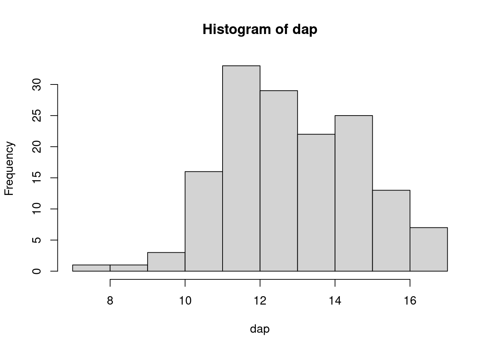
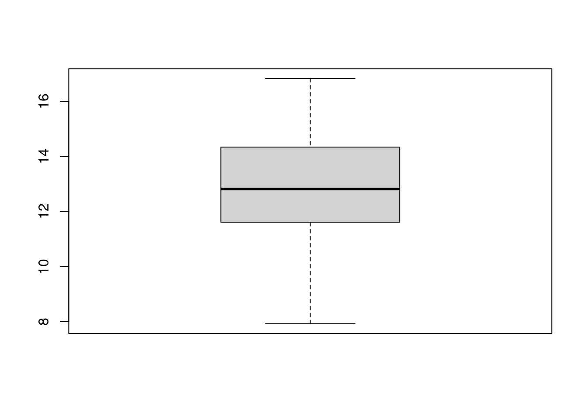
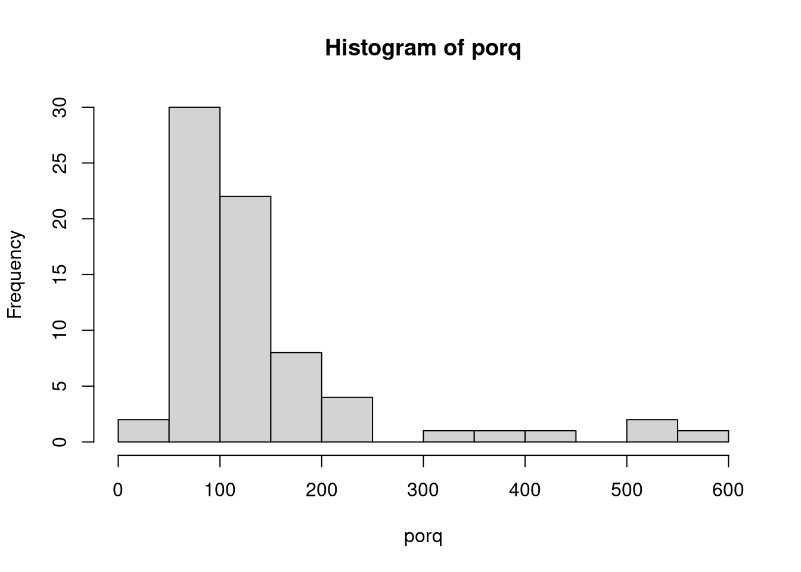
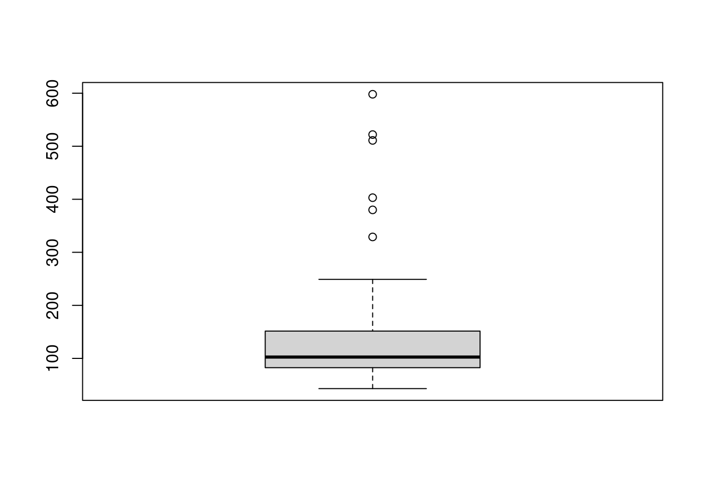
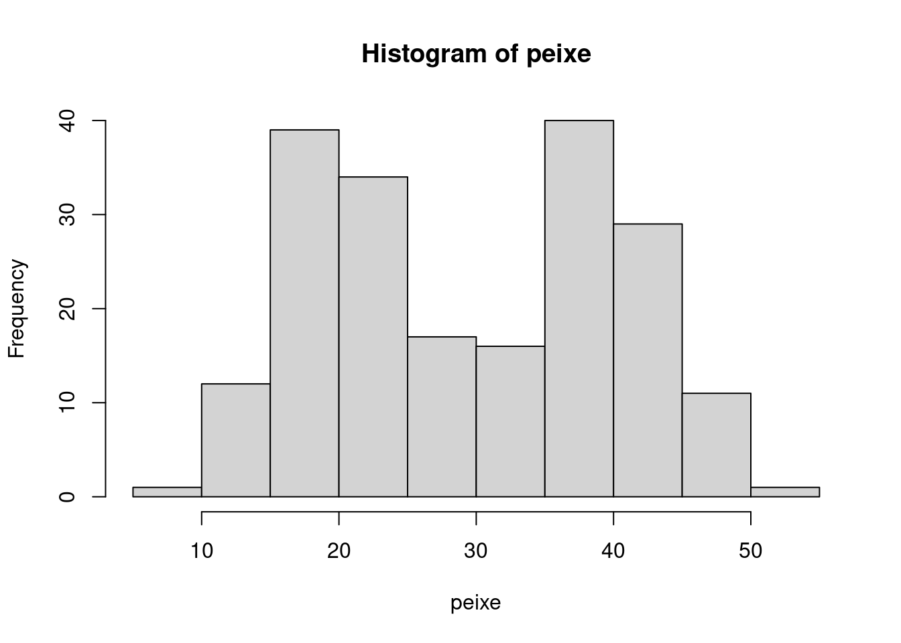
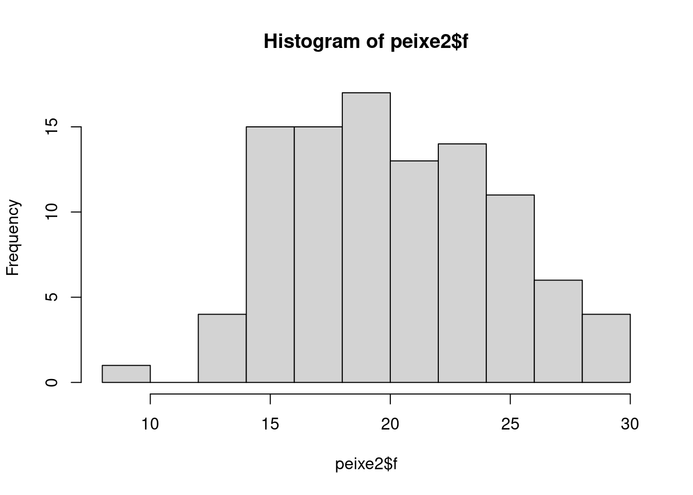
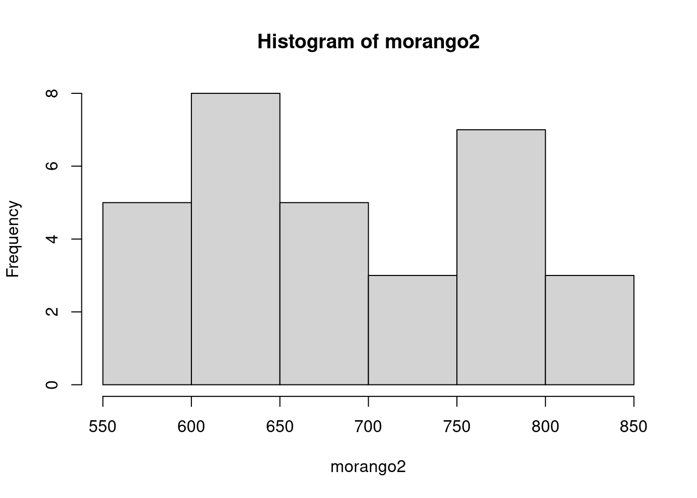

# Estatística Básica {#estbas}


Neste capítulo, iremos estudar alguns itens que podem ser compreendidos como a base das análises estatísticas, pois são usados transversalmente em muitos outros assuntos tratados posteriormente.

Para facilitar o entendimento, alguns dos próximos exemplos (deste e dos próximos capítulos) utilizarão os dados obtidos em uma população conforme descrito a seguir.

Considere uma população com 150 árvores pertencente a um reflorestamento de Mogno Africano. O DAP destas árvores foi medido aos 5 anos após o plantio e os dados são mostrados na tabela abaixo:


```{=html}
<div id="bcekuceuya" style="overflow-x:auto;overflow-y:auto;width:auto;height:auto;">
<style>html {
  font-family: -apple-system, BlinkMacSystemFont, 'Segoe UI', Roboto, Oxygen, Ubuntu, Cantarell, 'Helvetica Neue', 'Fira Sans', 'Droid Sans', Arial, sans-serif;
}

#bcekuceuya .gt_table {
  display: table;
  border-collapse: collapse;
  margin-left: auto;
  margin-right: auto;
  color: #333333;
  font-size: 16px;
  font-weight: normal;
  font-style: normal;
  background-color: #FFFFFF;
  width: auto;
  border-top-style: solid;
  border-top-width: 2px;
  border-top-color: #A8A8A8;
  border-right-style: none;
  border-right-width: 2px;
  border-right-color: #D3D3D3;
  border-bottom-style: solid;
  border-bottom-width: 2px;
  border-bottom-color: #A8A8A8;
  border-left-style: none;
  border-left-width: 2px;
  border-left-color: #D3D3D3;
}

#bcekuceuya .gt_heading {
  background-color: #FFFFFF;
  text-align: center;
  border-bottom-color: #FFFFFF;
  border-left-style: none;
  border-left-width: 1px;
  border-left-color: #D3D3D3;
  border-right-style: none;
  border-right-width: 1px;
  border-right-color: #D3D3D3;
}

#bcekuceuya .gt_title {
  color: #333333;
  font-size: 125%;
  font-weight: initial;
  padding-top: 4px;
  padding-bottom: 4px;
  padding-left: 5px;
  padding-right: 5px;
  border-bottom-color: #FFFFFF;
  border-bottom-width: 0;
}

#bcekuceuya .gt_subtitle {
  color: #333333;
  font-size: 85%;
  font-weight: initial;
  padding-top: 0;
  padding-bottom: 6px;
  padding-left: 5px;
  padding-right: 5px;
  border-top-color: #FFFFFF;
  border-top-width: 0;
}

#bcekuceuya .gt_bottom_border {
  border-bottom-style: solid;
  border-bottom-width: 2px;
  border-bottom-color: #D3D3D3;
}

#bcekuceuya .gt_col_headings {
  border-top-style: solid;
  border-top-width: 2px;
  border-top-color: #D3D3D3;
  border-bottom-style: solid;
  border-bottom-width: 2px;
  border-bottom-color: #D3D3D3;
  border-left-style: none;
  border-left-width: 1px;
  border-left-color: #D3D3D3;
  border-right-style: none;
  border-right-width: 1px;
  border-right-color: #D3D3D3;
}

#bcekuceuya .gt_col_heading {
  color: #333333;
  background-color: #FFFFFF;
  font-size: 100%;
  font-weight: normal;
  text-transform: inherit;
  border-left-style: none;
  border-left-width: 1px;
  border-left-color: #D3D3D3;
  border-right-style: none;
  border-right-width: 1px;
  border-right-color: #D3D3D3;
  vertical-align: bottom;
  padding-top: 5px;
  padding-bottom: 6px;
  padding-left: 5px;
  padding-right: 5px;
  overflow-x: hidden;
}

#bcekuceuya .gt_column_spanner_outer {
  color: #333333;
  background-color: #FFFFFF;
  font-size: 100%;
  font-weight: normal;
  text-transform: inherit;
  padding-top: 0;
  padding-bottom: 0;
  padding-left: 4px;
  padding-right: 4px;
}

#bcekuceuya .gt_column_spanner_outer:first-child {
  padding-left: 0;
}

#bcekuceuya .gt_column_spanner_outer:last-child {
  padding-right: 0;
}

#bcekuceuya .gt_column_spanner {
  border-bottom-style: solid;
  border-bottom-width: 2px;
  border-bottom-color: #D3D3D3;
  vertical-align: bottom;
  padding-top: 5px;
  padding-bottom: 5px;
  overflow-x: hidden;
  display: inline-block;
  width: 100%;
}

#bcekuceuya .gt_group_heading {
  padding-top: 8px;
  padding-bottom: 8px;
  padding-left: 5px;
  padding-right: 5px;
  color: #333333;
  background-color: #FFFFFF;
  font-size: 100%;
  font-weight: initial;
  text-transform: inherit;
  border-top-style: solid;
  border-top-width: 2px;
  border-top-color: #D3D3D3;
  border-bottom-style: solid;
  border-bottom-width: 2px;
  border-bottom-color: #D3D3D3;
  border-left-style: none;
  border-left-width: 1px;
  border-left-color: #D3D3D3;
  border-right-style: none;
  border-right-width: 1px;
  border-right-color: #D3D3D3;
  vertical-align: middle;
}

#bcekuceuya .gt_empty_group_heading {
  padding: 0.5px;
  color: #333333;
  background-color: #FFFFFF;
  font-size: 100%;
  font-weight: initial;
  border-top-style: solid;
  border-top-width: 2px;
  border-top-color: #D3D3D3;
  border-bottom-style: solid;
  border-bottom-width: 2px;
  border-bottom-color: #D3D3D3;
  vertical-align: middle;
}

#bcekuceuya .gt_from_md > :first-child {
  margin-top: 0;
}

#bcekuceuya .gt_from_md > :last-child {
  margin-bottom: 0;
}

#bcekuceuya .gt_row {
  padding-top: 8px;
  padding-bottom: 8px;
  padding-left: 5px;
  padding-right: 5px;
  margin: 10px;
  border-top-style: solid;
  border-top-width: 1px;
  border-top-color: #D3D3D3;
  border-left-style: none;
  border-left-width: 1px;
  border-left-color: #D3D3D3;
  border-right-style: none;
  border-right-width: 1px;
  border-right-color: #D3D3D3;
  vertical-align: middle;
  overflow-x: hidden;
}

#bcekuceuya .gt_stub {
  color: #333333;
  background-color: #FFFFFF;
  font-size: 100%;
  font-weight: initial;
  text-transform: inherit;
  border-right-style: solid;
  border-right-width: 2px;
  border-right-color: #D3D3D3;
  padding-left: 5px;
  padding-right: 5px;
}

#bcekuceuya .gt_stub_row_group {
  color: #333333;
  background-color: #FFFFFF;
  font-size: 100%;
  font-weight: initial;
  text-transform: inherit;
  border-right-style: solid;
  border-right-width: 2px;
  border-right-color: #D3D3D3;
  padding-left: 5px;
  padding-right: 5px;
  vertical-align: top;
}

#bcekuceuya .gt_row_group_first td {
  border-top-width: 2px;
}

#bcekuceuya .gt_summary_row {
  color: #333333;
  background-color: #FFFFFF;
  text-transform: inherit;
  padding-top: 8px;
  padding-bottom: 8px;
  padding-left: 5px;
  padding-right: 5px;
}

#bcekuceuya .gt_first_summary_row {
  border-top-style: solid;
  border-top-color: #D3D3D3;
}

#bcekuceuya .gt_first_summary_row.thick {
  border-top-width: 2px;
}

#bcekuceuya .gt_last_summary_row {
  padding-top: 8px;
  padding-bottom: 8px;
  padding-left: 5px;
  padding-right: 5px;
  border-bottom-style: solid;
  border-bottom-width: 2px;
  border-bottom-color: #D3D3D3;
}

#bcekuceuya .gt_grand_summary_row {
  color: #333333;
  background-color: #FFFFFF;
  text-transform: inherit;
  padding-top: 8px;
  padding-bottom: 8px;
  padding-left: 5px;
  padding-right: 5px;
}

#bcekuceuya .gt_first_grand_summary_row {
  padding-top: 8px;
  padding-bottom: 8px;
  padding-left: 5px;
  padding-right: 5px;
  border-top-style: double;
  border-top-width: 6px;
  border-top-color: #D3D3D3;
}

#bcekuceuya .gt_striped {
  background-color: rgba(128, 128, 128, 0.05);
}

#bcekuceuya .gt_table_body {
  border-top-style: solid;
  border-top-width: 2px;
  border-top-color: #D3D3D3;
  border-bottom-style: solid;
  border-bottom-width: 2px;
  border-bottom-color: #D3D3D3;
}

#bcekuceuya .gt_footnotes {
  color: #333333;
  background-color: #FFFFFF;
  border-bottom-style: none;
  border-bottom-width: 2px;
  border-bottom-color: #D3D3D3;
  border-left-style: none;
  border-left-width: 2px;
  border-left-color: #D3D3D3;
  border-right-style: none;
  border-right-width: 2px;
  border-right-color: #D3D3D3;
}

#bcekuceuya .gt_footnote {
  margin: 0px;
  font-size: 90%;
  padding-left: 4px;
  padding-right: 4px;
  padding-left: 5px;
  padding-right: 5px;
}

#bcekuceuya .gt_sourcenotes {
  color: #333333;
  background-color: #FFFFFF;
  border-bottom-style: none;
  border-bottom-width: 2px;
  border-bottom-color: #D3D3D3;
  border-left-style: none;
  border-left-width: 2px;
  border-left-color: #D3D3D3;
  border-right-style: none;
  border-right-width: 2px;
  border-right-color: #D3D3D3;
}

#bcekuceuya .gt_sourcenote {
  font-size: 90%;
  padding-top: 4px;
  padding-bottom: 4px;
  padding-left: 5px;
  padding-right: 5px;
}

#bcekuceuya .gt_left {
  text-align: left;
}

#bcekuceuya .gt_center {
  text-align: center;
}

#bcekuceuya .gt_right {
  text-align: right;
  font-variant-numeric: tabular-nums;
}

#bcekuceuya .gt_font_normal {
  font-weight: normal;
}

#bcekuceuya .gt_font_bold {
  font-weight: bold;
}

#bcekuceuya .gt_font_italic {
  font-style: italic;
}

#bcekuceuya .gt_super {
  font-size: 65%;
}

#bcekuceuya .gt_two_val_uncert {
  display: inline-block;
  line-height: 1em;
  text-align: right;
  font-size: 60%;
  vertical-align: -0.25em;
  margin-left: 0.1em;
}

#bcekuceuya .gt_footnote_marks {
  font-style: italic;
  font-weight: normal;
  font-size: 75%;
  vertical-align: 0.4em;
}

#bcekuceuya .gt_asterisk {
  font-size: 100%;
  vertical-align: 0;
}

#bcekuceuya .gt_slash_mark {
  font-size: 0.7em;
  line-height: 0.7em;
  vertical-align: 0.15em;
}

#bcekuceuya .gt_fraction_numerator {
  font-size: 0.6em;
  line-height: 0.6em;
  vertical-align: 0.45em;
}

#bcekuceuya .gt_fraction_denominator {
  font-size: 0.6em;
  line-height: 0.6em;
  vertical-align: -0.05em;
}
</style>
<table class="gt_table">
  
  
  <tbody class="gt_table_body">
    <tr><td class="gt_row gt_right">14.80</td>
<td class="gt_row gt_right">12.26</td>
<td class="gt_row gt_right">13.77</td>
<td class="gt_row gt_right">14.28</td>
<td class="gt_row gt_right">15.01</td>
<td class="gt_row gt_right">12.83</td>
<td class="gt_row gt_right">14.98</td>
<td class="gt_row gt_right">14.77</td>
<td class="gt_row gt_right">12.88</td>
<td class="gt_row gt_right">13.77</td></tr>
    <tr><td class="gt_row gt_right">11.59</td>
<td class="gt_row gt_right">14.44</td>
<td class="gt_row gt_right">12.52</td>
<td class="gt_row gt_right">14.12</td>
<td class="gt_row gt_right">10.44</td>
<td class="gt_row gt_right">16.19</td>
<td class="gt_row gt_right">13.59</td>
<td class="gt_row gt_right">10.92</td>
<td class="gt_row gt_right">11.42</td>
<td class="gt_row gt_right">15.64</td></tr>
    <tr><td class="gt_row gt_right">13.54</td>
<td class="gt_row gt_right">10.87</td>
<td class="gt_row gt_right">12.80</td>
<td class="gt_row gt_right">16.48</td>
<td class="gt_row gt_right">14.78</td>
<td class="gt_row gt_right">15.31</td>
<td class="gt_row gt_right">16.83</td>
<td class="gt_row gt_right">14.69</td>
<td class="gt_row gt_right">12.63</td>
<td class="gt_row gt_right">13.09</td></tr>
    <tr><td class="gt_row gt_right">12.79</td>
<td class="gt_row gt_right">11.78</td>
<td class="gt_row gt_right">10.94</td>
<td class="gt_row gt_right">13.77</td>
<td class="gt_row gt_right">13.48</td>
<td class="gt_row gt_right">10.60</td>
<td class="gt_row gt_right">13.00</td>
<td class="gt_row gt_right">13.78</td>
<td class="gt_row gt_right">12.38</td>
<td class="gt_row gt_right">7.92</td></tr>
    <tr><td class="gt_row gt_right">15.59</td>
<td class="gt_row gt_right">11.02</td>
<td class="gt_row gt_right">11.85</td>
<td class="gt_row gt_right">13.50</td>
<td class="gt_row gt_right">14.97</td>
<td class="gt_row gt_right">13.49</td>
<td class="gt_row gt_right">13.80</td>
<td class="gt_row gt_right">15.21</td>
<td class="gt_row gt_right">14.14</td>
<td class="gt_row gt_right">12.22</td></tr>
    <tr><td class="gt_row gt_right">11.46</td>
<td class="gt_row gt_right">14.42</td>
<td class="gt_row gt_right">13.32</td>
<td class="gt_row gt_right">11.39</td>
<td class="gt_row gt_right">14.55</td>
<td class="gt_row gt_right">10.04</td>
<td class="gt_row gt_right">15.13</td>
<td class="gt_row gt_right">11.09</td>
<td class="gt_row gt_right">12.05</td>
<td class="gt_row gt_right">10.98</td></tr>
    <tr><td class="gt_row gt_right">11.96</td>
<td class="gt_row gt_right">10.78</td>
<td class="gt_row gt_right">11.49</td>
<td class="gt_row gt_right">11.80</td>
<td class="gt_row gt_right">10.87</td>
<td class="gt_row gt_right">12.91</td>
<td class="gt_row gt_right">12.48</td>
<td class="gt_row gt_right">10.34</td>
<td class="gt_row gt_right">12.79</td>
<td class="gt_row gt_right">11.73</td></tr>
    <tr><td class="gt_row gt_right">10.84</td>
<td class="gt_row gt_right">11.69</td>
<td class="gt_row gt_right">13.78</td>
<td class="gt_row gt_right">11.21</td>
<td class="gt_row gt_right">15.16</td>
<td class="gt_row gt_right">11.79</td>
<td class="gt_row gt_right">11.96</td>
<td class="gt_row gt_right">14.34</td>
<td class="gt_row gt_right">13.63</td>
<td class="gt_row gt_right">12.86</td></tr>
    <tr><td class="gt_row gt_right">12.09</td>
<td class="gt_row gt_right">10.36</td>
<td class="gt_row gt_right">12.59</td>
<td class="gt_row gt_right">16.02</td>
<td class="gt_row gt_right">12.00</td>
<td class="gt_row gt_right">14.24</td>
<td class="gt_row gt_right">13.70</td>
<td class="gt_row gt_right">12.09</td>
<td class="gt_row gt_right">11.84</td>
<td class="gt_row gt_right">9.86</td></tr>
    <tr><td class="gt_row gt_right">12.75</td>
<td class="gt_row gt_right">11.05</td>
<td class="gt_row gt_right">15.00</td>
<td class="gt_row gt_right">10.64</td>
<td class="gt_row gt_right">12.89</td>
<td class="gt_row gt_right">11.48</td>
<td class="gt_row gt_right">13.89</td>
<td class="gt_row gt_right">11.84</td>
<td class="gt_row gt_right">11.95</td>
<td class="gt_row gt_right">11.99</td></tr>
    <tr><td class="gt_row gt_right">12.29</td>
<td class="gt_row gt_right">15.57</td>
<td class="gt_row gt_right">12.50</td>
<td class="gt_row gt_right">15.84</td>
<td class="gt_row gt_right">8.78</td>
<td class="gt_row gt_right">11.29</td>
<td class="gt_row gt_right">10.16</td>
<td class="gt_row gt_right">11.65</td>
<td class="gt_row gt_right">15.60</td>
<td class="gt_row gt_right">14.07</td></tr>
    <tr><td class="gt_row gt_right">11.61</td>
<td class="gt_row gt_right">13.88</td>
<td class="gt_row gt_right">13.47</td>
<td class="gt_row gt_right">16.68</td>
<td class="gt_row gt_right">12.91</td>
<td class="gt_row gt_right">14.52</td>
<td class="gt_row gt_right">15.55</td>
<td class="gt_row gt_right">10.00</td>
<td class="gt_row gt_right">13.76</td>
<td class="gt_row gt_right">12.22</td></tr>
    <tr><td class="gt_row gt_right">14.15</td>
<td class="gt_row gt_right">14.57</td>
<td class="gt_row gt_right">16.71</td>
<td class="gt_row gt_right">13.46</td>
<td class="gt_row gt_right">12.10</td>
<td class="gt_row gt_right">11.36</td>
<td class="gt_row gt_right">12.60</td>
<td class="gt_row gt_right">13.33</td>
<td class="gt_row gt_right">16.45</td>
<td class="gt_row gt_right">9.80</td></tr>
    <tr><td class="gt_row gt_right">14.87</td>
<td class="gt_row gt_right">15.46</td>
<td class="gt_row gt_right">15.38</td>
<td class="gt_row gt_right">10.96</td>
<td class="gt_row gt_right">13.91</td>
<td class="gt_row gt_right">12.64</td>
<td class="gt_row gt_right">14.39</td>
<td class="gt_row gt_right">11.69</td>
<td class="gt_row gt_right">11.05</td>
<td class="gt_row gt_right">11.55</td></tr>
    <tr><td class="gt_row gt_right">10.74</td>
<td class="gt_row gt_right">14.46</td>
<td class="gt_row gt_right">11.16</td>
<td class="gt_row gt_right">12.49</td>
<td class="gt_row gt_right">12.85</td>
<td class="gt_row gt_right">14.55</td>
<td class="gt_row gt_right">11.98</td>
<td class="gt_row gt_right">14.24</td>
<td class="gt_row gt_right">14.87</td>
<td class="gt_row gt_right">11.13</td></tr>
  </tbody>
  
  
</table>
</div>
```


Os dados também podem ser acessados no arquivo [dap.csv](data/dap.csv).


## Medidas de centro

**Média**

A média aritmética é a medida de centro mais comum.

**Mediana**

É o ponto do meio de uma distribuição, o número em relação ao qual metade das observações é menor, e metade, maior.


:::{.example #centro name="Medidas de centro"}

Considere o conjunto de dados [dap.csv](data/dap.csv).

Qual a média e qual a mediana destes dados?


```r
# média
mean(dap)
```

```
## [1] 12.94553
```

```r
# mediana
median(dap)
```

```
## [1] 12.815
```


:::


## Medidas de dispersão

As medidas de dispersão descrevem a variabilidade dos dados.

### Quartil

Os *quartis* delimitam a metade central. 

* O primeiro quartil (Q1) cai em um quarto do caminho da lista. 
* O terceiro quartil (Q3) cai em três quartos do caminho na lista.
* A Amplitude interquartil (AIQ) é a diferença entre o 3º e 1º quartil

Conhecendo os quartis, podemos descrever uma distribuição com um Resumo de cinco números. São eles:

* menor observação
* primeiro quartil
* mediana
* terceiro quartil
* maior observação


:::{.example #cinco name="Resumo dos cinco números"}

Considere o conjunto de dados [dap.csv](data/dap.csv).

Qual o Resumo de cinco números para estes dados?


```r
quantile(dap)
```

```
##     0%    25%    50%    75%   100% 
##  7.920 11.620 12.815 14.325 16.830
```

:::

### Variância e desvio-padrão

São as descrições numéricas mais comuns de uma distribuição.

A variância s^2^ de um conjunto de observações é a média dos quadrados dos desvios das observações a partir de sua média.

O desvio-padrão s é a raiz quadrada da variância s^2^.

:::{.example #desvio name="Variância e desvio-padrão"}

Considere o conjunto de dados [dap.csv](data/dap.csv).

Qual a variância e o desvio-padrão destes dados?^[As funções `var` e `sd` utilizam o denominador n-1 no cálculo, que não é adequado para o cálculo da variância e desvio-padrão de uma população. No entanto, para uma população de tamanho grande, as diferenças são desprezíveis.]


```r
# Variância
var(dap)
```

```
## [1] 3.168652
```

```r
# Desvio-padrão
sd(dap)
```

```
## [1] 1.780071
```

:::


## Descrição de uma distribuição

Qualquer conjunto de dados pode (e deve) ser descrito por meio dos resumos numéricos juntamente com a análise gráfica (Seção \@ref(graf_dist).

Essa descrição visa também verificar a assimetria dos dados e a presença de valores discrepantes.

:::{.example #desc1 name="Descrição de uma distribuição simétrica"}

Considere o conjunto de dados [dap.csv](data/dap.csv).

Descreva esta distribuição com o uso de gráficos e resumos numéricos.


```r
# Histograma
 hist(dap)
```



```r
# Diagrama de ramo e folhas
stem(dap)
```

```
## 
##   The decimal point is at the |
## 
##    7 | 9
##    8 | 
##    8 | 8
##    9 | 
##    9 | 89
##   10 | 002344
##   10 | 667889999
##   11 | 0001111223444
##   11 | 5556667777888889
##   12 | 000000111122334
##   12 | 5555666688888999999
##   13 | 0133
##   13 | 5555556678888888999
##   14 | 11122233444
##   14 | 55666788899
##   15 | 000012234
##   15 | 5666668
##   16 | 02
##   16 | 55778
```

```r
# Box-plot
boxplot(dap)
```



Esta é uma distribuição simétrica e que não possui valores atípicos. 

O DAP média da população é de 12.95 cm com desvio-padrão de 1.78.

::: 


Vejamos outro exemplo com uma distribuição bastante diferente


:::{.example #desc2 name="Descrição de uma distribuição assimétrica"}

Considere os dados do tempo de sobrevivência de porquinhos-da-índia após terem recebido uma injeção de bactéria infecciosa em um experimento médico.

Os dados podem ser encontrados no arquivo [porquinho.xlsx](data/porquinho.xlsx)


```r
# Histograma
 hist(porq)
```



```r
# Diagrama de ramo e folhas
stem(porq)
```

```
## 
##   The decimal point is 2 digit(s) to the right of the |
## 
##   0 | 455666677778888888888999999
##   1 | 0000000000011111222334444556678889
##   2 | 01145
##   3 | 38
##   4 | 0
##   5 | 12
##   6 | 0
```

```r
# Box-plot
boxplot(porq)
```



A distribuição é assimétrica á direita. A mediana da distribuição é 102.5. 

O resumo de cinco números é 43, 82.75, 102.5, 149.25, 598

Metade dos porquinhos-da-índia morrem dentro dos primeiros 102 dias. Quase todos não sobrevivem até 149 dias.

No entanto, alguns poucos animais sobrevivem mais, de modo que o gráfico se estende mais para a direita do pico, até o valor mais alto de 598 dias.

Tempos de sobrevivência, seja de máquinas sob esforço ou de pacientes depois de um tratamento, em geral, são assimétricos à direita.

::: 


Muitas vezes, uma distribuição pode apresentar dois (ou mais) picos. A existência de mais de um pico sugere que indívíduos de vários tipos estão misturados no conjunto de dados.

:::{.example #desc3 name="Descrição de uma distribuição bimodal"}


  
Considere o conjunto de dados [peixe.csv](data/peixe.csv) que contém o comprimento (em cm) de vários peixes apanhados em um rio.


```r
# Histograma
 hist(peixe)
```



```r
# Diagrama de ramo e folhas
stem(peixe)
```

```
## 
##   The decimal point is at the |
## 
##    8 | 5
##   10 | 
##   12 | 646
##   14 | 013467789114579
##   16 | 0122557900144577
##   18 | 1277780145566788
##   20 | 0822222458999
##   22 | 022389125668999
##   24 | 4579900348
##   26 | 02456135
##   28 | 072356
##   30 | 15
##   32 | 012591234
##   34 | 336801236
##   36 | 000344678901145556679
##   38 | 00159001335577
##   40 | 025682556899
##   42 | 03555578012356
##   44 | 02475569
##   46 | 456815
##   48 | 6
##   50 | 2
```

Esta é uma distribuição bimodal, ou seja, tem dois picos, que representam peixes menores e maiores. 

A média da distribuição é 29.67 cm. Veja que este valor pouco representa a distribuição, pois a média está no *"vale"* entre os picos, ou seja, uma região que contém poucos valores. 

Os dois picos podem refletir um dimorfismo sexual (machos maiores que fêmeas ou vice-versa) ou a presença de duas raças de peixes no rio.


A descrição separada das duas distribuições pode ser bem mais útil. Veja o arquivo [peixe2.csv](data/peixe2.csv)


```r
# Histograma para peixes machos
hist(peixe2$m)
```


```r
# Histograma para peixes fêmeas
hist(peixe2$f)
```



A média do tamanho dos peixes machos é 39.1 cm e dos peixes fêmeas é 20.3 cm.


:::


Por fim, pode haver nas distribuições um ou alguns poucos valores discrepantes, ou seja, valores que diferem consideravelmente dos demais. Muito frequentemente, também são chamados de *outliers.*


:::{.example #descdiscrepante name="Descrição de uma distribuição com valores discrepantes"}


Considere os dados de produção de morango (em g/planta) contidos no arquivo [morango.csv](data/morango.csv).


```r
# Histograma
 hist(morango)
```


```r
# Diagrama de ramo e folhas
stem(morango)
```

```
## 
##   The decimal point is 3 digit(s) to the right of the |
## 
##   0 | 6666666666666777777778888888888
##   1 | 
##   2 | 
##   3 | 
##   4 | 
##   5 | 
##   6 | 9
```

```r
# Box-plot
boxplot(morango)
```


Esta distribuição apresenta claramente um valor discrepante: 6870 g na posição 10 do conjunto de dados.

A média da distribuição é 883.8 g e a mediana é 670 g.

O desvio-padrão é 1095.4 e o resumo de cinco números é 568, 628.25, 670, 772.25, 6870.


Ao se excluir este valor discrepante (*outlier*), veja como fica a distribuição.


```r
morango2 <- morango 
morango2[10] <- NA

# Histograma
 hist(morango2)
```



```r
# Diagrama de ramo e folhas
stem(morango2)
```

```
## 
##   The decimal point is 2 digit(s) to the right of the |
## 
##   5 | 79999
##   6 | 0023334
##   6 | 556689
##   7 | 344
##   7 | 6777899
##   8 | 233
```

```r
# Box-plot
boxplot(morango2)
```


Agora, conseguimos ver que a distribuição é simétrica. 

A média é 690.7 g e a mediana é 664 g.

O desvio-padrão é 83.4 e o resumo de cinco números é 568, 626.5, 664, 771.5, 829.

:::

## Comparação média/mediana

O exemplo \@ref(exm:descdiscrepante) ilustra um fato importante sobre a média como medida de centro: ela é muito sensível a observações extremas, como em uma distribuição assimétrica ou na presença de valores atípicos.

Como a média não pode resistir à influência de observações extremas, dizemos que ela não é uma medida resistente de centro. 

Ao contrário, a mediana é influenciada apenas pelo número total de pontos de dados e pelo valor numérico do ponto, ou pontos, localizado no centro da distribuição. 

A média e a mediana de uma distribuição razoavelmente simétrica estão bem próximas uma da outra. 

Se a distribuição for exatamente simétrica, a média e a mediana serão exatamente iguais.

Em uma distribuição assimétrica, a média está, em geral, numa posição mais extrema na cauda longa do que a mediana.


Assim como a média, o desvio-padrão *s* não é resistente. Algumas observações atípicas podem tornar *s* bastante grande.

Como o desvio-padrão mede a dispersão em torno da média, deve ser usado apenas quando a média for escolhida como a medida de centro.

