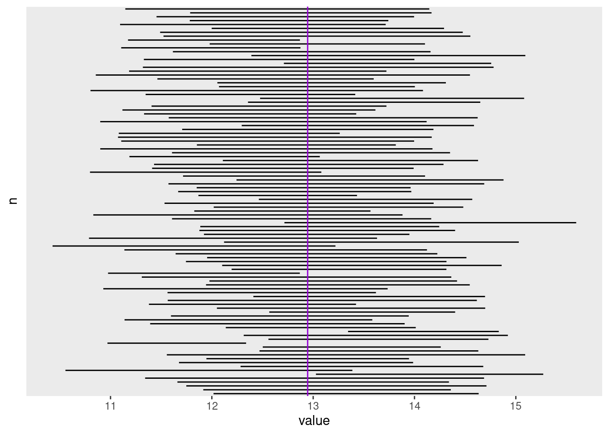
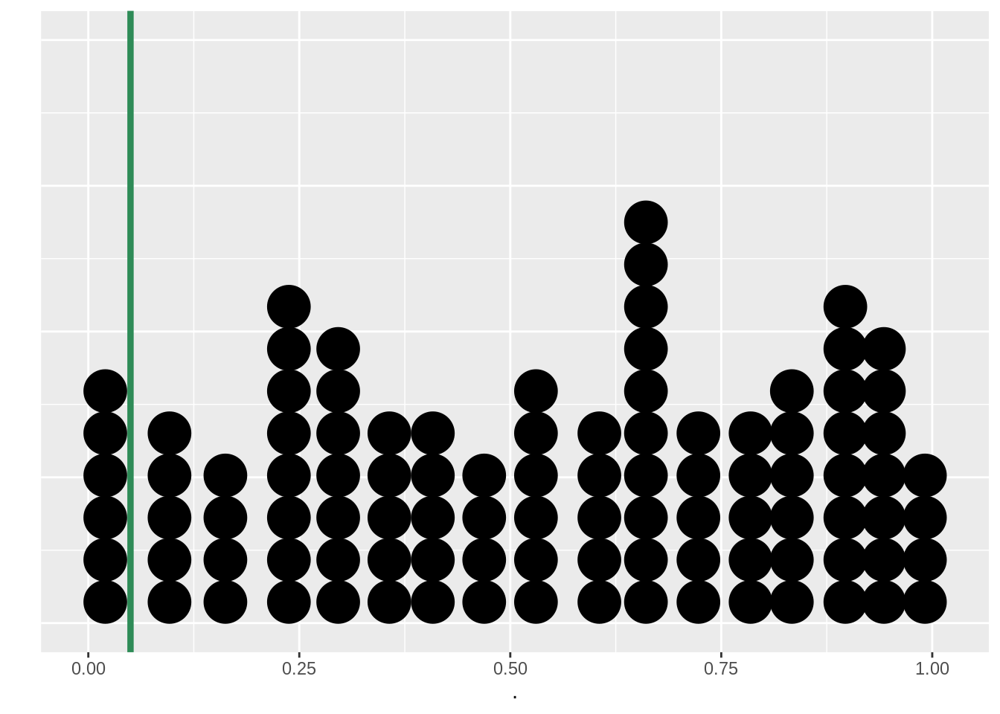

# Introdução à inferência

A inferência estatística fornece métodos para se tirarem conclusões sobre uma população a partir de dados amostrais.

* Intervalos de confiança: para se estimar o valor de um parâmetro de uma população;
* Testes de significância ou Teste de hipóteses: para se avaliar a evidência a favor ou contra uma afirmativa sobre uma população. 

Assim, o objetivo de uma amostragem é inferirmos, a partir dos dados amostrais, alguma conclusão sobre a população mais ampla que a amostra representa, associada a uma probabilidade. 

Nos exemplos deste capítulo, utilizaremos a população descrita no início do capítulo \@ref(estbas). Também iremos utilizar um processo de amostragem aleatório para extrair amostra(s) desta população.


## Intervalo de Confiança para a média populacional

O Intervalo de Confiança (IC) é uma estimativa de um intervalo que contém um parâmetro populacional.

Utilizaremos a função `t.test` para calcular um Intervalo de Confiança para a média.


:::{.example #icm name="Intervalo de Confiança para a média"}

Considere o conjunto de dados [dap.csv](data/dap.csv). Por serem dados de uma população, vamos fazer uma amostragem (`sample`) de 10 indivíduos e calcular o IC de 95% ^[valor padrão da função `t.test`].


```r
sample(dap, 10) %>% t.test()
```

```
## 
## 	One Sample t-test
## 
## data:  .
## t = 23.04, df = 9, p-value = 2.598e-09
## alternative hypothesis: true mean is not equal to 0
## 95 percent confidence interval:
##  12.01668 14.63332
## sample estimates:
## mean of x 
##    13.325
```

O *output* da função `t.test` contém muitas informções, mas por hora, vamos nos focar apenas no intervalo de confiança, indicado pelo texto *95 percent confidence interval*

Assim, o intervalo de confiança para a média populacional desta amostra está entre 12.02 e 14.63. Em outras palavras, estamos 95% confiantes que a média populacional do DAP de árvores de Mogno Africano está compreendidade entre 12.02 cm e 14.63 cm.

O valor da média amostral, 13.33 cm, é a estimativa central e pode ser entendida como uma estimativa não enviesada da média populacional. 

:::

A amostra deste exemplo vem de uma população conhecida, cuja média populacional é 12.95 cm. Vejam que a média amostral e a média populacional diferem entre si, mas o IC calculado contém a média populacional. 

A interpretação que devemos fazer do IC de 95% é que 95 em 100 amostras feitas na população irão conter a média populacional. Vejamos a explicação no exemplo \@ref(exm:icsimula) com o uso de simulação.


:::{.example #icsimula name="Intervalo de Confiança para a média - simulações"}

Considere o conjunto de dados [dap.csv](data/dap.csv). 

Inicialmente, criamos uma função que faz uma amostragem de *n* elementos e retorna os valores inferior e superior do IC calculado. 


```r
## Função que amostra n elementos e retorna os valores inferior e superior do IC calculado
## data = conjunto de dados de onde será retirada a amostra
## n_sample = tamanho da amostra
ic_amostr <- function(data, n_sample, ...) {
  ic_sample <- sample(data, n_sample) %>% t.test(...)
  return(ic_sample$conf.int)
}
```

Em seguida, com o uso da função `replicate`, realizamos 100^[É possível realizar mais simulações, por exemplo, 10 mil] simulações deste processo:


```r
## 100 simulações com a função replicate
ic_simul <- replicate(100, ic_amostr(dap, 10))

## mostrar apenas os primeiros valores do resultado
ic_simul %>%
  t() %>%
  head()
```

```
##          [,1]     [,2]
## [1,] 12.01668 14.63332
## [2,] 11.91541 14.35859
## [3,] 11.74785 14.71015
## [4,] 11.66021 14.33979
## [5,] 11.34152 14.68648
## [6,] 13.02743 15.27057
```

Quantos dos IC simulados não contém a verdadeira média^[Este valor já é conhecido: 12.95] populacional?


Por meio de uma análise gráfica:

<div class="figure">

<p class="caption">(\#fig:unnamed-chunk-7)Intervalos de confiança simulados para várias amostragens de uma população. A média populacional é representada pela linha vertical violeta.</p>
</div>

Calculando a proporção de ICs que não contém a média populacional:


```r
(ic_simul[1, ] > mean(dap) | ic_simul[2, ] < mean(dap)) %>% mean()
```

```
## [1] 0.06
```

Estes resultados mostram que 6 dos 100 ICs simulados não contém a média populacional. Para um IC de 95%, está 
bem próximo do valor esperado. 

:::

Também é possível alterar a probabilidade do IC, com o argumento `conf.level` da função `t.test`.


```r
sample(dap, 10) %>% t.test(conf.level=0.99)
```

```
## 
## 	One Sample t-test
## 
## data:  .
## t = 23.04, df = 9, p-value = 2.598e-09
## alternative hypothesis: true mean is not equal to 0
## 99 percent confidence interval:
##  11.44546 15.20454
## sample estimates:
## mean of x 
##    13.325
```

O Intervalo de confiança para a média com 99% de probabilidade está entre 11.45 e 15.2. Estamos 99% confiantes de que o valor da média populacional esteja entre 11.45 e 15.2. Observe que o intervalo do IC é maior quando aumentamos o nível de significância.


## O teste t para uma amostra

O teste t para uma amostra compara uma média amostral com um valor sob hipótese nula. 

O teste é planejado para se avaliar a força da evidência contra a hipótese nula, ou seja, a hipótese nula é verdadeira até que se prove o contrário.

Como regra de decisão, comparamos o p-valor do teste com um valor de probabilidade definido anteriormente, formalmente conhecido como α.
  
  * Se p-valor < α então rejeito a hipótese H~0~
  * Se p-valor >= α então não rejeito a hipótese H~0~

O p-valor é definido como a probabilidade calculada de que, supondo a hipótese nula verdadeira, o teste assuma um valor tão ou mais extremo que o valor realmente observado. Em outras palavras, é o menor valor de α para o qual ainda rejeitamos a hipótese H~0~.

O valor de α mais comumente utilizado é de 0,05 ou 5%. No entanto, dependendo da área de conhecimento, este valor pode ser maior ou menor. 

Antes de realizar qualquer teste de hipóteses, como o teste t, as hipóteses devem ser claramente descritas.

Hipóteses:
* H~0~: hipótese nula, ou seja, a afirmativa a ser testada.

* H~1~ ou H~a~: a hipótese alternativa, ou seja, uma afirmativa que contradiz a hipótese nula. 

As hipóteses alternativas podem ter três configurações, conforme o tipo do teste:

1. Teste bilateral: quando H~1~ afirma que o valor é diferente do valor da hipótese nula;
1. Teste unilateral à direita: quando H~1~ afirma que o valor é maior que o valor da hipótese nula;
1. Teste unilateral à esquerda: quando H~1~ afirma que o valor é menor que o valor da hipótese nula.


:::{.example #t1 name="Teste t para uma amostra"}

Considere o conjunto de dados [dap.csv](data/dap.csv). Faça uma amostra de 10 indivíduos da população e verifique a hipótese de que a média amostral difere da média populacional.

Primeiramente, devemos estabelecer as hipóteses:

* H~0~: esta amostra vem de uma população cuja média populacional é igual a 12.95
* H~1~: esta amostra vem de uma população cuja média populacional é diferente de 12.95

Na função `t.test`, passamos o valor da média da hipótese H~0~ para o argumento `mu`. Neste exemplo, vamos passar na forma de uma função `mean(dap)` para evitar arredondamentos.


```r
sample(dap, 10) %>% t.test(mu = mean(dap))
```

```
## 
## 	One Sample t-test
## 
## data:  .
## t = 0.65612, df = 9, p-value = 0.5282
## alternative hypothesis: true mean is not equal to 12.94553
## 95 percent confidence interval:
##  12.01668 14.63332
## sample estimates:
## mean of x 
##    13.325
```


A média desta amostra é 13.33 cm. Este valor difere (numericamente) da média populacional de 12.95 cm. No entanto, o p-valor do teste de 0.528 nos leva a não rejeitar a hipótese H~0~, ou seja,  não há evidências de que a média amostral seja estatisticamente diferente da média populacional, como esperado.

:::


Vejamos como podemos interpretar o teste t com o uso de simulações:


:::{.example #t1simul name="Teste t para uma amostra - simulações"}

Considere o conjunto de dados [dap.csv](data/dap.csv).

Criamos uma função que faz uma amostragem de *n* elementos e retorna o p-valor do teste t. 


```r
## Função que amostra n elementos e retorna o p-valor do teste t
## data = conjunto de dados de onde será retirada a amostra
## n_sample = tamanho da amostra
t1_amostr <- function(data, n_sample, ...) {
  ic_sample <- sample(data, n_sample) %>% t.test(...)
  return(ic_sample$p.value)
}
```


Em seguida, procedemos com 100 simulações do teste t como descrito no Exemplo \@ref(exm:t1).


```r
## 100 simulações com a função replicate
t1_simul <- replicate(100, t1_amostr(dap, 10, mu = 12.94553))

## mostrar apenas os primeiros valores do resultado
head(t1_simul)
```

```
## [1] 0.52816007 0.73107989 0.67524680 0.92873704 0.92824148 0.03814826
```


Em quantas amostras o valor da média amostral é estatisticamente diferente do que o valor da média sob a hipótese nula? Utilize 5% de probabilidade.

Por meio de uma análise gráfica:

<div class="figure">

<p class="caption">(\#fig:unnamed-chunk-16)p-valores simulados para várias amostragens de uma população. A probabilidade de 5% é representada pela linha vertical verde.</p>
</div>


Calculando a proporção de p-valores menores que o α pré-estabelecido de 5%:


```r
mean(t1_simul < 0.05)
```

```
## [1] 0.06
```

Os resultados mostram que em 6 de 100 amostras o teste t rejeitou a hipótese nula, ou seja, indicou uma diferença significativa entre a média amostral e a média populacional. 

:::
