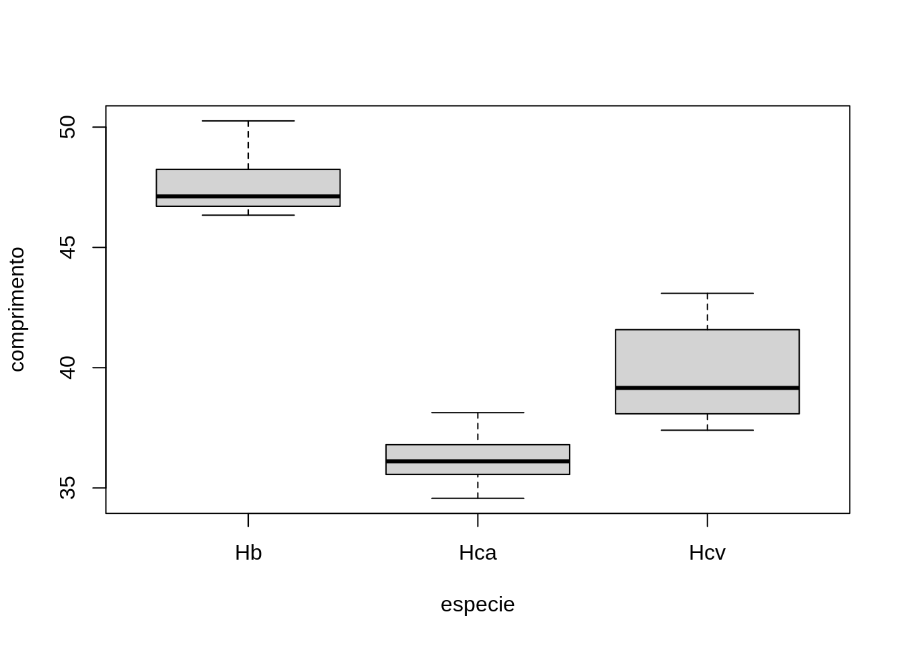
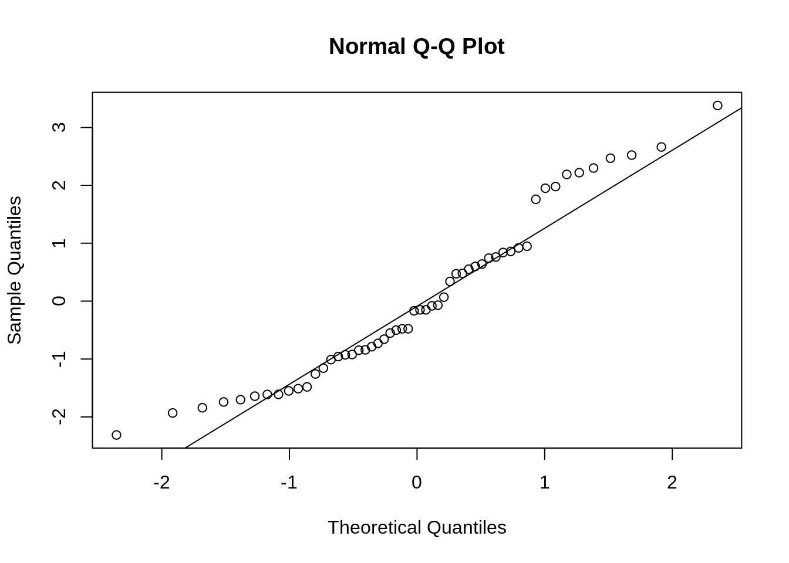
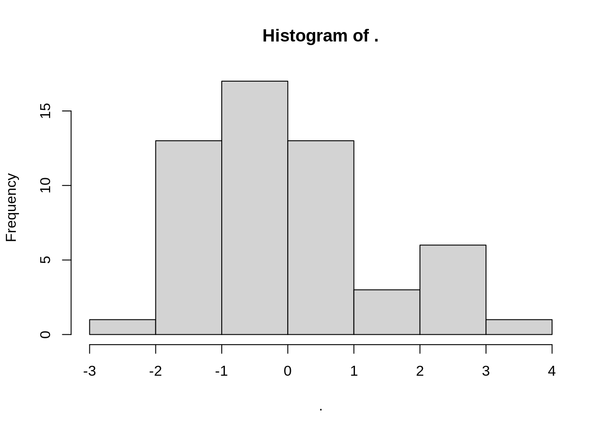
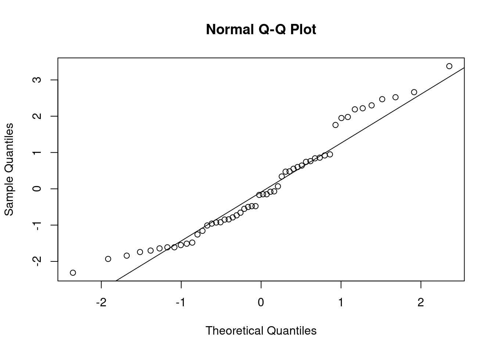

# Análise de Variância {#anova}

Os procedimentos t de duas amostras comparam as médias de duas populações ou as respostas médias a dois tratamentos em um experimento.

Naturalmente, os estudos nem sempre comparam apenas dois grupos. Precisamos de um método que compare qualquer quantidade de médias.


## Comparação de várias médias

Os métodos estatísticos para se lidar com comparações múltiplas geralmente apresentam dois passos:

1.Um teste geral para verificarmos se há boa evidência de quaisquer diferenças entre os parâmetros que desejamos comparar.

2.Uma análise de acompanhamento detalhada para decidirmos quais parâmetros são diferentes e estimarmos o tamanho das diferenças.

## A ideia da Análise de Variância

Considere a população com 150 árvores pertencente a um reflorestamento de Mogno Africano (Capítulo 6).

Suponha que retiremos 5 amostras aleatórias desta população com 8 indivíduos em cada amostra.


```{=html}
<div id="tjdigtdsnt" style="overflow-x:auto;overflow-y:auto;width:auto;height:auto;">
<style>html {
  font-family: -apple-system, BlinkMacSystemFont, 'Segoe UI', Roboto, Oxygen, Ubuntu, Cantarell, 'Helvetica Neue', 'Fira Sans', 'Droid Sans', Arial, sans-serif;
}

#tjdigtdsnt .gt_table {
  display: table;
  border-collapse: collapse;
  margin-left: auto;
  margin-right: auto;
  color: #333333;
  font-size: 16px;
  font-weight: normal;
  font-style: normal;
  background-color: #FFFFFF;
  width: auto;
  border-top-style: solid;
  border-top-width: 2px;
  border-top-color: #A8A8A8;
  border-right-style: none;
  border-right-width: 2px;
  border-right-color: #D3D3D3;
  border-bottom-style: solid;
  border-bottom-width: 2px;
  border-bottom-color: #A8A8A8;
  border-left-style: none;
  border-left-width: 2px;
  border-left-color: #D3D3D3;
}

#tjdigtdsnt .gt_heading {
  background-color: #FFFFFF;
  text-align: center;
  border-bottom-color: #FFFFFF;
  border-left-style: none;
  border-left-width: 1px;
  border-left-color: #D3D3D3;
  border-right-style: none;
  border-right-width: 1px;
  border-right-color: #D3D3D3;
}

#tjdigtdsnt .gt_title {
  color: #333333;
  font-size: 125%;
  font-weight: initial;
  padding-top: 4px;
  padding-bottom: 4px;
  padding-left: 5px;
  padding-right: 5px;
  border-bottom-color: #FFFFFF;
  border-bottom-width: 0;
}

#tjdigtdsnt .gt_subtitle {
  color: #333333;
  font-size: 85%;
  font-weight: initial;
  padding-top: 0;
  padding-bottom: 6px;
  padding-left: 5px;
  padding-right: 5px;
  border-top-color: #FFFFFF;
  border-top-width: 0;
}

#tjdigtdsnt .gt_bottom_border {
  border-bottom-style: solid;
  border-bottom-width: 2px;
  border-bottom-color: #D3D3D3;
}

#tjdigtdsnt .gt_col_headings {
  border-top-style: solid;
  border-top-width: 2px;
  border-top-color: #D3D3D3;
  border-bottom-style: solid;
  border-bottom-width: 2px;
  border-bottom-color: #D3D3D3;
  border-left-style: none;
  border-left-width: 1px;
  border-left-color: #D3D3D3;
  border-right-style: none;
  border-right-width: 1px;
  border-right-color: #D3D3D3;
}

#tjdigtdsnt .gt_col_heading {
  color: #333333;
  background-color: #FFFFFF;
  font-size: 100%;
  font-weight: normal;
  text-transform: inherit;
  border-left-style: none;
  border-left-width: 1px;
  border-left-color: #D3D3D3;
  border-right-style: none;
  border-right-width: 1px;
  border-right-color: #D3D3D3;
  vertical-align: bottom;
  padding-top: 5px;
  padding-bottom: 6px;
  padding-left: 5px;
  padding-right: 5px;
  overflow-x: hidden;
}

#tjdigtdsnt .gt_column_spanner_outer {
  color: #333333;
  background-color: #FFFFFF;
  font-size: 100%;
  font-weight: normal;
  text-transform: inherit;
  padding-top: 0;
  padding-bottom: 0;
  padding-left: 4px;
  padding-right: 4px;
}

#tjdigtdsnt .gt_column_spanner_outer:first-child {
  padding-left: 0;
}

#tjdigtdsnt .gt_column_spanner_outer:last-child {
  padding-right: 0;
}

#tjdigtdsnt .gt_column_spanner {
  border-bottom-style: solid;
  border-bottom-width: 2px;
  border-bottom-color: #D3D3D3;
  vertical-align: bottom;
  padding-top: 5px;
  padding-bottom: 5px;
  overflow-x: hidden;
  display: inline-block;
  width: 100%;
}

#tjdigtdsnt .gt_group_heading {
  padding-top: 8px;
  padding-bottom: 8px;
  padding-left: 5px;
  padding-right: 5px;
  color: #333333;
  background-color: #FFFFFF;
  font-size: 100%;
  font-weight: initial;
  text-transform: inherit;
  border-top-style: solid;
  border-top-width: 2px;
  border-top-color: #D3D3D3;
  border-bottom-style: solid;
  border-bottom-width: 2px;
  border-bottom-color: #D3D3D3;
  border-left-style: none;
  border-left-width: 1px;
  border-left-color: #D3D3D3;
  border-right-style: none;
  border-right-width: 1px;
  border-right-color: #D3D3D3;
  vertical-align: middle;
}

#tjdigtdsnt .gt_empty_group_heading {
  padding: 0.5px;
  color: #333333;
  background-color: #FFFFFF;
  font-size: 100%;
  font-weight: initial;
  border-top-style: solid;
  border-top-width: 2px;
  border-top-color: #D3D3D3;
  border-bottom-style: solid;
  border-bottom-width: 2px;
  border-bottom-color: #D3D3D3;
  vertical-align: middle;
}

#tjdigtdsnt .gt_from_md > :first-child {
  margin-top: 0;
}

#tjdigtdsnt .gt_from_md > :last-child {
  margin-bottom: 0;
}

#tjdigtdsnt .gt_row {
  padding-top: 8px;
  padding-bottom: 8px;
  padding-left: 5px;
  padding-right: 5px;
  margin: 10px;
  border-top-style: solid;
  border-top-width: 1px;
  border-top-color: #D3D3D3;
  border-left-style: none;
  border-left-width: 1px;
  border-left-color: #D3D3D3;
  border-right-style: none;
  border-right-width: 1px;
  border-right-color: #D3D3D3;
  vertical-align: middle;
  overflow-x: hidden;
}

#tjdigtdsnt .gt_stub {
  color: #333333;
  background-color: #FFFFFF;
  font-size: 100%;
  font-weight: initial;
  text-transform: inherit;
  border-right-style: solid;
  border-right-width: 2px;
  border-right-color: #D3D3D3;
  padding-left: 5px;
  padding-right: 5px;
}

#tjdigtdsnt .gt_stub_row_group {
  color: #333333;
  background-color: #FFFFFF;
  font-size: 100%;
  font-weight: initial;
  text-transform: inherit;
  border-right-style: solid;
  border-right-width: 2px;
  border-right-color: #D3D3D3;
  padding-left: 5px;
  padding-right: 5px;
  vertical-align: top;
}

#tjdigtdsnt .gt_row_group_first td {
  border-top-width: 2px;
}

#tjdigtdsnt .gt_summary_row {
  color: #333333;
  background-color: #FFFFFF;
  text-transform: inherit;
  padding-top: 8px;
  padding-bottom: 8px;
  padding-left: 5px;
  padding-right: 5px;
}

#tjdigtdsnt .gt_first_summary_row {
  border-top-style: solid;
  border-top-color: #D3D3D3;
}

#tjdigtdsnt .gt_first_summary_row.thick {
  border-top-width: 2px;
}

#tjdigtdsnt .gt_last_summary_row {
  padding-top: 8px;
  padding-bottom: 8px;
  padding-left: 5px;
  padding-right: 5px;
  border-bottom-style: solid;
  border-bottom-width: 2px;
  border-bottom-color: #D3D3D3;
}

#tjdigtdsnt .gt_grand_summary_row {
  color: #333333;
  background-color: #FFFFFF;
  text-transform: inherit;
  padding-top: 8px;
  padding-bottom: 8px;
  padding-left: 5px;
  padding-right: 5px;
}

#tjdigtdsnt .gt_first_grand_summary_row {
  padding-top: 8px;
  padding-bottom: 8px;
  padding-left: 5px;
  padding-right: 5px;
  border-top-style: double;
  border-top-width: 6px;
  border-top-color: #D3D3D3;
}

#tjdigtdsnt .gt_striped {
  background-color: rgba(128, 128, 128, 0.05);
}

#tjdigtdsnt .gt_table_body {
  border-top-style: solid;
  border-top-width: 2px;
  border-top-color: #D3D3D3;
  border-bottom-style: solid;
  border-bottom-width: 2px;
  border-bottom-color: #D3D3D3;
}

#tjdigtdsnt .gt_footnotes {
  color: #333333;
  background-color: #FFFFFF;
  border-bottom-style: none;
  border-bottom-width: 2px;
  border-bottom-color: #D3D3D3;
  border-left-style: none;
  border-left-width: 2px;
  border-left-color: #D3D3D3;
  border-right-style: none;
  border-right-width: 2px;
  border-right-color: #D3D3D3;
}

#tjdigtdsnt .gt_footnote {
  margin: 0px;
  font-size: 90%;
  padding-left: 4px;
  padding-right: 4px;
  padding-left: 5px;
  padding-right: 5px;
}

#tjdigtdsnt .gt_sourcenotes {
  color: #333333;
  background-color: #FFFFFF;
  border-bottom-style: none;
  border-bottom-width: 2px;
  border-bottom-color: #D3D3D3;
  border-left-style: none;
  border-left-width: 2px;
  border-left-color: #D3D3D3;
  border-right-style: none;
  border-right-width: 2px;
  border-right-color: #D3D3D3;
}

#tjdigtdsnt .gt_sourcenote {
  font-size: 90%;
  padding-top: 4px;
  padding-bottom: 4px;
  padding-left: 5px;
  padding-right: 5px;
}

#tjdigtdsnt .gt_left {
  text-align: left;
}

#tjdigtdsnt .gt_center {
  text-align: center;
}

#tjdigtdsnt .gt_right {
  text-align: right;
  font-variant-numeric: tabular-nums;
}

#tjdigtdsnt .gt_font_normal {
  font-weight: normal;
}

#tjdigtdsnt .gt_font_bold {
  font-weight: bold;
}

#tjdigtdsnt .gt_font_italic {
  font-style: italic;
}

#tjdigtdsnt .gt_super {
  font-size: 65%;
}

#tjdigtdsnt .gt_two_val_uncert {
  display: inline-block;
  line-height: 1em;
  text-align: right;
  font-size: 60%;
  vertical-align: -0.25em;
  margin-left: 0.1em;
}

#tjdigtdsnt .gt_footnote_marks {
  font-style: italic;
  font-weight: normal;
  font-size: 75%;
  vertical-align: 0.4em;
}

#tjdigtdsnt .gt_asterisk {
  font-size: 100%;
  vertical-align: 0;
}

#tjdigtdsnt .gt_slash_mark {
  font-size: 0.7em;
  line-height: 0.7em;
  vertical-align: 0.15em;
}

#tjdigtdsnt .gt_fraction_numerator {
  font-size: 0.6em;
  line-height: 0.6em;
  vertical-align: 0.45em;
}

#tjdigtdsnt .gt_fraction_denominator {
  font-size: 0.6em;
  line-height: 0.6em;
  vertical-align: -0.05em;
}
</style>
<table class="gt_table">
  
  <thead class="gt_col_headings">
    <tr>
      <th class="gt_col_heading gt_columns_bottom_border gt_right" rowspan="1" colspan="1">am1</th>
      <th class="gt_col_heading gt_columns_bottom_border gt_right" rowspan="1" colspan="1">am2</th>
      <th class="gt_col_heading gt_columns_bottom_border gt_right" rowspan="1" colspan="1">am3</th>
      <th class="gt_col_heading gt_columns_bottom_border gt_right" rowspan="1" colspan="1">am4</th>
      <th class="gt_col_heading gt_columns_bottom_border gt_right" rowspan="1" colspan="1">am5</th>
    </tr>
  </thead>
  <tbody class="gt_table_body">
    <tr><td class="gt_row gt_right">14.69</td>
<td class="gt_row gt_right">15.31</td>
<td class="gt_row gt_right">12.91</td>
<td class="gt_row gt_right">12.88</td>
<td class="gt_row gt_right">10.98</td></tr>
    <tr><td class="gt_row gt_right">11.96</td>
<td class="gt_row gt_right">11.78</td>
<td class="gt_row gt_right">9.86</td>
<td class="gt_row gt_right">14.57</td>
<td class="gt_row gt_right">11.46</td></tr>
    <tr><td class="gt_row gt_right">11.13</td>
<td class="gt_row gt_right">14.55</td>
<td class="gt_row gt_right">12.64</td>
<td class="gt_row gt_right">14.80</td>
<td class="gt_row gt_right">12.49</td></tr>
    <tr><td class="gt_row gt_right">11.05</td>
<td class="gt_row gt_right">14.97</td>
<td class="gt_row gt_right">12.79</td>
<td class="gt_row gt_right">14.14</td>
<td class="gt_row gt_right">15.60</td></tr>
    <tr><td class="gt_row gt_right">14.24</td>
<td class="gt_row gt_right">13.77</td>
<td class="gt_row gt_right">13.80</td>
<td class="gt_row gt_right">11.80</td>
<td class="gt_row gt_right">10.84</td></tr>
    <tr><td class="gt_row gt_right">16.19</td>
<td class="gt_row gt_right">15.64</td>
<td class="gt_row gt_right">15.57</td>
<td class="gt_row gt_right">12.52</td>
<td class="gt_row gt_right">10.96</td></tr>
    <tr><td class="gt_row gt_right">12.75</td>
<td class="gt_row gt_right">7.92</td>
<td class="gt_row gt_right">13.88</td>
<td class="gt_row gt_right">12.50</td>
<td class="gt_row gt_right">13.48</td></tr>
    <tr><td class="gt_row gt_right">14.15</td>
<td class="gt_row gt_right">13.09</td>
<td class="gt_row gt_right">16.71</td>
<td class="gt_row gt_right">12.09</td>
<td class="gt_row gt_right">12.60</td></tr>
  </tbody>
  
  
</table>
</div>
```


Estes dados podem ser encontrados no arquivo [dap5.csv](data/dap5.csv)

Uma Análise de Variância pode ser executada com as funções `lm` e `anova`, como a seguir:


```r
aov_dap5 <- lm(dap~amostra, data=dap5)
anova(aov_dap5)
```

```
## Analysis of Variance Table
## 
## Response: dap
##           Df  Sum Sq Mean Sq F value Pr(>F)
## amostra    4   7.371  1.8428  0.5075 0.7305
## Residuals 35 127.091  3.6312
```


Queremos testar a hipótese nula de que não há diferenças entre os diâmetros médios das cinco populações de onde as amostras foram retiradas:

H~0~:μ~1~ = μ~2~ = μ~3~ = μ~~4 = μ~5~

A hipótese alternativa é a de que há alguma diferença, isto é, nem todas as três médias populacionais são iguais:

H~1~: nem todas as médias μ são iguais

A priori, sabemos que as cinco amostras foram aleatoriamente retiradas da mesma população. Logo, o teste F da Análise de Variância é não significativo (como esperado). Seu p-valor foi de 0.73 e, por isso, não rejeitamos a hipótese H~0~, ou seja, não há evidências que os diâmetros médios das amostras sejam diferentes ou que venham de populações diferentes.

Mas o que occoreria se houvesse um efeito aditivo em cada uma das amostras?
Vamos supor que a amostra 1 tenha um efeito aditivo de +5 unidades no DAP. A amostra 2 de -5, a amostra 3 de +3, a amostra 4 de +2 e, por fim, a amostra 5 não tenha nenhum efeito aditivo. O resultado é este mostrado no arquivo [dap5p.csv](data/dap5p.csv)


```{=html}
<div id="xzcvtvieoo" style="overflow-x:auto;overflow-y:auto;width:auto;height:auto;">
<style>html {
  font-family: -apple-system, BlinkMacSystemFont, 'Segoe UI', Roboto, Oxygen, Ubuntu, Cantarell, 'Helvetica Neue', 'Fira Sans', 'Droid Sans', Arial, sans-serif;
}

#xzcvtvieoo .gt_table {
  display: table;
  border-collapse: collapse;
  margin-left: auto;
  margin-right: auto;
  color: #333333;
  font-size: 16px;
  font-weight: normal;
  font-style: normal;
  background-color: #FFFFFF;
  width: auto;
  border-top-style: solid;
  border-top-width: 2px;
  border-top-color: #A8A8A8;
  border-right-style: none;
  border-right-width: 2px;
  border-right-color: #D3D3D3;
  border-bottom-style: solid;
  border-bottom-width: 2px;
  border-bottom-color: #A8A8A8;
  border-left-style: none;
  border-left-width: 2px;
  border-left-color: #D3D3D3;
}

#xzcvtvieoo .gt_heading {
  background-color: #FFFFFF;
  text-align: center;
  border-bottom-color: #FFFFFF;
  border-left-style: none;
  border-left-width: 1px;
  border-left-color: #D3D3D3;
  border-right-style: none;
  border-right-width: 1px;
  border-right-color: #D3D3D3;
}

#xzcvtvieoo .gt_title {
  color: #333333;
  font-size: 125%;
  font-weight: initial;
  padding-top: 4px;
  padding-bottom: 4px;
  padding-left: 5px;
  padding-right: 5px;
  border-bottom-color: #FFFFFF;
  border-bottom-width: 0;
}

#xzcvtvieoo .gt_subtitle {
  color: #333333;
  font-size: 85%;
  font-weight: initial;
  padding-top: 0;
  padding-bottom: 6px;
  padding-left: 5px;
  padding-right: 5px;
  border-top-color: #FFFFFF;
  border-top-width: 0;
}

#xzcvtvieoo .gt_bottom_border {
  border-bottom-style: solid;
  border-bottom-width: 2px;
  border-bottom-color: #D3D3D3;
}

#xzcvtvieoo .gt_col_headings {
  border-top-style: solid;
  border-top-width: 2px;
  border-top-color: #D3D3D3;
  border-bottom-style: solid;
  border-bottom-width: 2px;
  border-bottom-color: #D3D3D3;
  border-left-style: none;
  border-left-width: 1px;
  border-left-color: #D3D3D3;
  border-right-style: none;
  border-right-width: 1px;
  border-right-color: #D3D3D3;
}

#xzcvtvieoo .gt_col_heading {
  color: #333333;
  background-color: #FFFFFF;
  font-size: 100%;
  font-weight: normal;
  text-transform: inherit;
  border-left-style: none;
  border-left-width: 1px;
  border-left-color: #D3D3D3;
  border-right-style: none;
  border-right-width: 1px;
  border-right-color: #D3D3D3;
  vertical-align: bottom;
  padding-top: 5px;
  padding-bottom: 6px;
  padding-left: 5px;
  padding-right: 5px;
  overflow-x: hidden;
}

#xzcvtvieoo .gt_column_spanner_outer {
  color: #333333;
  background-color: #FFFFFF;
  font-size: 100%;
  font-weight: normal;
  text-transform: inherit;
  padding-top: 0;
  padding-bottom: 0;
  padding-left: 4px;
  padding-right: 4px;
}

#xzcvtvieoo .gt_column_spanner_outer:first-child {
  padding-left: 0;
}

#xzcvtvieoo .gt_column_spanner_outer:last-child {
  padding-right: 0;
}

#xzcvtvieoo .gt_column_spanner {
  border-bottom-style: solid;
  border-bottom-width: 2px;
  border-bottom-color: #D3D3D3;
  vertical-align: bottom;
  padding-top: 5px;
  padding-bottom: 5px;
  overflow-x: hidden;
  display: inline-block;
  width: 100%;
}

#xzcvtvieoo .gt_group_heading {
  padding-top: 8px;
  padding-bottom: 8px;
  padding-left: 5px;
  padding-right: 5px;
  color: #333333;
  background-color: #FFFFFF;
  font-size: 100%;
  font-weight: initial;
  text-transform: inherit;
  border-top-style: solid;
  border-top-width: 2px;
  border-top-color: #D3D3D3;
  border-bottom-style: solid;
  border-bottom-width: 2px;
  border-bottom-color: #D3D3D3;
  border-left-style: none;
  border-left-width: 1px;
  border-left-color: #D3D3D3;
  border-right-style: none;
  border-right-width: 1px;
  border-right-color: #D3D3D3;
  vertical-align: middle;
}

#xzcvtvieoo .gt_empty_group_heading {
  padding: 0.5px;
  color: #333333;
  background-color: #FFFFFF;
  font-size: 100%;
  font-weight: initial;
  border-top-style: solid;
  border-top-width: 2px;
  border-top-color: #D3D3D3;
  border-bottom-style: solid;
  border-bottom-width: 2px;
  border-bottom-color: #D3D3D3;
  vertical-align: middle;
}

#xzcvtvieoo .gt_from_md > :first-child {
  margin-top: 0;
}

#xzcvtvieoo .gt_from_md > :last-child {
  margin-bottom: 0;
}

#xzcvtvieoo .gt_row {
  padding-top: 8px;
  padding-bottom: 8px;
  padding-left: 5px;
  padding-right: 5px;
  margin: 10px;
  border-top-style: solid;
  border-top-width: 1px;
  border-top-color: #D3D3D3;
  border-left-style: none;
  border-left-width: 1px;
  border-left-color: #D3D3D3;
  border-right-style: none;
  border-right-width: 1px;
  border-right-color: #D3D3D3;
  vertical-align: middle;
  overflow-x: hidden;
}

#xzcvtvieoo .gt_stub {
  color: #333333;
  background-color: #FFFFFF;
  font-size: 100%;
  font-weight: initial;
  text-transform: inherit;
  border-right-style: solid;
  border-right-width: 2px;
  border-right-color: #D3D3D3;
  padding-left: 5px;
  padding-right: 5px;
}

#xzcvtvieoo .gt_stub_row_group {
  color: #333333;
  background-color: #FFFFFF;
  font-size: 100%;
  font-weight: initial;
  text-transform: inherit;
  border-right-style: solid;
  border-right-width: 2px;
  border-right-color: #D3D3D3;
  padding-left: 5px;
  padding-right: 5px;
  vertical-align: top;
}

#xzcvtvieoo .gt_row_group_first td {
  border-top-width: 2px;
}

#xzcvtvieoo .gt_summary_row {
  color: #333333;
  background-color: #FFFFFF;
  text-transform: inherit;
  padding-top: 8px;
  padding-bottom: 8px;
  padding-left: 5px;
  padding-right: 5px;
}

#xzcvtvieoo .gt_first_summary_row {
  border-top-style: solid;
  border-top-color: #D3D3D3;
}

#xzcvtvieoo .gt_first_summary_row.thick {
  border-top-width: 2px;
}

#xzcvtvieoo .gt_last_summary_row {
  padding-top: 8px;
  padding-bottom: 8px;
  padding-left: 5px;
  padding-right: 5px;
  border-bottom-style: solid;
  border-bottom-width: 2px;
  border-bottom-color: #D3D3D3;
}

#xzcvtvieoo .gt_grand_summary_row {
  color: #333333;
  background-color: #FFFFFF;
  text-transform: inherit;
  padding-top: 8px;
  padding-bottom: 8px;
  padding-left: 5px;
  padding-right: 5px;
}

#xzcvtvieoo .gt_first_grand_summary_row {
  padding-top: 8px;
  padding-bottom: 8px;
  padding-left: 5px;
  padding-right: 5px;
  border-top-style: double;
  border-top-width: 6px;
  border-top-color: #D3D3D3;
}

#xzcvtvieoo .gt_striped {
  background-color: rgba(128, 128, 128, 0.05);
}

#xzcvtvieoo .gt_table_body {
  border-top-style: solid;
  border-top-width: 2px;
  border-top-color: #D3D3D3;
  border-bottom-style: solid;
  border-bottom-width: 2px;
  border-bottom-color: #D3D3D3;
}

#xzcvtvieoo .gt_footnotes {
  color: #333333;
  background-color: #FFFFFF;
  border-bottom-style: none;
  border-bottom-width: 2px;
  border-bottom-color: #D3D3D3;
  border-left-style: none;
  border-left-width: 2px;
  border-left-color: #D3D3D3;
  border-right-style: none;
  border-right-width: 2px;
  border-right-color: #D3D3D3;
}

#xzcvtvieoo .gt_footnote {
  margin: 0px;
  font-size: 90%;
  padding-left: 4px;
  padding-right: 4px;
  padding-left: 5px;
  padding-right: 5px;
}

#xzcvtvieoo .gt_sourcenotes {
  color: #333333;
  background-color: #FFFFFF;
  border-bottom-style: none;
  border-bottom-width: 2px;
  border-bottom-color: #D3D3D3;
  border-left-style: none;
  border-left-width: 2px;
  border-left-color: #D3D3D3;
  border-right-style: none;
  border-right-width: 2px;
  border-right-color: #D3D3D3;
}

#xzcvtvieoo .gt_sourcenote {
  font-size: 90%;
  padding-top: 4px;
  padding-bottom: 4px;
  padding-left: 5px;
  padding-right: 5px;
}

#xzcvtvieoo .gt_left {
  text-align: left;
}

#xzcvtvieoo .gt_center {
  text-align: center;
}

#xzcvtvieoo .gt_right {
  text-align: right;
  font-variant-numeric: tabular-nums;
}

#xzcvtvieoo .gt_font_normal {
  font-weight: normal;
}

#xzcvtvieoo .gt_font_bold {
  font-weight: bold;
}

#xzcvtvieoo .gt_font_italic {
  font-style: italic;
}

#xzcvtvieoo .gt_super {
  font-size: 65%;
}

#xzcvtvieoo .gt_two_val_uncert {
  display: inline-block;
  line-height: 1em;
  text-align: right;
  font-size: 60%;
  vertical-align: -0.25em;
  margin-left: 0.1em;
}

#xzcvtvieoo .gt_footnote_marks {
  font-style: italic;
  font-weight: normal;
  font-size: 75%;
  vertical-align: 0.4em;
}

#xzcvtvieoo .gt_asterisk {
  font-size: 100%;
  vertical-align: 0;
}

#xzcvtvieoo .gt_slash_mark {
  font-size: 0.7em;
  line-height: 0.7em;
  vertical-align: 0.15em;
}

#xzcvtvieoo .gt_fraction_numerator {
  font-size: 0.6em;
  line-height: 0.6em;
  vertical-align: 0.45em;
}

#xzcvtvieoo .gt_fraction_denominator {
  font-size: 0.6em;
  line-height: 0.6em;
  vertical-align: -0.05em;
}
</style>
<table class="gt_table">
  
  <thead class="gt_col_headings">
    <tr>
      <th class="gt_col_heading gt_columns_bottom_border gt_right" rowspan="1" colspan="1">am1</th>
      <th class="gt_col_heading gt_columns_bottom_border gt_right" rowspan="1" colspan="1">am2</th>
      <th class="gt_col_heading gt_columns_bottom_border gt_right" rowspan="1" colspan="1">am3</th>
      <th class="gt_col_heading gt_columns_bottom_border gt_right" rowspan="1" colspan="1">am4</th>
      <th class="gt_col_heading gt_columns_bottom_border gt_right" rowspan="1" colspan="1">am5</th>
    </tr>
  </thead>
  <tbody class="gt_table_body">
    <tr><td class="gt_row gt_right">19.69</td>
<td class="gt_row gt_right">10.31</td>
<td class="gt_row gt_right">15.91</td>
<td class="gt_row gt_right">14.88</td>
<td class="gt_row gt_right">10.98</td></tr>
    <tr><td class="gt_row gt_right">16.96</td>
<td class="gt_row gt_right">6.78</td>
<td class="gt_row gt_right">12.86</td>
<td class="gt_row gt_right">16.57</td>
<td class="gt_row gt_right">11.46</td></tr>
    <tr><td class="gt_row gt_right">16.13</td>
<td class="gt_row gt_right">9.55</td>
<td class="gt_row gt_right">15.64</td>
<td class="gt_row gt_right">16.80</td>
<td class="gt_row gt_right">12.49</td></tr>
    <tr><td class="gt_row gt_right">16.05</td>
<td class="gt_row gt_right">9.97</td>
<td class="gt_row gt_right">15.79</td>
<td class="gt_row gt_right">16.14</td>
<td class="gt_row gt_right">15.60</td></tr>
    <tr><td class="gt_row gt_right">19.24</td>
<td class="gt_row gt_right">8.77</td>
<td class="gt_row gt_right">16.80</td>
<td class="gt_row gt_right">13.80</td>
<td class="gt_row gt_right">10.84</td></tr>
    <tr><td class="gt_row gt_right">21.19</td>
<td class="gt_row gt_right">10.64</td>
<td class="gt_row gt_right">18.57</td>
<td class="gt_row gt_right">14.52</td>
<td class="gt_row gt_right">10.96</td></tr>
    <tr><td class="gt_row gt_right">17.75</td>
<td class="gt_row gt_right">2.92</td>
<td class="gt_row gt_right">16.88</td>
<td class="gt_row gt_right">14.50</td>
<td class="gt_row gt_right">13.48</td></tr>
    <tr><td class="gt_row gt_right">19.15</td>
<td class="gt_row gt_right">8.09</td>
<td class="gt_row gt_right">19.71</td>
<td class="gt_row gt_right">14.09</td>
<td class="gt_row gt_right">12.60</td></tr>
  </tbody>
  
  
</table>
</div>
```


A Análise de Variância, com estes valores atualizados, fica assim:


```r
aov_dap5p <- lm(dap~amostra, data=dap5p)
anova(aov_dap5p)
```

```
## Analysis of Variance Table
## 
## Response: dap
##           Df Sum Sq Mean Sq F value    Pr(>F)    
## amostra    4 482.71 120.678  33.234 1.791e-11 ***
## Residuals 35 127.09   3.631                      
## ---
## Signif. codes:  0 '***' 0.001 '**' 0.01 '*' 0.05 '.' 0.1 ' ' 1
```


Para as mesmas hipóteses anteriores, o teste F da Análise de Variância é significativo (p-valor ~ 0). Neste caso, rejeitamos a hipótese H~0~ e podemos concluir que há evidências de que as amostras tenham médias de diâmetro diferentes ou que seja oriundas de populações diferentes.


## Análise de Variância para um fator

:::{.example #anova1 name="Análise de Variância para um fator"}

Pesquisadores estudaram a relação entre variedades da flor tropical *Heliconia*, na ilha de Dominica, e as diferentes espécies de beija-flores que fertilizam essas flores.

Acredita-se que os comprimentos das flores e as formas dos bicos dos beija-flores evoluíram juntos e se adaptaram uns aos outros.

Se isso for verdade, as variedades de flores fertilizadas por diferentes espécies de beija-flores devem ter diferentes distribuições de comprimentos.

O arquivo [bflor.xlsx](data/bflor.xlsx) fornece as medidas de comprimentos (em milímetros, mm) para amostras de três variedades de *Heliconia*, cada uma fertilizada por uma espécie diferente de beija-flor.

Em particular, os comprimentos médios de suas flores são diferentes?

As três variedades têm distribuições com comprimentos diferentes?


Queremos testar a hipótese nula de que não há diferenças entre os comprimentos médios das três populações de flores:

H~0~: μ~1~ = μ~2~ = μ~3~

A hipótese alternativa é a de que há alguma diferença, isto é, nem todas as três médias populacionais são iguais:

H~1~: nem todas as μ~1~, μ~2~ e μ~3~ são iguais


Iniciemos com uma análise exploratória: 


```r
bflor <- readxl::read_excel("data/bflor.xlsx") %>%
  mutate(especie = factor(especie))


bflor %>% 
  group_by(especie) %>%
  summarise(n=n(),
            media=mean(comprimento),
            desvpad = sd(comprimento),
            var=var(comprimento))
```

```
## # A tibble: 3 × 5
##   especie     n media desvpad   var
##   <fct>   <int> <dbl>   <dbl> <dbl>
## 1 Hb         16  47.6   1.21  1.47 
## 2 Hca        15  36.2   0.975 0.951
## 3 Hcv        23  39.7   1.80  3.24
```

```r
boxplot(comprimento~especie, data=bflor)
```



Efetuamos a Análise de Variância propriamente dita:


```r
aov_bflor <- lm(comprimento~especie, data=bflor)

anova(aov_bflor)
```

```
## Analysis of Variance Table
## 
## Response: comprimento
##           Df  Sum Sq Mean Sq F value    Pr(>F)    
## especie    2 1082.87  541.44  259.12 < 2.2e-16 ***
## Residuals 51  106.57    2.09                      
## ---
## Signif. codes:  0 '***' 0.001 '**' 0.01 '*' 0.05 '.' 0.1 ' ' 1
```
**CONCLUSÃO**: Há forte evidência de que as três variedades de flores não tenham, todas, o mesmo comprimento médio.

O teste F não diz quais das três médias são significantemente diferentes. Aparentemente, pela nossa análise de dados preliminar, as flores da bihai são visivelmente maiores que as da vermelha ou da amarela.

As flores vermelhas e amarelas são muito próximas, mas as vermelhas tendem a ser mais compridas.

:::

## Condições para a ANOVA

1. Temos k AASs independentes, uma de cada uma das k populações.

Como de costume, o planejamento da produção dos dados é a condição mais importante para inferência. Uma amostragem viesada ou confundimento pode tornar qualquer inferência sem sentido.

2. Cada uma das k populações tem uma distribuição Normal com média desconhecida

Procedimentos para comparação de médias não são muito sensíveis à falta de Normalidade. A Anova torna-se mais segura à medida que os tamanhos das amostras aumentam. Quando não houver valores atípicos e as distribuições forem aproximadamente simétricas, podemos usar a Anova com segurança.

3. Todas as populações têm o mesmo desvio-padrão $\sigma$, de valor desconhecido.

A terceira condição é problemática. Não é fácil verificar a condição de igualdade dos desvios-padrão populacionais. 
Testes estatísticos de igualdade dos desvios-padrão são tão sensíveis à ausência de Normalidade que, na prática, têm pouco valor.

Mas, qual é a gravidade de os desvios-padrão serem desiguais?

A Anova não é muito sensível a violações da condição, particularmente quando todas as amostras têm tamanhos iguais ou semelhantes e nenhuma delas é muito pequena.
Ao planejar um estudo, tente tomar amostras do mesmo tamanho aproximado de todos os grupos que pretende comparar e não utilize amostras muito pequenas.

Certifique-se, antes de fazer a Anova, de que os desvios-padrão amostrais sejam, pelo menos, semelhantes entre si.
Como regra prática: maior desvio-padrão não seja o dobro (ou triplo) do menor.


:::{.example #press2 name="Verificação do pressuposto da Normalidade"}

.


```r
## curtose
aov_bflor %>% residuals() %>% moments::kurtosis()
```

```
## [1] 2.349862
```

```r
## assimetria
aov_bflor %>% residuals() %>% moments::skewness()
```

```
## [1] 0.5223018
```

```r
## Teste de Shapiro-Wilk
aov_bflor %>% residuals() %>% shapiro.test()
```

```
## 
## 	Shapiro-Wilk normality test
## 
## data:  .
## W = 0.94889, p-value = 0.02227
```

```r
## Gráfico dos quantis normais
aov_bflor %>% residuals() %>% qqnorm()
aov_bflor %>% residuals() %>% qqline()
```



```r
## Histograma
aov_bflor %>% residuals() %>% hist()
```



```r
## Ramo e folhas
aov_bflor %>% residuals() %>% stem()
```

```
## 
##   The decimal point is at the |
## 
##   -2 | 3
##   -1 | 98776665553200
##   -0 | 9988877655522211
##    0 | 1355666788999
##    1 | 8
##    2 | 00223557
##    3 | 4
```

.

:::


Pela análise do conjunto dos resultados acima, não há evidência de desvio severo da Normalidade.

:::{.example #press3 name="Verificação do pressuposto da homogeneidade das variâncias"}

.


```r
## razão maior/menor desvio-padrão
bflor %>% group_by(especie) %>% summarise(desvpad=sd(comprimento)) %>%
mutate(razao=max(desvpad)/desvpad)
```

```
## # A tibble: 3 × 3
##   especie desvpad razao
##   <fct>     <dbl> <dbl>
## 1 Hb        1.21   1.48
## 2 Hca       0.975  1.84
## 3 Hcv       1.80   1
```

```r
## boxplot condicional dos resíduos
boxplot(residuals(aov_bflor)~especie, data = bflor)
```



```r
## resíduos vs ajustados
plot(aov_bflor,1)
```


```r
## teste de Bartlett
bartlett.test(residuals(aov_bflor)~especie, data=bflor)
```

```
## 
## 	Bartlett test of homogeneity of variances
## 
## data:  residuals(aov_bflor) by especie
## Bartlett's K-squared = 6.4839, df = 2, p-value = 0.03909
```

```r
## teste de Levene
car::leveneTest(residuals(aov_bflor)~especie, data=bflor)
```

```
## Levene's Test for Homogeneity of Variance (center = median)
##       Df F value  Pr(>F)  
## group  2  4.3722 0.01768 *
##       51                  
## ---
## Signif. codes:  0 '***' 0.001 '**' 0.01 '*' 0.05 '.' 0.1 ' ' 1
```

Pela análise do conjunto dos resultados acima, não há evidência de não homogeneidade das variâncias.


:::


