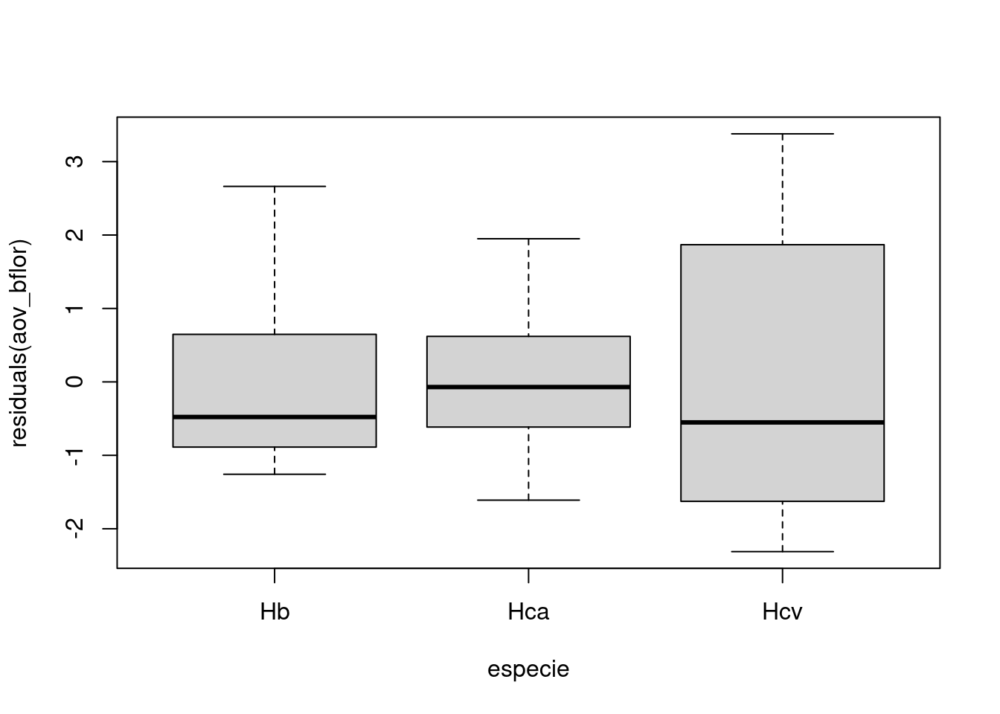
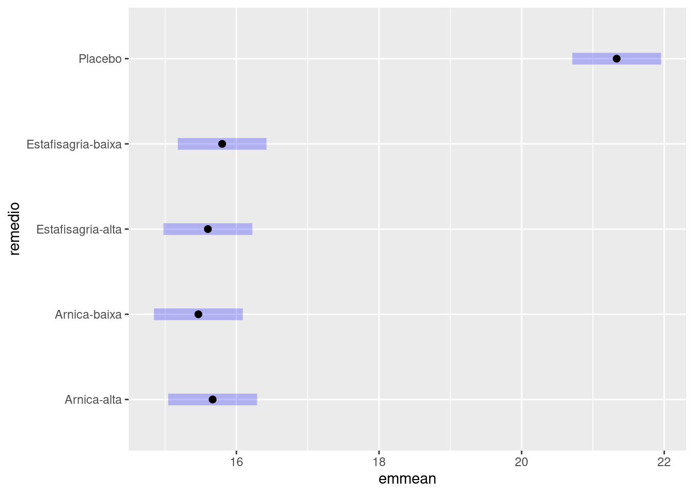

# Análise de Variância

Os procedimentos t de duas amostras comparam as médias de duas populações ou as respostas médias a dois tratamentos em um experimento.

Naturalmente, os estudos nem sempre comparam apenas dois grupos. Precisamos de um método que compare qualquer quantidade de médias.


## Comparação de várias médias

Os métodos estatísticos para se lidar com comparações múltiplas geralmente apresentam dois passos:

1.Um teste geral para verificarmos se há boa evidência de quaisquer diferenças entre os parâmetros que desejamos comparar.

2.Uma análise de acompanhamento detalhada para decidirmos quais parâmetros são diferentes e estimarmos o tamanho das diferenças.

## A ideia da Análise de Variância

Considere a população com 150 árvores pertencente a um reflorestamento de Mogno Africano (Capítulo 6).

Suponha que retiremos 5 amostras aleatórias desta população com 8 indivíduos em cada amostra.


```{=html}
<div id="tjdigtdsnt" style="overflow-x:auto;overflow-y:auto;width:auto;height:auto;">
<style>html {
  font-family: -apple-system, BlinkMacSystemFont, 'Segoe UI', Roboto, Oxygen, Ubuntu, Cantarell, 'Helvetica Neue', 'Fira Sans', 'Droid Sans', Arial, sans-serif;
}

#tjdigtdsnt .gt_table {
  display: table;
  border-collapse: collapse;
  margin-left: auto;
  margin-right: auto;
  color: #333333;
  font-size: 16px;
  font-weight: normal;
  font-style: normal;
  background-color: #FFFFFF;
  width: auto;
  border-top-style: solid;
  border-top-width: 2px;
  border-top-color: #A8A8A8;
  border-right-style: none;
  border-right-width: 2px;
  border-right-color: #D3D3D3;
  border-bottom-style: solid;
  border-bottom-width: 2px;
  border-bottom-color: #A8A8A8;
  border-left-style: none;
  border-left-width: 2px;
  border-left-color: #D3D3D3;
}

#tjdigtdsnt .gt_heading {
  background-color: #FFFFFF;
  text-align: center;
  border-bottom-color: #FFFFFF;
  border-left-style: none;
  border-left-width: 1px;
  border-left-color: #D3D3D3;
  border-right-style: none;
  border-right-width: 1px;
  border-right-color: #D3D3D3;
}

#tjdigtdsnt .gt_title {
  color: #333333;
  font-size: 125%;
  font-weight: initial;
  padding-top: 4px;
  padding-bottom: 4px;
  padding-left: 5px;
  padding-right: 5px;
  border-bottom-color: #FFFFFF;
  border-bottom-width: 0;
}

#tjdigtdsnt .gt_subtitle {
  color: #333333;
  font-size: 85%;
  font-weight: initial;
  padding-top: 0;
  padding-bottom: 6px;
  padding-left: 5px;
  padding-right: 5px;
  border-top-color: #FFFFFF;
  border-top-width: 0;
}

#tjdigtdsnt .gt_bottom_border {
  border-bottom-style: solid;
  border-bottom-width: 2px;
  border-bottom-color: #D3D3D3;
}

#tjdigtdsnt .gt_col_headings {
  border-top-style: solid;
  border-top-width: 2px;
  border-top-color: #D3D3D3;
  border-bottom-style: solid;
  border-bottom-width: 2px;
  border-bottom-color: #D3D3D3;
  border-left-style: none;
  border-left-width: 1px;
  border-left-color: #D3D3D3;
  border-right-style: none;
  border-right-width: 1px;
  border-right-color: #D3D3D3;
}

#tjdigtdsnt .gt_col_heading {
  color: #333333;
  background-color: #FFFFFF;
  font-size: 100%;
  font-weight: normal;
  text-transform: inherit;
  border-left-style: none;
  border-left-width: 1px;
  border-left-color: #D3D3D3;
  border-right-style: none;
  border-right-width: 1px;
  border-right-color: #D3D3D3;
  vertical-align: bottom;
  padding-top: 5px;
  padding-bottom: 6px;
  padding-left: 5px;
  padding-right: 5px;
  overflow-x: hidden;
}

#tjdigtdsnt .gt_column_spanner_outer {
  color: #333333;
  background-color: #FFFFFF;
  font-size: 100%;
  font-weight: normal;
  text-transform: inherit;
  padding-top: 0;
  padding-bottom: 0;
  padding-left: 4px;
  padding-right: 4px;
}

#tjdigtdsnt .gt_column_spanner_outer:first-child {
  padding-left: 0;
}

#tjdigtdsnt .gt_column_spanner_outer:last-child {
  padding-right: 0;
}

#tjdigtdsnt .gt_column_spanner {
  border-bottom-style: solid;
  border-bottom-width: 2px;
  border-bottom-color: #D3D3D3;
  vertical-align: bottom;
  padding-top: 5px;
  padding-bottom: 5px;
  overflow-x: hidden;
  display: inline-block;
  width: 100%;
}

#tjdigtdsnt .gt_group_heading {
  padding-top: 8px;
  padding-bottom: 8px;
  padding-left: 5px;
  padding-right: 5px;
  color: #333333;
  background-color: #FFFFFF;
  font-size: 100%;
  font-weight: initial;
  text-transform: inherit;
  border-top-style: solid;
  border-top-width: 2px;
  border-top-color: #D3D3D3;
  border-bottom-style: solid;
  border-bottom-width: 2px;
  border-bottom-color: #D3D3D3;
  border-left-style: none;
  border-left-width: 1px;
  border-left-color: #D3D3D3;
  border-right-style: none;
  border-right-width: 1px;
  border-right-color: #D3D3D3;
  vertical-align: middle;
}

#tjdigtdsnt .gt_empty_group_heading {
  padding: 0.5px;
  color: #333333;
  background-color: #FFFFFF;
  font-size: 100%;
  font-weight: initial;
  border-top-style: solid;
  border-top-width: 2px;
  border-top-color: #D3D3D3;
  border-bottom-style: solid;
  border-bottom-width: 2px;
  border-bottom-color: #D3D3D3;
  vertical-align: middle;
}

#tjdigtdsnt .gt_from_md > :first-child {
  margin-top: 0;
}

#tjdigtdsnt .gt_from_md > :last-child {
  margin-bottom: 0;
}

#tjdigtdsnt .gt_row {
  padding-top: 8px;
  padding-bottom: 8px;
  padding-left: 5px;
  padding-right: 5px;
  margin: 10px;
  border-top-style: solid;
  border-top-width: 1px;
  border-top-color: #D3D3D3;
  border-left-style: none;
  border-left-width: 1px;
  border-left-color: #D3D3D3;
  border-right-style: none;
  border-right-width: 1px;
  border-right-color: #D3D3D3;
  vertical-align: middle;
  overflow-x: hidden;
}

#tjdigtdsnt .gt_stub {
  color: #333333;
  background-color: #FFFFFF;
  font-size: 100%;
  font-weight: initial;
  text-transform: inherit;
  border-right-style: solid;
  border-right-width: 2px;
  border-right-color: #D3D3D3;
  padding-left: 5px;
  padding-right: 5px;
}

#tjdigtdsnt .gt_stub_row_group {
  color: #333333;
  background-color: #FFFFFF;
  font-size: 100%;
  font-weight: initial;
  text-transform: inherit;
  border-right-style: solid;
  border-right-width: 2px;
  border-right-color: #D3D3D3;
  padding-left: 5px;
  padding-right: 5px;
  vertical-align: top;
}

#tjdigtdsnt .gt_row_group_first td {
  border-top-width: 2px;
}

#tjdigtdsnt .gt_summary_row {
  color: #333333;
  background-color: #FFFFFF;
  text-transform: inherit;
  padding-top: 8px;
  padding-bottom: 8px;
  padding-left: 5px;
  padding-right: 5px;
}

#tjdigtdsnt .gt_first_summary_row {
  border-top-style: solid;
  border-top-color: #D3D3D3;
}

#tjdigtdsnt .gt_first_summary_row.thick {
  border-top-width: 2px;
}

#tjdigtdsnt .gt_last_summary_row {
  padding-top: 8px;
  padding-bottom: 8px;
  padding-left: 5px;
  padding-right: 5px;
  border-bottom-style: solid;
  border-bottom-width: 2px;
  border-bottom-color: #D3D3D3;
}

#tjdigtdsnt .gt_grand_summary_row {
  color: #333333;
  background-color: #FFFFFF;
  text-transform: inherit;
  padding-top: 8px;
  padding-bottom: 8px;
  padding-left: 5px;
  padding-right: 5px;
}

#tjdigtdsnt .gt_first_grand_summary_row {
  padding-top: 8px;
  padding-bottom: 8px;
  padding-left: 5px;
  padding-right: 5px;
  border-top-style: double;
  border-top-width: 6px;
  border-top-color: #D3D3D3;
}

#tjdigtdsnt .gt_striped {
  background-color: rgba(128, 128, 128, 0.05);
}

#tjdigtdsnt .gt_table_body {
  border-top-style: solid;
  border-top-width: 2px;
  border-top-color: #D3D3D3;
  border-bottom-style: solid;
  border-bottom-width: 2px;
  border-bottom-color: #D3D3D3;
}

#tjdigtdsnt .gt_footnotes {
  color: #333333;
  background-color: #FFFFFF;
  border-bottom-style: none;
  border-bottom-width: 2px;
  border-bottom-color: #D3D3D3;
  border-left-style: none;
  border-left-width: 2px;
  border-left-color: #D3D3D3;
  border-right-style: none;
  border-right-width: 2px;
  border-right-color: #D3D3D3;
}

#tjdigtdsnt .gt_footnote {
  margin: 0px;
  font-size: 90%;
  padding-left: 4px;
  padding-right: 4px;
  padding-left: 5px;
  padding-right: 5px;
}

#tjdigtdsnt .gt_sourcenotes {
  color: #333333;
  background-color: #FFFFFF;
  border-bottom-style: none;
  border-bottom-width: 2px;
  border-bottom-color: #D3D3D3;
  border-left-style: none;
  border-left-width: 2px;
  border-left-color: #D3D3D3;
  border-right-style: none;
  border-right-width: 2px;
  border-right-color: #D3D3D3;
}

#tjdigtdsnt .gt_sourcenote {
  font-size: 90%;
  padding-top: 4px;
  padding-bottom: 4px;
  padding-left: 5px;
  padding-right: 5px;
}

#tjdigtdsnt .gt_left {
  text-align: left;
}

#tjdigtdsnt .gt_center {
  text-align: center;
}

#tjdigtdsnt .gt_right {
  text-align: right;
  font-variant-numeric: tabular-nums;
}

#tjdigtdsnt .gt_font_normal {
  font-weight: normal;
}

#tjdigtdsnt .gt_font_bold {
  font-weight: bold;
}

#tjdigtdsnt .gt_font_italic {
  font-style: italic;
}

#tjdigtdsnt .gt_super {
  font-size: 65%;
}

#tjdigtdsnt .gt_two_val_uncert {
  display: inline-block;
  line-height: 1em;
  text-align: right;
  font-size: 60%;
  vertical-align: -0.25em;
  margin-left: 0.1em;
}

#tjdigtdsnt .gt_footnote_marks {
  font-style: italic;
  font-weight: normal;
  font-size: 75%;
  vertical-align: 0.4em;
}

#tjdigtdsnt .gt_asterisk {
  font-size: 100%;
  vertical-align: 0;
}

#tjdigtdsnt .gt_slash_mark {
  font-size: 0.7em;
  line-height: 0.7em;
  vertical-align: 0.15em;
}

#tjdigtdsnt .gt_fraction_numerator {
  font-size: 0.6em;
  line-height: 0.6em;
  vertical-align: 0.45em;
}

#tjdigtdsnt .gt_fraction_denominator {
  font-size: 0.6em;
  line-height: 0.6em;
  vertical-align: -0.05em;
}
</style>
<table class="gt_table">
  
  <thead class="gt_col_headings">
    <tr>
      <th class="gt_col_heading gt_columns_bottom_border gt_right" rowspan="1" colspan="1">am1</th>
      <th class="gt_col_heading gt_columns_bottom_border gt_right" rowspan="1" colspan="1">am2</th>
      <th class="gt_col_heading gt_columns_bottom_border gt_right" rowspan="1" colspan="1">am3</th>
      <th class="gt_col_heading gt_columns_bottom_border gt_right" rowspan="1" colspan="1">am4</th>
      <th class="gt_col_heading gt_columns_bottom_border gt_right" rowspan="1" colspan="1">am5</th>
    </tr>
  </thead>
  <tbody class="gt_table_body">
    <tr><td class="gt_row gt_right">14.69</td>
<td class="gt_row gt_right">15.31</td>
<td class="gt_row gt_right">12.91</td>
<td class="gt_row gt_right">12.88</td>
<td class="gt_row gt_right">10.98</td></tr>
    <tr><td class="gt_row gt_right">11.96</td>
<td class="gt_row gt_right">11.78</td>
<td class="gt_row gt_right">9.86</td>
<td class="gt_row gt_right">14.57</td>
<td class="gt_row gt_right">11.46</td></tr>
    <tr><td class="gt_row gt_right">11.13</td>
<td class="gt_row gt_right">14.55</td>
<td class="gt_row gt_right">12.64</td>
<td class="gt_row gt_right">14.80</td>
<td class="gt_row gt_right">12.49</td></tr>
    <tr><td class="gt_row gt_right">11.05</td>
<td class="gt_row gt_right">14.97</td>
<td class="gt_row gt_right">12.79</td>
<td class="gt_row gt_right">14.14</td>
<td class="gt_row gt_right">15.60</td></tr>
    <tr><td class="gt_row gt_right">14.24</td>
<td class="gt_row gt_right">13.77</td>
<td class="gt_row gt_right">13.80</td>
<td class="gt_row gt_right">11.80</td>
<td class="gt_row gt_right">10.84</td></tr>
    <tr><td class="gt_row gt_right">16.19</td>
<td class="gt_row gt_right">15.64</td>
<td class="gt_row gt_right">15.57</td>
<td class="gt_row gt_right">12.52</td>
<td class="gt_row gt_right">10.96</td></tr>
    <tr><td class="gt_row gt_right">12.75</td>
<td class="gt_row gt_right">7.92</td>
<td class="gt_row gt_right">13.88</td>
<td class="gt_row gt_right">12.50</td>
<td class="gt_row gt_right">13.48</td></tr>
    <tr><td class="gt_row gt_right">14.15</td>
<td class="gt_row gt_right">13.09</td>
<td class="gt_row gt_right">16.71</td>
<td class="gt_row gt_right">12.09</td>
<td class="gt_row gt_right">12.60</td></tr>
  </tbody>
  
  
</table>
</div>
```


Estes dados podem ser encontrados no arquivo [dap5.csv](data/dap5.csv)

Uma Análise de Variância pode ser executada com as funções `lm` e `anova`, como a seguir:


```r
aov_dap5 <- lm(dap ~ amostra, data = dap5)
anova(aov_dap5)
```

```
## Analysis of Variance Table
## 
## Response: dap
##           Df  Sum Sq Mean Sq F value Pr(>F)
## amostra    4   7.371  1.8428  0.5075 0.7305
## Residuals 35 127.091  3.6312
```


Queremos testar a hipótese nula de que não há diferenças entre os diâmetros médios das cinco populações de onde as amostras foram retiradas:

H~0~:μ~1~ = μ~2~ = μ~3~ = μ~~4 = μ~5~

A hipótese alternativa é a de que há alguma diferença, isto é, nem todas as três médias populacionais são iguais:

H~1~: nem todas as médias μ são iguais

A priori, sabemos que as cinco amostras foram aleatoriamente retiradas da mesma população. Logo, o teste F da Análise de Variância é não significativo (como esperado). Seu p-valor foi de 0.73 e, por isso, não rejeitamos a hipótese H~0~, ou seja, não há evidências que os diâmetros médios das amostras sejam diferentes ou que venham de populações diferentes.

Mas o que occoreria se houvesse um efeito aditivo em cada uma das amostras?
Vamos supor que a amostra 1 tenha um efeito aditivo de +5 unidades no DAP. A amostra 2 de -5, a amostra 3 de +3, a amostra 4 de +2 e, por fim, a amostra 5 não tenha nenhum efeito aditivo. O resultado é este mostrado no arquivo [dap5p.csv](data/dap5p.csv)


```{=html}
<div id="xzcvtvieoo" style="overflow-x:auto;overflow-y:auto;width:auto;height:auto;">
<style>html {
  font-family: -apple-system, BlinkMacSystemFont, 'Segoe UI', Roboto, Oxygen, Ubuntu, Cantarell, 'Helvetica Neue', 'Fira Sans', 'Droid Sans', Arial, sans-serif;
}

#xzcvtvieoo .gt_table {
  display: table;
  border-collapse: collapse;
  margin-left: auto;
  margin-right: auto;
  color: #333333;
  font-size: 16px;
  font-weight: normal;
  font-style: normal;
  background-color: #FFFFFF;
  width: auto;
  border-top-style: solid;
  border-top-width: 2px;
  border-top-color: #A8A8A8;
  border-right-style: none;
  border-right-width: 2px;
  border-right-color: #D3D3D3;
  border-bottom-style: solid;
  border-bottom-width: 2px;
  border-bottom-color: #A8A8A8;
  border-left-style: none;
  border-left-width: 2px;
  border-left-color: #D3D3D3;
}

#xzcvtvieoo .gt_heading {
  background-color: #FFFFFF;
  text-align: center;
  border-bottom-color: #FFFFFF;
  border-left-style: none;
  border-left-width: 1px;
  border-left-color: #D3D3D3;
  border-right-style: none;
  border-right-width: 1px;
  border-right-color: #D3D3D3;
}

#xzcvtvieoo .gt_title {
  color: #333333;
  font-size: 125%;
  font-weight: initial;
  padding-top: 4px;
  padding-bottom: 4px;
  padding-left: 5px;
  padding-right: 5px;
  border-bottom-color: #FFFFFF;
  border-bottom-width: 0;
}

#xzcvtvieoo .gt_subtitle {
  color: #333333;
  font-size: 85%;
  font-weight: initial;
  padding-top: 0;
  padding-bottom: 6px;
  padding-left: 5px;
  padding-right: 5px;
  border-top-color: #FFFFFF;
  border-top-width: 0;
}

#xzcvtvieoo .gt_bottom_border {
  border-bottom-style: solid;
  border-bottom-width: 2px;
  border-bottom-color: #D3D3D3;
}

#xzcvtvieoo .gt_col_headings {
  border-top-style: solid;
  border-top-width: 2px;
  border-top-color: #D3D3D3;
  border-bottom-style: solid;
  border-bottom-width: 2px;
  border-bottom-color: #D3D3D3;
  border-left-style: none;
  border-left-width: 1px;
  border-left-color: #D3D3D3;
  border-right-style: none;
  border-right-width: 1px;
  border-right-color: #D3D3D3;
}

#xzcvtvieoo .gt_col_heading {
  color: #333333;
  background-color: #FFFFFF;
  font-size: 100%;
  font-weight: normal;
  text-transform: inherit;
  border-left-style: none;
  border-left-width: 1px;
  border-left-color: #D3D3D3;
  border-right-style: none;
  border-right-width: 1px;
  border-right-color: #D3D3D3;
  vertical-align: bottom;
  padding-top: 5px;
  padding-bottom: 6px;
  padding-left: 5px;
  padding-right: 5px;
  overflow-x: hidden;
}

#xzcvtvieoo .gt_column_spanner_outer {
  color: #333333;
  background-color: #FFFFFF;
  font-size: 100%;
  font-weight: normal;
  text-transform: inherit;
  padding-top: 0;
  padding-bottom: 0;
  padding-left: 4px;
  padding-right: 4px;
}

#xzcvtvieoo .gt_column_spanner_outer:first-child {
  padding-left: 0;
}

#xzcvtvieoo .gt_column_spanner_outer:last-child {
  padding-right: 0;
}

#xzcvtvieoo .gt_column_spanner {
  border-bottom-style: solid;
  border-bottom-width: 2px;
  border-bottom-color: #D3D3D3;
  vertical-align: bottom;
  padding-top: 5px;
  padding-bottom: 5px;
  overflow-x: hidden;
  display: inline-block;
  width: 100%;
}

#xzcvtvieoo .gt_group_heading {
  padding-top: 8px;
  padding-bottom: 8px;
  padding-left: 5px;
  padding-right: 5px;
  color: #333333;
  background-color: #FFFFFF;
  font-size: 100%;
  font-weight: initial;
  text-transform: inherit;
  border-top-style: solid;
  border-top-width: 2px;
  border-top-color: #D3D3D3;
  border-bottom-style: solid;
  border-bottom-width: 2px;
  border-bottom-color: #D3D3D3;
  border-left-style: none;
  border-left-width: 1px;
  border-left-color: #D3D3D3;
  border-right-style: none;
  border-right-width: 1px;
  border-right-color: #D3D3D3;
  vertical-align: middle;
}

#xzcvtvieoo .gt_empty_group_heading {
  padding: 0.5px;
  color: #333333;
  background-color: #FFFFFF;
  font-size: 100%;
  font-weight: initial;
  border-top-style: solid;
  border-top-width: 2px;
  border-top-color: #D3D3D3;
  border-bottom-style: solid;
  border-bottom-width: 2px;
  border-bottom-color: #D3D3D3;
  vertical-align: middle;
}

#xzcvtvieoo .gt_from_md > :first-child {
  margin-top: 0;
}

#xzcvtvieoo .gt_from_md > :last-child {
  margin-bottom: 0;
}

#xzcvtvieoo .gt_row {
  padding-top: 8px;
  padding-bottom: 8px;
  padding-left: 5px;
  padding-right: 5px;
  margin: 10px;
  border-top-style: solid;
  border-top-width: 1px;
  border-top-color: #D3D3D3;
  border-left-style: none;
  border-left-width: 1px;
  border-left-color: #D3D3D3;
  border-right-style: none;
  border-right-width: 1px;
  border-right-color: #D3D3D3;
  vertical-align: middle;
  overflow-x: hidden;
}

#xzcvtvieoo .gt_stub {
  color: #333333;
  background-color: #FFFFFF;
  font-size: 100%;
  font-weight: initial;
  text-transform: inherit;
  border-right-style: solid;
  border-right-width: 2px;
  border-right-color: #D3D3D3;
  padding-left: 5px;
  padding-right: 5px;
}

#xzcvtvieoo .gt_stub_row_group {
  color: #333333;
  background-color: #FFFFFF;
  font-size: 100%;
  font-weight: initial;
  text-transform: inherit;
  border-right-style: solid;
  border-right-width: 2px;
  border-right-color: #D3D3D3;
  padding-left: 5px;
  padding-right: 5px;
  vertical-align: top;
}

#xzcvtvieoo .gt_row_group_first td {
  border-top-width: 2px;
}

#xzcvtvieoo .gt_summary_row {
  color: #333333;
  background-color: #FFFFFF;
  text-transform: inherit;
  padding-top: 8px;
  padding-bottom: 8px;
  padding-left: 5px;
  padding-right: 5px;
}

#xzcvtvieoo .gt_first_summary_row {
  border-top-style: solid;
  border-top-color: #D3D3D3;
}

#xzcvtvieoo .gt_first_summary_row.thick {
  border-top-width: 2px;
}

#xzcvtvieoo .gt_last_summary_row {
  padding-top: 8px;
  padding-bottom: 8px;
  padding-left: 5px;
  padding-right: 5px;
  border-bottom-style: solid;
  border-bottom-width: 2px;
  border-bottom-color: #D3D3D3;
}

#xzcvtvieoo .gt_grand_summary_row {
  color: #333333;
  background-color: #FFFFFF;
  text-transform: inherit;
  padding-top: 8px;
  padding-bottom: 8px;
  padding-left: 5px;
  padding-right: 5px;
}

#xzcvtvieoo .gt_first_grand_summary_row {
  padding-top: 8px;
  padding-bottom: 8px;
  padding-left: 5px;
  padding-right: 5px;
  border-top-style: double;
  border-top-width: 6px;
  border-top-color: #D3D3D3;
}

#xzcvtvieoo .gt_striped {
  background-color: rgba(128, 128, 128, 0.05);
}

#xzcvtvieoo .gt_table_body {
  border-top-style: solid;
  border-top-width: 2px;
  border-top-color: #D3D3D3;
  border-bottom-style: solid;
  border-bottom-width: 2px;
  border-bottom-color: #D3D3D3;
}

#xzcvtvieoo .gt_footnotes {
  color: #333333;
  background-color: #FFFFFF;
  border-bottom-style: none;
  border-bottom-width: 2px;
  border-bottom-color: #D3D3D3;
  border-left-style: none;
  border-left-width: 2px;
  border-left-color: #D3D3D3;
  border-right-style: none;
  border-right-width: 2px;
  border-right-color: #D3D3D3;
}

#xzcvtvieoo .gt_footnote {
  margin: 0px;
  font-size: 90%;
  padding-left: 4px;
  padding-right: 4px;
  padding-left: 5px;
  padding-right: 5px;
}

#xzcvtvieoo .gt_sourcenotes {
  color: #333333;
  background-color: #FFFFFF;
  border-bottom-style: none;
  border-bottom-width: 2px;
  border-bottom-color: #D3D3D3;
  border-left-style: none;
  border-left-width: 2px;
  border-left-color: #D3D3D3;
  border-right-style: none;
  border-right-width: 2px;
  border-right-color: #D3D3D3;
}

#xzcvtvieoo .gt_sourcenote {
  font-size: 90%;
  padding-top: 4px;
  padding-bottom: 4px;
  padding-left: 5px;
  padding-right: 5px;
}

#xzcvtvieoo .gt_left {
  text-align: left;
}

#xzcvtvieoo .gt_center {
  text-align: center;
}

#xzcvtvieoo .gt_right {
  text-align: right;
  font-variant-numeric: tabular-nums;
}

#xzcvtvieoo .gt_font_normal {
  font-weight: normal;
}

#xzcvtvieoo .gt_font_bold {
  font-weight: bold;
}

#xzcvtvieoo .gt_font_italic {
  font-style: italic;
}

#xzcvtvieoo .gt_super {
  font-size: 65%;
}

#xzcvtvieoo .gt_two_val_uncert {
  display: inline-block;
  line-height: 1em;
  text-align: right;
  font-size: 60%;
  vertical-align: -0.25em;
  margin-left: 0.1em;
}

#xzcvtvieoo .gt_footnote_marks {
  font-style: italic;
  font-weight: normal;
  font-size: 75%;
  vertical-align: 0.4em;
}

#xzcvtvieoo .gt_asterisk {
  font-size: 100%;
  vertical-align: 0;
}

#xzcvtvieoo .gt_slash_mark {
  font-size: 0.7em;
  line-height: 0.7em;
  vertical-align: 0.15em;
}

#xzcvtvieoo .gt_fraction_numerator {
  font-size: 0.6em;
  line-height: 0.6em;
  vertical-align: 0.45em;
}

#xzcvtvieoo .gt_fraction_denominator {
  font-size: 0.6em;
  line-height: 0.6em;
  vertical-align: -0.05em;
}
</style>
<table class="gt_table">
  
  <thead class="gt_col_headings">
    <tr>
      <th class="gt_col_heading gt_columns_bottom_border gt_right" rowspan="1" colspan="1">am1</th>
      <th class="gt_col_heading gt_columns_bottom_border gt_right" rowspan="1" colspan="1">am2</th>
      <th class="gt_col_heading gt_columns_bottom_border gt_right" rowspan="1" colspan="1">am3</th>
      <th class="gt_col_heading gt_columns_bottom_border gt_right" rowspan="1" colspan="1">am4</th>
      <th class="gt_col_heading gt_columns_bottom_border gt_right" rowspan="1" colspan="1">am5</th>
    </tr>
  </thead>
  <tbody class="gt_table_body">
    <tr><td class="gt_row gt_right">19.69</td>
<td class="gt_row gt_right">10.31</td>
<td class="gt_row gt_right">15.91</td>
<td class="gt_row gt_right">14.88</td>
<td class="gt_row gt_right">10.98</td></tr>
    <tr><td class="gt_row gt_right">16.96</td>
<td class="gt_row gt_right">6.78</td>
<td class="gt_row gt_right">12.86</td>
<td class="gt_row gt_right">16.57</td>
<td class="gt_row gt_right">11.46</td></tr>
    <tr><td class="gt_row gt_right">16.13</td>
<td class="gt_row gt_right">9.55</td>
<td class="gt_row gt_right">15.64</td>
<td class="gt_row gt_right">16.80</td>
<td class="gt_row gt_right">12.49</td></tr>
    <tr><td class="gt_row gt_right">16.05</td>
<td class="gt_row gt_right">9.97</td>
<td class="gt_row gt_right">15.79</td>
<td class="gt_row gt_right">16.14</td>
<td class="gt_row gt_right">15.60</td></tr>
    <tr><td class="gt_row gt_right">19.24</td>
<td class="gt_row gt_right">8.77</td>
<td class="gt_row gt_right">16.80</td>
<td class="gt_row gt_right">13.80</td>
<td class="gt_row gt_right">10.84</td></tr>
    <tr><td class="gt_row gt_right">21.19</td>
<td class="gt_row gt_right">10.64</td>
<td class="gt_row gt_right">18.57</td>
<td class="gt_row gt_right">14.52</td>
<td class="gt_row gt_right">10.96</td></tr>
    <tr><td class="gt_row gt_right">17.75</td>
<td class="gt_row gt_right">2.92</td>
<td class="gt_row gt_right">16.88</td>
<td class="gt_row gt_right">14.50</td>
<td class="gt_row gt_right">13.48</td></tr>
    <tr><td class="gt_row gt_right">19.15</td>
<td class="gt_row gt_right">8.09</td>
<td class="gt_row gt_right">19.71</td>
<td class="gt_row gt_right">14.09</td>
<td class="gt_row gt_right">12.60</td></tr>
  </tbody>
  
  
</table>
</div>
```


A Análise de Variância, com estes valores atualizados, fica assim:


```r
aov_dap5p <- lm(dap ~ amostra, data = dap5p)
anova(aov_dap5p)
```

```
## Analysis of Variance Table
## 
## Response: dap
##           Df Sum Sq Mean Sq F value    Pr(>F)    
## amostra    4 482.71 120.678  33.234 1.791e-11 ***
## Residuals 35 127.09   3.631                      
## ---
## Signif. codes:  0 '***' 0.001 '**' 0.01 '*' 0.05 '.' 0.1 ' ' 1
```


Para as mesmas hipóteses anteriores, o teste F da Análise de Variância é significativo (p-valor ~ 0). Neste caso, rejeitamos a hipótese H~0~ e podemos concluir que há evidências de que as amostras tenham médias de diâmetro diferentes ou que seja oriundas de populações diferentes.


## Análise de Variância para um fator

:::{.example #anova1 name="Análise de Variância para um fator"}

Pesquisadores estudaram a relação entre variedades da flor tropical *Heliconia*, na ilha de Dominica, e as diferentes espécies de beija-flores que fertilizam essas flores.

Acredita-se que os comprimentos das flores e as formas dos bicos dos beija-flores evoluíram juntos e se adaptaram uns aos outros.

Se isso for verdade, as variedades de flores fertilizadas por diferentes espécies de beija-flores devem ter diferentes distribuições de comprimentos.

O arquivo [bflor.xlsx](data/bflor.xlsx) fornece as medidas de comprimentos (em milímetros, mm) para amostras de três variedades de *Heliconia*, cada uma fertilizada por uma espécie diferente de beija-flor. As espécies são:

1. *Heliconia bihai*
1. *Heliconia caribaea* vermelha
1. *Heliconia caribaea* amarela

Em particular, os comprimentos médios de suas flores são diferentes?

As três variedades têm distribuições com comprimentos diferentes?


Queremos testar a hipótese nula de que não há diferenças entre os comprimentos médios das três populações de flores:

H~0~: μ~1~ = μ~2~ = μ~3~

A hipótese alternativa é a de que há alguma diferença, isto é, nem todas as três médias populacionais são iguais:

H~1~: nem todas as μ~1~, μ~2~ e μ~3~ são iguais


Iniciemos com uma análise exploratória: 


```r
bflor <- readxl::read_excel("data/bflor.xlsx") %>%
  mutate(especie = factor(especie))


bflor %>%
  group_by(especie) %>%
  summarise(
    n = n(),
    media = mean(comprimento),
    desvpad = sd(comprimento),
    var = var(comprimento)
  )
```

```
## # A tibble: 3 × 5
##   especie     n media desvpad   var
##   <fct>   <int> <dbl>   <dbl> <dbl>
## 1 Hb         16  47.6   1.21  1.47 
## 2 Hca        15  36.2   0.975 0.951
## 3 Hcv        23  39.7   1.80  3.24
```

```r
boxplot(comprimento ~ especie, data = bflor)
```


Efetuamos a Análise de Variância propriamente dita:


```r
aov_bflor <- lm(comprimento ~ especie, data = bflor)

anova(aov_bflor)
```

```
## Analysis of Variance Table
## 
## Response: comprimento
##           Df  Sum Sq Mean Sq F value    Pr(>F)    
## especie    2 1082.87  541.44  259.12 < 2.2e-16 ***
## Residuals 51  106.57    2.09                      
## ---
## Signif. codes:  0 '***' 0.001 '**' 0.01 '*' 0.05 '.' 0.1 ' ' 1
```
**CONCLUSÃO**: Há forte evidência de que as três variedades de flores não tenham, todas, o mesmo comprimento médio.

O teste F não diz quais das três médias são significantemente diferentes. Aparentemente, pela nossa análise de dados preliminar, as flores da bihai são visivelmente maiores que as da vermelha ou da amarela.

As flores vermelhas e amarelas são muito próximas, mas as vermelhas tendem a ser mais compridas.

:::

## Condições para a ANOVA

1. Temos k AASs independentes, uma de cada uma das k populações.

Como de costume, o planejamento da produção dos dados é a condição mais importante para inferência. Uma amostragem viesada ou confundimento pode tornar qualquer inferência sem sentido.

2. Cada uma das k populações tem uma distribuição Normal com média desconhecida

Procedimentos para comparação de médias não são muito sensíveis à falta de Normalidade. A Anova torna-se mais segura à medida que os tamanhos das amostras aumentam. Quando não houver valores atípicos e as distribuições forem aproximadamente simétricas, podemos usar a Anova com segurança.

3. Todas as populações têm o mesmo desvio-padrão $\sigma$, de valor desconhecido.

A terceira condição é problemática. Não é fácil verificar a condição de igualdade dos desvios-padrão populacionais. 
Testes estatísticos de igualdade dos desvios-padrão são tão sensíveis à ausência de Normalidade que, na prática, têm pouco valor.

Mas, qual é a gravidade de os desvios-padrão serem desiguais?

A Anova não é muito sensível a violações da condição, particularmente quando todas as amostras têm tamanhos iguais ou semelhantes e nenhuma delas é muito pequena.
Ao planejar um estudo, tente tomar amostras do mesmo tamanho aproximado de todos os grupos que pretende comparar e não utilize amostras muito pequenas.

Certifique-se, antes de fazer a Anova, de que os desvios-padrão amostrais sejam, pelo menos, semelhantes entre si.
Como regra prática: maior desvio-padrão não seja o dobro (ou triplo) do menor.


:::{.example #press2 name="Verificação do pressuposto da Normalidade"}

.


```r
## curtose
aov_bflor %>%
  residuals() %>%
  moments::kurtosis()
```

```
## [1] 2.349862
```

```r
## assimetria
aov_bflor %>%
  residuals() %>%
  moments::skewness()
```

```
## [1] 0.5223018
```

```r
## Teste de Shapiro-Wilk
aov_bflor %>%
  residuals() %>%
  shapiro.test()
```

```
## 
## 	Shapiro-Wilk normality test
## 
## data:  .
## W = 0.94889, p-value = 0.02227
```

```r
## Gráfico dos quantis normais
aov_bflor %>%
  residuals() %>%
  qqnorm()
aov_bflor %>%
  residuals() %>%
  qqline()
```


```r
## Histograma
aov_bflor %>%
  residuals() %>%
  hist()
```


```r
## Ramo e folhas
aov_bflor %>%
  residuals() %>%
  stem()
```

```
## 
##   The decimal point is at the |
## 
##   -2 | 3
##   -1 | 98776665553200
##   -0 | 9988877655522211
##    0 | 1355666788999
##    1 | 8
##    2 | 00223557
##    3 | 4
```

.

:::


Pela análise do conjunto dos resultados acima, não há evidência de desvio severo da Normalidade.

:::{.example #press3 name="Verificação do pressuposto da homogeneidade das variâncias"}

.


```r
## razão maior/menor desvio-padrão
bflor %>%
  group_by(especie) %>%
  summarise(desvpad = sd(comprimento)) %>%
  mutate(razao = max(desvpad) / desvpad)
```

```
## # A tibble: 3 × 3
##   especie desvpad razao
##   <fct>     <dbl> <dbl>
## 1 Hb        1.21   1.48
## 2 Hca       0.975  1.84
## 3 Hcv       1.80   1
```

```r
## boxplot condicional dos resíduos
boxplot(residuals(aov_bflor) ~ especie, data = bflor)
```


```r
## resíduos vs ajustados
plot(aov_bflor, 1)
```


```r
## teste de Bartlett
bartlett.test(residuals(aov_bflor) ~ especie, data = bflor)
```

```
## 
## 	Bartlett test of homogeneity of variances
## 
## data:  residuals(aov_bflor) by especie
## Bartlett's K-squared = 6.4839, df = 2, p-value = 0.03909
```

```r
## teste de Levene
car::leveneTest(residuals(aov_bflor) ~ especie, data = bflor)
```

```
## Levene's Test for Homogeneity of Variance (center = median)
##       Df F value  Pr(>F)  
## group  2  4.3722 0.01768 *
##       51                  
## ---
## Signif. codes:  0 '***' 0.001 '**' 0.01 '*' 0.05 '.' 0.1 ' ' 1
```

Pela análise do conjunto dos resultados acima, não há evidência de não homogeneidade das variâncias.


:::


## Testes de acompanhamento

Para sabermos quais tratamentos diferem entre si, utilizamos um teste de acompanhamento (teste *post hoc*).

Entre os mais utilizados, serão tratados neste capítulo os seguintes testes:

* Teste de Dunnett
* Teste de Tukey
* Contrastes ortogonais

### Teste de Dunnett

Testa os contrastes envolvendo o(s) tratamento(s) testemunha (ou controle ou placebo).


:::{.example #dunnett name="Teste de Dunnett"}


A homeopatia procura utilizar pequenas doses de substâncias altamente diluídas e geralmente perigosas. Cientistas advertem que há pouca evidência que apoie a homeopatia como tratamento eficaz para qualquer condição específica, exceto para uns poucos estudos.

Em um desses estudos, os pesquisadores fizeram e suturaram uma incisão muscular profunda em ratos anestesiados e, então, associaram-nos aleatoriamente a um de cinco tratamentos:

1. Arnica - dose alta
1. Arnica - dose baixa
1. Estafisagria - dose alta
1. Estafisagria - dose baixa
1. Placebo

As feridas eram examinadas diariamente para se determinar o tempo (em dias) até sua completa cicatrização. Os valores estão no arquivo [homeopatia.xlsx](data/homeopatia.xlsx)

Há evidência significante de que o tempo de cicatrização dependa do tratamento recebido?


Após efetuada a Análise de Variância e verificados os pressupostos^[Análise não mostrada aqui.], segue-se com o teste de Dunnett


```r
dn_remedio <- emmeans::emmeans(aov_hom, ~remedio,
  contr = "dunnett",
  ref = which(names(table(hom$remedio)) == "Placebo")
)


## contrastes
dn_remedio$contrasts
```

```
##  contrast                       estimate    SE df t.ratio p.value
##  (Arnica-alta) - Placebo           -5.67 0.442 70 -12.831  <.0001
##  (Arnica-baixa) - Placebo          -5.87 0.442 70 -13.284  <.0001
##  (Estafisagria-alta) - Placebo     -5.73 0.442 70 -12.982  <.0001
##  (Estafisagria-baixa) - Placebo    -5.53 0.442 70 -12.529  <.0001
## 
## P value adjustment: dunnettx method for 4 tests
```

```r
## intervalo de confiança
dn_remedio$contrasts %>% confint()
```

```
##  contrast                       estimate    SE df lower.CL upper.CL
##  (Arnica-alta) - Placebo           -5.67 0.442 70    -6.78    -4.56
##  (Arnica-baixa) - Placebo          -5.87 0.442 70    -6.98    -4.76
##  (Estafisagria-alta) - Placebo     -5.73 0.442 70    -6.84    -4.62
##  (Estafisagria-baixa) - Placebo    -5.53 0.442 70    -6.64    -4.42
## 
## Confidence level used: 0.95 
## Conf-level adjustment: dunnettx method for 4 estimates
```

```r
## plot
dn_remedio$emmeans %>% plot()
```




```{=html}
<div id="rxtmvrczhz" style="overflow-x:auto;overflow-y:auto;width:auto;height:auto;">
<style>html {
  font-family: -apple-system, BlinkMacSystemFont, 'Segoe UI', Roboto, Oxygen, Ubuntu, Cantarell, 'Helvetica Neue', 'Fira Sans', 'Droid Sans', Arial, sans-serif;
}

#rxtmvrczhz .gt_table {
  display: table;
  border-collapse: collapse;
  margin-left: auto;
  margin-right: auto;
  color: #333333;
  font-size: 16px;
  font-weight: normal;
  font-style: normal;
  background-color: #FFFFFF;
  width: auto;
  border-top-style: solid;
  border-top-width: 2px;
  border-top-color: #A8A8A8;
  border-right-style: none;
  border-right-width: 2px;
  border-right-color: #D3D3D3;
  border-bottom-style: solid;
  border-bottom-width: 2px;
  border-bottom-color: #A8A8A8;
  border-left-style: none;
  border-left-width: 2px;
  border-left-color: #D3D3D3;
}

#rxtmvrczhz .gt_heading {
  background-color: #FFFFFF;
  text-align: center;
  border-bottom-color: #FFFFFF;
  border-left-style: none;
  border-left-width: 1px;
  border-left-color: #D3D3D3;
  border-right-style: none;
  border-right-width: 1px;
  border-right-color: #D3D3D3;
}

#rxtmvrczhz .gt_title {
  color: #333333;
  font-size: 125%;
  font-weight: initial;
  padding-top: 4px;
  padding-bottom: 4px;
  padding-left: 5px;
  padding-right: 5px;
  border-bottom-color: #FFFFFF;
  border-bottom-width: 0;
}

#rxtmvrczhz .gt_subtitle {
  color: #333333;
  font-size: 85%;
  font-weight: initial;
  padding-top: 0;
  padding-bottom: 6px;
  padding-left: 5px;
  padding-right: 5px;
  border-top-color: #FFFFFF;
  border-top-width: 0;
}

#rxtmvrczhz .gt_bottom_border {
  border-bottom-style: solid;
  border-bottom-width: 2px;
  border-bottom-color: #D3D3D3;
}

#rxtmvrczhz .gt_col_headings {
  border-top-style: solid;
  border-top-width: 2px;
  border-top-color: #D3D3D3;
  border-bottom-style: solid;
  border-bottom-width: 2px;
  border-bottom-color: #D3D3D3;
  border-left-style: none;
  border-left-width: 1px;
  border-left-color: #D3D3D3;
  border-right-style: none;
  border-right-width: 1px;
  border-right-color: #D3D3D3;
}

#rxtmvrczhz .gt_col_heading {
  color: #333333;
  background-color: #FFFFFF;
  font-size: 100%;
  font-weight: normal;
  text-transform: inherit;
  border-left-style: none;
  border-left-width: 1px;
  border-left-color: #D3D3D3;
  border-right-style: none;
  border-right-width: 1px;
  border-right-color: #D3D3D3;
  vertical-align: bottom;
  padding-top: 5px;
  padding-bottom: 6px;
  padding-left: 5px;
  padding-right: 5px;
  overflow-x: hidden;
}

#rxtmvrczhz .gt_column_spanner_outer {
  color: #333333;
  background-color: #FFFFFF;
  font-size: 100%;
  font-weight: normal;
  text-transform: inherit;
  padding-top: 0;
  padding-bottom: 0;
  padding-left: 4px;
  padding-right: 4px;
}

#rxtmvrczhz .gt_column_spanner_outer:first-child {
  padding-left: 0;
}

#rxtmvrczhz .gt_column_spanner_outer:last-child {
  padding-right: 0;
}

#rxtmvrczhz .gt_column_spanner {
  border-bottom-style: solid;
  border-bottom-width: 2px;
  border-bottom-color: #D3D3D3;
  vertical-align: bottom;
  padding-top: 5px;
  padding-bottom: 5px;
  overflow-x: hidden;
  display: inline-block;
  width: 100%;
}

#rxtmvrczhz .gt_group_heading {
  padding-top: 8px;
  padding-bottom: 8px;
  padding-left: 5px;
  padding-right: 5px;
  color: #333333;
  background-color: #FFFFFF;
  font-size: 100%;
  font-weight: initial;
  text-transform: inherit;
  border-top-style: solid;
  border-top-width: 2px;
  border-top-color: #D3D3D3;
  border-bottom-style: solid;
  border-bottom-width: 2px;
  border-bottom-color: #D3D3D3;
  border-left-style: none;
  border-left-width: 1px;
  border-left-color: #D3D3D3;
  border-right-style: none;
  border-right-width: 1px;
  border-right-color: #D3D3D3;
  vertical-align: middle;
}

#rxtmvrczhz .gt_empty_group_heading {
  padding: 0.5px;
  color: #333333;
  background-color: #FFFFFF;
  font-size: 100%;
  font-weight: initial;
  border-top-style: solid;
  border-top-width: 2px;
  border-top-color: #D3D3D3;
  border-bottom-style: solid;
  border-bottom-width: 2px;
  border-bottom-color: #D3D3D3;
  vertical-align: middle;
}

#rxtmvrczhz .gt_from_md > :first-child {
  margin-top: 0;
}

#rxtmvrczhz .gt_from_md > :last-child {
  margin-bottom: 0;
}

#rxtmvrczhz .gt_row {
  padding-top: 8px;
  padding-bottom: 8px;
  padding-left: 5px;
  padding-right: 5px;
  margin: 10px;
  border-top-style: solid;
  border-top-width: 1px;
  border-top-color: #D3D3D3;
  border-left-style: none;
  border-left-width: 1px;
  border-left-color: #D3D3D3;
  border-right-style: none;
  border-right-width: 1px;
  border-right-color: #D3D3D3;
  vertical-align: middle;
  overflow-x: hidden;
}

#rxtmvrczhz .gt_stub {
  color: #333333;
  background-color: #FFFFFF;
  font-size: 100%;
  font-weight: initial;
  text-transform: inherit;
  border-right-style: solid;
  border-right-width: 2px;
  border-right-color: #D3D3D3;
  padding-left: 5px;
  padding-right: 5px;
}

#rxtmvrczhz .gt_stub_row_group {
  color: #333333;
  background-color: #FFFFFF;
  font-size: 100%;
  font-weight: initial;
  text-transform: inherit;
  border-right-style: solid;
  border-right-width: 2px;
  border-right-color: #D3D3D3;
  padding-left: 5px;
  padding-right: 5px;
  vertical-align: top;
}

#rxtmvrczhz .gt_row_group_first td {
  border-top-width: 2px;
}

#rxtmvrczhz .gt_summary_row {
  color: #333333;
  background-color: #FFFFFF;
  text-transform: inherit;
  padding-top: 8px;
  padding-bottom: 8px;
  padding-left: 5px;
  padding-right: 5px;
}

#rxtmvrczhz .gt_first_summary_row {
  border-top-style: solid;
  border-top-color: #D3D3D3;
}

#rxtmvrczhz .gt_first_summary_row.thick {
  border-top-width: 2px;
}

#rxtmvrczhz .gt_last_summary_row {
  padding-top: 8px;
  padding-bottom: 8px;
  padding-left: 5px;
  padding-right: 5px;
  border-bottom-style: solid;
  border-bottom-width: 2px;
  border-bottom-color: #D3D3D3;
}

#rxtmvrczhz .gt_grand_summary_row {
  color: #333333;
  background-color: #FFFFFF;
  text-transform: inherit;
  padding-top: 8px;
  padding-bottom: 8px;
  padding-left: 5px;
  padding-right: 5px;
}

#rxtmvrczhz .gt_first_grand_summary_row {
  padding-top: 8px;
  padding-bottom: 8px;
  padding-left: 5px;
  padding-right: 5px;
  border-top-style: double;
  border-top-width: 6px;
  border-top-color: #D3D3D3;
}

#rxtmvrczhz .gt_striped {
  background-color: rgba(128, 128, 128, 0.05);
}

#rxtmvrczhz .gt_table_body {
  border-top-style: solid;
  border-top-width: 2px;
  border-top-color: #D3D3D3;
  border-bottom-style: solid;
  border-bottom-width: 2px;
  border-bottom-color: #D3D3D3;
}

#rxtmvrczhz .gt_footnotes {
  color: #333333;
  background-color: #FFFFFF;
  border-bottom-style: none;
  border-bottom-width: 2px;
  border-bottom-color: #D3D3D3;
  border-left-style: none;
  border-left-width: 2px;
  border-left-color: #D3D3D3;
  border-right-style: none;
  border-right-width: 2px;
  border-right-color: #D3D3D3;
}

#rxtmvrczhz .gt_footnote {
  margin: 0px;
  font-size: 90%;
  padding-left: 4px;
  padding-right: 4px;
  padding-left: 5px;
  padding-right: 5px;
}

#rxtmvrczhz .gt_sourcenotes {
  color: #333333;
  background-color: #FFFFFF;
  border-bottom-style: none;
  border-bottom-width: 2px;
  border-bottom-color: #D3D3D3;
  border-left-style: none;
  border-left-width: 2px;
  border-left-color: #D3D3D3;
  border-right-style: none;
  border-right-width: 2px;
  border-right-color: #D3D3D3;
}

#rxtmvrczhz .gt_sourcenote {
  font-size: 90%;
  padding-top: 4px;
  padding-bottom: 4px;
  padding-left: 5px;
  padding-right: 5px;
}

#rxtmvrczhz .gt_left {
  text-align: left;
}

#rxtmvrczhz .gt_center {
  text-align: center;
}

#rxtmvrczhz .gt_right {
  text-align: right;
  font-variant-numeric: tabular-nums;
}

#rxtmvrczhz .gt_font_normal {
  font-weight: normal;
}

#rxtmvrczhz .gt_font_bold {
  font-weight: bold;
}

#rxtmvrczhz .gt_font_italic {
  font-style: italic;
}

#rxtmvrczhz .gt_super {
  font-size: 65%;
}

#rxtmvrczhz .gt_two_val_uncert {
  display: inline-block;
  line-height: 1em;
  text-align: right;
  font-size: 60%;
  vertical-align: -0.25em;
  margin-left: 0.1em;
}

#rxtmvrczhz .gt_footnote_marks {
  font-style: italic;
  font-weight: normal;
  font-size: 75%;
  vertical-align: 0.4em;
}

#rxtmvrczhz .gt_asterisk {
  font-size: 100%;
  vertical-align: 0;
}

#rxtmvrczhz .gt_slash_mark {
  font-size: 0.7em;
  line-height: 0.7em;
  vertical-align: 0.15em;
}

#rxtmvrczhz .gt_fraction_numerator {
  font-size: 0.6em;
  line-height: 0.6em;
  vertical-align: 0.45em;
}

#rxtmvrczhz .gt_fraction_denominator {
  font-size: 0.6em;
  line-height: 0.6em;
  vertical-align: -0.05em;
}
</style>
<table class="gt_table">
  <thead class="gt_header">
    <tr>
      <th colspan="3" class="gt_heading gt_title gt_font_normal gt_bottom_border" style>Tabela X. Tempo de cicatrização médio (dias) para uma profunda ferida cirúrgica tratada com remédios homeopáticos.</th>
    </tr>
    
  </thead>
  <thead class="gt_col_headings">
    <tr>
      <th class="gt_col_heading gt_columns_bottom_border gt_left" rowspan="1" colspan="1">Remédio</th>
      <th class="gt_col_heading gt_columns_bottom_border gt_center" rowspan="1" colspan="1">Tempo de Cicatrização (dias)</th>
      <th class="gt_col_heading gt_columns_bottom_border gt_left" rowspan="1" colspan="1"></th>
    </tr>
  </thead>
  <tbody class="gt_table_body">
    <tr><td class="gt_row gt_left">Arnica-alta</td>
<td class="gt_row gt_center">15.67</td>
<td class="gt_row gt_left">*</td></tr>
    <tr><td class="gt_row gt_left">Arnica-baixa</td>
<td class="gt_row gt_center">15.47</td>
<td class="gt_row gt_left">*</td></tr>
    <tr><td class="gt_row gt_left">Estafisagria-alta</td>
<td class="gt_row gt_center">15.60</td>
<td class="gt_row gt_left">*</td></tr>
    <tr><td class="gt_row gt_left">Estafisagria-baixa</td>
<td class="gt_row gt_center">15.80</td>
<td class="gt_row gt_left">*</td></tr>
    <tr><td class="gt_row gt_left">Placebo</td>
<td class="gt_row gt_center">21.33</td>
<td class="gt_row gt_left"></td></tr>
  </tbody>
  
  <tfoot class="gt_footnotes">
    <tr>
      <td class="gt_footnote" colspan="3"> Médias seguidas por * diferem do tratamento placebo pelo teste de Dunnett (p&lt;0,05).</td>
    </tr>
  </tfoot>
</table>
</div>
```

Pelo teste de Dunnett, verifica-se que todos os remédios homeopáticos levaram a um tempo de cicatrização menor do que o tratamento placebo.

:::

### Teste de Tukey

Criado por John Tukey (1915–2000), realiza todos os contrastes (comparações) possíveis entre as médias populacionais mantendo o nível de significância.

Em lugar do teste *t*, utiliza o valor crítico *m*, que depende do número de populações, do número de observações e do nível de significância.

As hipóteses testadas são:

H~0~: μ~i~ = μ~j~

H~1~: μ~i~ ≠ μ~j~

para todas as médias populacionais

Ainda, há muitos outros teste de comparações múltiplas similares ao teste de Tukey. Se você é capaz de interpretar os resultado deste teste, será capaz de entender os resultados de muitos outros.


:::{.example #tukey name="Teste de Tukey"}

Voltando ao exemplo anterior das Flores de *Heliconia* ^[Lembre-se de calcular a Análise de Variância antes de efetuar os testes de acompanhamento.].

Utilizaremos o pacote *emmeans* para o cálculo do teste de Tukey.


```r
tk_especie <- emmeans::emmeans(aov_bflor, ~especie, contr = "tukey")

## contrastes
tk_especie$contrasts
```

```
##  contrast  estimate    SE df t.ratio p.value
##  Hb - Hca     11.42 0.520 51  21.977  <.0001
##  Hb - Hcv      7.89 0.471 51  16.759  <.0001
##  Hca - Hcv    -3.53 0.480 51  -7.361  <.0001
## 
## P value adjustment: tukey method for comparing a family of 3 estimates
```

```r
## Intervalo de confiança
tk_especie$contrasts %>% confint()
```

```
##  contrast  estimate    SE df lower.CL upper.CL
##  Hb - Hca     11.42 0.520 51    10.16    12.67
##  Hb - Hcv      7.89 0.471 51     6.75     9.02
##  Hca - Hcv    -3.53 0.480 51    -4.69    -2.37
## 
## Confidence level used: 0.95 
## Conf-level adjustment: tukey method for comparing a family of 3 estimates
```

```r
## letras (CLD)
tk_especie$emmeans %>% multcomp::cld(Letters = letters)
```

```
##  especie emmean    SE df lower.CL upper.CL .group
##  Hca       36.2 0.373 51     35.4     36.9  a    
##  Hcv       39.7 0.301 51     39.1     40.3   b   
##  Hb        47.6 0.361 51     46.9     48.3    c  
## 
## Confidence level used: 0.95 
## P value adjustment: tukey method for comparing a family of 3 estimates 
## significance level used: alpha = 0.05 
## NOTE: Compact letter displays can be misleading
##       because they show NON-findings rather than findings.
##       Consider using 'pairs()', 'pwpp()', or 'pwpm()' instead.
```

```r
## plot
tk_especie$emmeans %>% plot()
```



A Tabela abaixo mostra um exemplo de como os resultados do teste podem ser apresentados.


```{=html}
<div id="mmfxgbiela" style="overflow-x:auto;overflow-y:auto;width:auto;height:auto;">
<style>html {
  font-family: -apple-system, BlinkMacSystemFont, 'Segoe UI', Roboto, Oxygen, Ubuntu, Cantarell, 'Helvetica Neue', 'Fira Sans', 'Droid Sans', Arial, sans-serif;
}

#mmfxgbiela .gt_table {
  display: table;
  border-collapse: collapse;
  margin-left: auto;
  margin-right: auto;
  color: #333333;
  font-size: 16px;
  font-weight: normal;
  font-style: normal;
  background-color: #FFFFFF;
  width: auto;
  border-top-style: solid;
  border-top-width: 2px;
  border-top-color: #A8A8A8;
  border-right-style: none;
  border-right-width: 2px;
  border-right-color: #D3D3D3;
  border-bottom-style: solid;
  border-bottom-width: 2px;
  border-bottom-color: #A8A8A8;
  border-left-style: none;
  border-left-width: 2px;
  border-left-color: #D3D3D3;
}

#mmfxgbiela .gt_heading {
  background-color: #FFFFFF;
  text-align: center;
  border-bottom-color: #FFFFFF;
  border-left-style: none;
  border-left-width: 1px;
  border-left-color: #D3D3D3;
  border-right-style: none;
  border-right-width: 1px;
  border-right-color: #D3D3D3;
}

#mmfxgbiela .gt_title {
  color: #333333;
  font-size: 125%;
  font-weight: initial;
  padding-top: 4px;
  padding-bottom: 4px;
  padding-left: 5px;
  padding-right: 5px;
  border-bottom-color: #FFFFFF;
  border-bottom-width: 0;
}

#mmfxgbiela .gt_subtitle {
  color: #333333;
  font-size: 85%;
  font-weight: initial;
  padding-top: 0;
  padding-bottom: 6px;
  padding-left: 5px;
  padding-right: 5px;
  border-top-color: #FFFFFF;
  border-top-width: 0;
}

#mmfxgbiela .gt_bottom_border {
  border-bottom-style: solid;
  border-bottom-width: 2px;
  border-bottom-color: #D3D3D3;
}

#mmfxgbiela .gt_col_headings {
  border-top-style: solid;
  border-top-width: 2px;
  border-top-color: #D3D3D3;
  border-bottom-style: solid;
  border-bottom-width: 2px;
  border-bottom-color: #D3D3D3;
  border-left-style: none;
  border-left-width: 1px;
  border-left-color: #D3D3D3;
  border-right-style: none;
  border-right-width: 1px;
  border-right-color: #D3D3D3;
}

#mmfxgbiela .gt_col_heading {
  color: #333333;
  background-color: #FFFFFF;
  font-size: 100%;
  font-weight: normal;
  text-transform: inherit;
  border-left-style: none;
  border-left-width: 1px;
  border-left-color: #D3D3D3;
  border-right-style: none;
  border-right-width: 1px;
  border-right-color: #D3D3D3;
  vertical-align: bottom;
  padding-top: 5px;
  padding-bottom: 6px;
  padding-left: 5px;
  padding-right: 5px;
  overflow-x: hidden;
}

#mmfxgbiela .gt_column_spanner_outer {
  color: #333333;
  background-color: #FFFFFF;
  font-size: 100%;
  font-weight: normal;
  text-transform: inherit;
  padding-top: 0;
  padding-bottom: 0;
  padding-left: 4px;
  padding-right: 4px;
}

#mmfxgbiela .gt_column_spanner_outer:first-child {
  padding-left: 0;
}

#mmfxgbiela .gt_column_spanner_outer:last-child {
  padding-right: 0;
}

#mmfxgbiela .gt_column_spanner {
  border-bottom-style: solid;
  border-bottom-width: 2px;
  border-bottom-color: #D3D3D3;
  vertical-align: bottom;
  padding-top: 5px;
  padding-bottom: 5px;
  overflow-x: hidden;
  display: inline-block;
  width: 100%;
}

#mmfxgbiela .gt_group_heading {
  padding-top: 8px;
  padding-bottom: 8px;
  padding-left: 5px;
  padding-right: 5px;
  color: #333333;
  background-color: #FFFFFF;
  font-size: 100%;
  font-weight: initial;
  text-transform: inherit;
  border-top-style: solid;
  border-top-width: 2px;
  border-top-color: #D3D3D3;
  border-bottom-style: solid;
  border-bottom-width: 2px;
  border-bottom-color: #D3D3D3;
  border-left-style: none;
  border-left-width: 1px;
  border-left-color: #D3D3D3;
  border-right-style: none;
  border-right-width: 1px;
  border-right-color: #D3D3D3;
  vertical-align: middle;
}

#mmfxgbiela .gt_empty_group_heading {
  padding: 0.5px;
  color: #333333;
  background-color: #FFFFFF;
  font-size: 100%;
  font-weight: initial;
  border-top-style: solid;
  border-top-width: 2px;
  border-top-color: #D3D3D3;
  border-bottom-style: solid;
  border-bottom-width: 2px;
  border-bottom-color: #D3D3D3;
  vertical-align: middle;
}

#mmfxgbiela .gt_from_md > :first-child {
  margin-top: 0;
}

#mmfxgbiela .gt_from_md > :last-child {
  margin-bottom: 0;
}

#mmfxgbiela .gt_row {
  padding-top: 8px;
  padding-bottom: 8px;
  padding-left: 5px;
  padding-right: 5px;
  margin: 10px;
  border-top-style: solid;
  border-top-width: 1px;
  border-top-color: #D3D3D3;
  border-left-style: none;
  border-left-width: 1px;
  border-left-color: #D3D3D3;
  border-right-style: none;
  border-right-width: 1px;
  border-right-color: #D3D3D3;
  vertical-align: middle;
  overflow-x: hidden;
}

#mmfxgbiela .gt_stub {
  color: #333333;
  background-color: #FFFFFF;
  font-size: 100%;
  font-weight: initial;
  text-transform: inherit;
  border-right-style: solid;
  border-right-width: 2px;
  border-right-color: #D3D3D3;
  padding-left: 5px;
  padding-right: 5px;
}

#mmfxgbiela .gt_stub_row_group {
  color: #333333;
  background-color: #FFFFFF;
  font-size: 100%;
  font-weight: initial;
  text-transform: inherit;
  border-right-style: solid;
  border-right-width: 2px;
  border-right-color: #D3D3D3;
  padding-left: 5px;
  padding-right: 5px;
  vertical-align: top;
}

#mmfxgbiela .gt_row_group_first td {
  border-top-width: 2px;
}

#mmfxgbiela .gt_summary_row {
  color: #333333;
  background-color: #FFFFFF;
  text-transform: inherit;
  padding-top: 8px;
  padding-bottom: 8px;
  padding-left: 5px;
  padding-right: 5px;
}

#mmfxgbiela .gt_first_summary_row {
  border-top-style: solid;
  border-top-color: #D3D3D3;
}

#mmfxgbiela .gt_first_summary_row.thick {
  border-top-width: 2px;
}

#mmfxgbiela .gt_last_summary_row {
  padding-top: 8px;
  padding-bottom: 8px;
  padding-left: 5px;
  padding-right: 5px;
  border-bottom-style: solid;
  border-bottom-width: 2px;
  border-bottom-color: #D3D3D3;
}

#mmfxgbiela .gt_grand_summary_row {
  color: #333333;
  background-color: #FFFFFF;
  text-transform: inherit;
  padding-top: 8px;
  padding-bottom: 8px;
  padding-left: 5px;
  padding-right: 5px;
}

#mmfxgbiela .gt_first_grand_summary_row {
  padding-top: 8px;
  padding-bottom: 8px;
  padding-left: 5px;
  padding-right: 5px;
  border-top-style: double;
  border-top-width: 6px;
  border-top-color: #D3D3D3;
}

#mmfxgbiela .gt_striped {
  background-color: rgba(128, 128, 128, 0.05);
}

#mmfxgbiela .gt_table_body {
  border-top-style: solid;
  border-top-width: 2px;
  border-top-color: #D3D3D3;
  border-bottom-style: solid;
  border-bottom-width: 2px;
  border-bottom-color: #D3D3D3;
}

#mmfxgbiela .gt_footnotes {
  color: #333333;
  background-color: #FFFFFF;
  border-bottom-style: none;
  border-bottom-width: 2px;
  border-bottom-color: #D3D3D3;
  border-left-style: none;
  border-left-width: 2px;
  border-left-color: #D3D3D3;
  border-right-style: none;
  border-right-width: 2px;
  border-right-color: #D3D3D3;
}

#mmfxgbiela .gt_footnote {
  margin: 0px;
  font-size: 90%;
  padding-left: 4px;
  padding-right: 4px;
  padding-left: 5px;
  padding-right: 5px;
}

#mmfxgbiela .gt_sourcenotes {
  color: #333333;
  background-color: #FFFFFF;
  border-bottom-style: none;
  border-bottom-width: 2px;
  border-bottom-color: #D3D3D3;
  border-left-style: none;
  border-left-width: 2px;
  border-left-color: #D3D3D3;
  border-right-style: none;
  border-right-width: 2px;
  border-right-color: #D3D3D3;
}

#mmfxgbiela .gt_sourcenote {
  font-size: 90%;
  padding-top: 4px;
  padding-bottom: 4px;
  padding-left: 5px;
  padding-right: 5px;
}

#mmfxgbiela .gt_left {
  text-align: left;
}

#mmfxgbiela .gt_center {
  text-align: center;
}

#mmfxgbiela .gt_right {
  text-align: right;
  font-variant-numeric: tabular-nums;
}

#mmfxgbiela .gt_font_normal {
  font-weight: normal;
}

#mmfxgbiela .gt_font_bold {
  font-weight: bold;
}

#mmfxgbiela .gt_font_italic {
  font-style: italic;
}

#mmfxgbiela .gt_super {
  font-size: 65%;
}

#mmfxgbiela .gt_two_val_uncert {
  display: inline-block;
  line-height: 1em;
  text-align: right;
  font-size: 60%;
  vertical-align: -0.25em;
  margin-left: 0.1em;
}

#mmfxgbiela .gt_footnote_marks {
  font-style: italic;
  font-weight: normal;
  font-size: 75%;
  vertical-align: 0.4em;
}

#mmfxgbiela .gt_asterisk {
  font-size: 100%;
  vertical-align: 0;
}

#mmfxgbiela .gt_slash_mark {
  font-size: 0.7em;
  line-height: 0.7em;
  vertical-align: 0.15em;
}

#mmfxgbiela .gt_fraction_numerator {
  font-size: 0.6em;
  line-height: 0.6em;
  vertical-align: 0.45em;
}

#mmfxgbiela .gt_fraction_denominator {
  font-size: 0.6em;
  line-height: 0.6em;
  vertical-align: -0.05em;
}
</style>
<table class="gt_table">
  <thead class="gt_header">
    <tr>
      <th colspan="3" class="gt_heading gt_title gt_font_normal gt_bottom_border" style>Tabela X. Comprimento médio (mm) de flores de três espécies do gênero <em>Heliconia</em>.</th>
    </tr>
    
  </thead>
  <thead class="gt_col_headings">
    <tr>
      <th class="gt_col_heading gt_columns_bottom_border gt_left" rowspan="1" colspan="1">Espécie</th>
      <th class="gt_col_heading gt_columns_bottom_border gt_center" rowspan="1" colspan="1">Comprimento (mm)</th>
      <th class="gt_col_heading gt_columns_bottom_border gt_left" rowspan="1" colspan="1"></th>
    </tr>
  </thead>
  <tbody class="gt_table_body">
    <tr><td class="gt_row gt_left">Hb</td>
<td class="gt_row gt_center">47.60</td>
<td class="gt_row gt_left"> a  </td></tr>
    <tr><td class="gt_row gt_left">Hca</td>
<td class="gt_row gt_center">36.18</td>
<td class="gt_row gt_left">  b </td></tr>
    <tr><td class="gt_row gt_left">Hcv</td>
<td class="gt_row gt_center">39.71</td>
<td class="gt_row gt_left">   c</td></tr>
  </tbody>
  
  <tfoot class="gt_footnotes">
    <tr>
      <td class="gt_footnote" colspan="3"> Médias seguidas por letras iguais não diferem entre si pelo teste de Tukey (p&lt;0,05).</td>
    </tr>
  </tfoot>
</table>
</div>
```


Podemos concluir que as flores da variedade *H. bihai* tem maior comprimento que as demais. As flores de *H. caribaea* vermelha são maiores que *H. caribaea* amarela. Esta última tem o menor comprimento entre todas.


:::

### Teste de Scott Knott

É um teste de agrupamento que evita a ambiguidade causada em algumas situações pelo teste de Tukey, principalmente nos estudos com uma grande quantidade de tratamentos.

Utiliza-se o pacote `ScottKnott`^[Mais em https://lec.pro.br//software/pac-r/scottknott] para a realização do teste.

:::{.example #k name="Teste de Scott Knott"}

Exemplo de utilização do teste de Scott Knott no exemplo das flores de *Heliconia* 
.


```r
sk_bflor <- ScottKnott::SK(aov_bflor)
sk_bflor$out
```

```
## $Result
##     Means G1 G2 G3
## Hb  47.60  a      
## Hcv 39.71     b   
## Hca 36.18        c
## 
## $Sig.level
## [1] 0.05
## 
## $Replicates
## [1] 16 23 15
```


:::

### Contrastes ortogonais

O teste de Tukey (e outros testes de comparações múltiplas) fornecem conclusões sobre todos os contrastes possíveis. Alguns (ou muitos) destes contrastes podem não ser de nosso interesse. Outros contrastes de nosso interesse podem ser deixados de lado.

Se você tiver questões específicas em mente antes de produzir os dados, é muito mais eficiente planejar a análise para responder a estas questões.

Não use os contrastes para testar todas as comparações possíveis!

Contrastes só serão válidos se você tiver alguma razão científica para testar uma hipótese em particular antes mesmo de você coletar os dados.


:::{.example #contort name="Contrastes ortogonais"}

Para detectarmos a presença de insetos nocivos nos campos de plantações, podemos colocar cartões cobertos com um material pegajoso e examinar os insetos presos nos cartões.

Quais cores mais atraem os insetos?

Pesquisadores colocaram seis cartões de quatro cores (Amarelo, Azul, Branco e Verde) em locais aleatórios de um campo de aveia e contaram o número de besouros de folhas de cereal apanhados. Os resultados estão no arquivo [besouro.xlsx](data/besouro.xlsx).

Podemos executar o teste de Tukey, mas, antes de coletar os dados, já tínhamos questões específicas em mente:

* Suspeitamos que cores quentes (amarelo e verde) são mais atrativas que cores frias (azul e branco)
* Branco e azul devem ter respostas semelhantes
* Verde e amarelo devem ter respostas semelhantes

Assim, testamos três hipóteses:

Hipótese 1:

H~0~: μ~Az~ = μ~Br~

H~1~: μ~Az~ ≠ μ~Br~

Hipótese 2:

H~0~: μ~Am~ = μ~Ve~

H~1~: μ~Am~ ≠ μ~Ve~

Hipótese 3:

H~0~:(μ~Am~+μ~Ve~)=(μ~Az~+μ~Br~)

H~~1:(μ~Am~+μ~Ve~)>(μ~Az~+μ~Br~)

Duas hipóteses envolvem comparações aos pares.
A terceira é mais complexa e unilateral.

Reescrevemos as três hipóteses em termos de três contrastes:

C~1~ = (0)(μ~Am~) + (+1)(μ~Az~) + (−1)(μ~Br~) + (0)(μ~Ve~)
 
C~2~ = (−1)(μ~Am~) + (0)(μ~Az~) + (0)(μ~Br~) + (+1)(μ~Ve~)

C~3~ = (+1)(μ~Am~) + (−1)(μ~Az~) + (−1)(μ~Br~) + (+1)(μ~Ve~)

Verifique que a soma dos coeficientes em cada linha deve ser igual a 0 (zero) (senão não é um contraste).

Para verificar a ortogonalidade entre os contrastes, a soma do produtos dos coeficientes também deve ser igual a 0 (zero).


As hipóteses para estes contrastes são:

Hipótese 1:

H~0~: C~1~ = 0

H~1~: C~1~ ≠ 0

Hipótese 2:

H~0~: C~2~ = 0

H~1~: C~2~ ≠ 0

Hipótese 3:

H~0~: C~3~ = 0

H~1~: C~3~ > 0


```r
# Contrastes
K.bes <- rbind(
  "C1" = c(0, +1, -1, 0),
  "C2" = c(-1, 0, 0, +1),
  "C3" = c(+1, -1, -1, +1)
)

# verificar se contrastes são ortogonais (soma=0)
sum(K.bes[1, ] * K.bes[2, ])
```

```
## [1] 0
```

```r
sum(K.bes[1, ] * K.bes[3, ])
```

```
## [1] 0
```

```r
sum(K.bes[2, ] * K.bes[3, ])
```

```
## [1] 0
```

```r
library(multcomp)
ctr_besouro <- glht(aov_bes, linfct = mcp(cor = K.bes))
summary(ctr_besouro)
```

```
## 
## 	 Simultaneous Tests for General Linear Hypotheses
## 
## Multiple Comparisons of Means: User-defined Contrasts
## 
## 
## Fit: lm(formula = numero ~ cor, data = bes)
## 
## Linear Hypotheses:
##         Estimate Std. Error t value Pr(>|t|)    
## C1 == 0   -1.333      3.274  -0.407 0.967629    
## C2 == 0  -16.000      3.274  -4.886 0.000255 ***
## C3 == 0   47.333      4.631  10.221  < 1e-04 ***
## ---
## Signif. codes:  0 '***' 0.001 '**' 0.01 '*' 0.05 '.' 0.1 ' ' 1
## (Adjusted p values reported -- single-step method)
```

```r
## Intervalo de confiança
ctr_besouro %>% confint()
```

```
## 
## 	 Simultaneous Confidence Intervals
## 
## Multiple Comparisons of Means: User-defined Contrasts
## 
## 
## Fit: lm(formula = numero ~ cor, data = bes)
## 
## Quantile = 2.5958
## 95% family-wise confidence level
##  
## 
## Linear Hypotheses:
##         Estimate lwr      upr     
## C1 == 0  -1.3333  -9.8332   7.1666
## C2 == 0 -16.0000 -24.4999  -7.5001
## C3 == 0  47.3333  35.3127  59.3540
```

Estamos 95% confiantes de que o número médio de besouros atraídos pelas cores Verde e Amarelo é superior ao número de besouros atraídos pelas cores Branco e Azul.

* Há grande evidência que o contraste C3 é maior que zero.

Os outros contrastes mostram que:

* Azul e Branco não diferem entre si
* Verde e Amarelo diferem entre si

::: 

