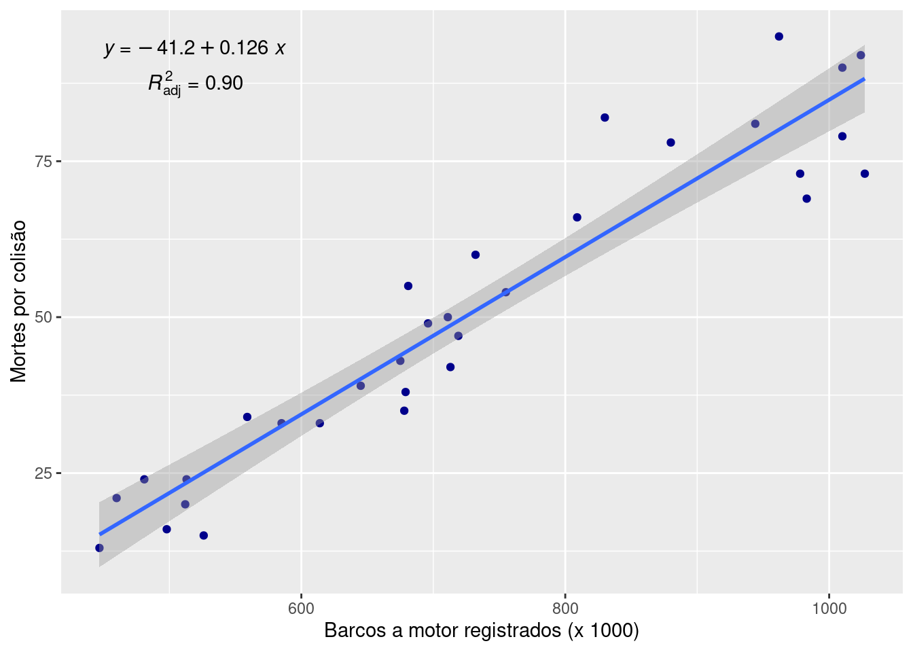
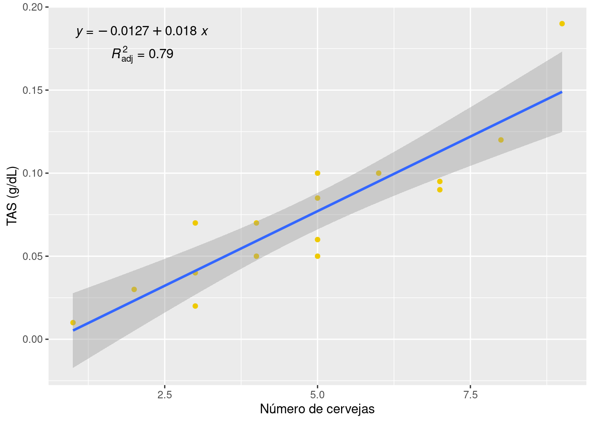

# Correlação e Regressão

Muitos estudos estatísticos analisam a relação entre duas variáveis. As relações estatísticas são tendências gerais, não regras rígidas, e permitem exceções individuais. Por exemplo, embora os fumantes, em média, morram mais jovens que os não fumantes, algumas pessoas vivem até os 90 anos fumando três maços de cigarros por dia.

## Variável resposta e Variável explicativa

Uma variável resposta mede o resultado de um estudo.

Uma variável explicativa esclarece ou influencia as mudanças em uma variável resposta.

Muitas vezes, variáveis explicativas são chamadas de variáveis independentes e variáveis resposta são chamadas de variáveis dependentes.

* Estudantes voluntários beberam números diferentes de latas de cerveja. Trinta minutos depois, um policial mediu o teor de álcool no sangue dos voluntários. O número de latas consumidas é a variável explicativa, e o percentual de álcool no sangue é a variável resposta.
* Uma pesquisa coletou informações sobre altura, idade, gênero e uma longa lista de atributos, com o objetivo de documentar as características da população. Não há variável reposta ou explicativa nesse contexto.
* Um pediatra observou os mesmos dados anteriores com foco em idade e gênero, juntamente com outras variáveis, como etnia, para discutir o crescimento de uma criança. Neste caso, idade e gênero são variáveis explicativas, e altura é a variável resposta.

Nem sempre fica claro quais são as variáveis explicativa e resposta em um estudo. Pode depender da forma como o estudo foi montado e como as variávveis foram coletadas. Muitas vezes, somente é possível explorar a relação entre as variáveis consideradas.

## Diagrama de dispersão {#diagrama_dispersao}

A maneira mais eficiente de se mostrar a relação entre duas variáveis quantitativas é por meio de um diagrama de dispersão.

Um diagrama de dispersão mostra a relação entre duas variáveis quantitativas, medidas nos mesmos indivíduos.

Os valores de uma variável aparecem no eixo horizontal, e os valores da outra, no eixo vertical.

Cada indivíduo nos dados aparece como um ponto no gráfico determinado pelos valores de ambas as variáveis para tal indivíduo.

Sempre represente graficamente a variável explicativa, se houver, no eixo horizontal (eixo x) de um diagrama de dispersão.

:::{.example #dispers name="Diagrama de dispersão"}

Os peixes-boi são mamíferos aquáticos grandes e herbívoros, encontrados principalmente nos rios e estuários da Flórida. Essa espécie ameaçada sofre com a coabitação com populações humanas, e muitos peixes-boi morrem a cada ano em consequência de colisões com barcos a motor.

O arquivo [pboi.xlsx](data/pboi.xlsx) traz o número de barcos a motor resgistrados, entre 1977 e 2008, e sua influência nas mortes de peixes-boi em consequência de colisões.


```r
pboi <- readxl::read_excel("data/pboi.xlsx")

library(ggplot2)
ggplot(pboi, aes(x = barco, y = morte)) +
  geom_point(colour = "darkblue") +
  labs(
    x = "Barcos a motor registrados (x 1000)",
    y = "Mortes por colisão"
  )
```


* O “número de barcos registrados” é a variável explicativa.
* O “número de mortes de peixes-boi por colisão” é a variável resposta.
* O tempo (ano em que os dados foram coletados) não é uma variável relevante aqui (indivíduos).

O diagrama acima mostra uma direção nítida: uma subida, da parte de baixo, à esquerda, para a parte de cima, à direita.

Os anos com maior registro de barcos tendem a ter contagem mais alta de mortes de peixes-boi por colisões. Chamamos de associação positiva entre as duas variáveis ^[Quando uma variável aumenta e a outra diminui, chamamos de associação negativa.].

A forma da relação é linear, isto é, o padrão geral segue uma reta, da esquerda para a direita, de baixo para cima.

A intensidade de uma relação em um diagrama de dispersão é determinada pela proximidade com que os pontos seguem uma forma clara. A relação geral é forte.

O número de registros de barcos a motor explica grande parte da variação entre mortes de peixes-boi por colisões. Anos com menos barcos registrados tendem a ter menos mortes de peixes-boi. Para preservar essa espécie ameaçada, a restrição no número de barcos registrados pode ser útil.

No entanto, não consideramos outros fatores, como limites de velocidade, multas ou educação dos pilotos, que poderiam também ser influentes. Nossas conclusões se limitam aos dados disponíveis e ao que eles dizem sobre a relação entre registros de barcos a motor e acidentes com peixes-boi.

:::

## Correlação

É uma medida de associação linear que elimina a subjetividade da interpretação gráfica. Alguns programas se referem a r como coeficiente de correlação de Pearson, ou r de Pearson.


Os dois diagramas de dispersão representam exatamente os mesmos dados, porém o gráfico à direita foi desenhado em tamanho menor em um grande espaço. O gráfico à direita parece mostrar uma relação linear mais forte.


:::{.example #cor name="Correlação"}

Qual a correlação entre número de barcos e morte de peixe-boi?


```r
with(pboi, cor(morte, barco))
```

```
## [1] 0.9501555
```

A correlação é de 0,95 ou 95%.

::: 

Fatos sobre a correlação:

Não faz distinção entre as variáveis explicativa e resposta.
Não se altera quando mudamos as unidades de medida de x, de y ou de ambas.
A correlação r é sempre um número entre –1 e 1.
Positiva indica uma associação positiva.
Negativa indica uma associação negativa.
Valores próximos de zero indicam uma relação linear muito fraca.
A intensidade da relação linear cresce à medida que r se afasta de zero em direção a -1 ou a 1.


## Regressão

Uma reta de regressão resume a relação entre duas variáveis. Usamos uma reta de regressão para predizer o valor de *y* para determinado valor de *x*.

A reta da regressão linear simples tem o seguinte formato:

$$y = a + b \cdot x$$

Nessa equação, b é a inclinação, ou seja, a alteração de *y* quando *x* aumenta uma unidade. O número *a* é o intercepto, ou seja, o valor de *y* quando *x* = 0.


:::{.example #reg name="Regressão"}

Qual é a reta de regressão linear simples que descreve a relação entre o número de barcos e a quantidade de barcos a motor rsgistrados?


```r
reg_pboi <- lm(morte ~ barco, data = pboi)
coef(reg_pboi)
```

```
## (Intercept)       barco 
##  -41.204687    0.126052
```

$$
morte = -41.2047 + 0.1261 \cdot barcos
$$

Cuidado com a extrapolação! O que aconteceria se tivéssemos 0 (zero) barcos registrados?


Uma forma muito comum de representar a regressão é por meio de uma reta ajustada no diagrama de dispersão, junto com a equação ajustada e o coeficiente de detemrinação ajustado (R^2^~adj~ ^[Pode ser entendido como um coeficiente de qualidade do ajuste.])


```r
library(ggplot2)
ggplot(pboi, aes(x = barco, y = morte)) +
  geom_point(colour = "darkblue") +
  labs(
    x = "Barcos a motor registrados (x 1000)",
    y = "Mortes por colisão"
  ) +
  geom_smooth(method = "lm", formula = y ~ x) +
  ggpmisc::stat_poly_eq(aes(label = paste0("atop(", ..eq.label.., ",", ..adj.rr.label.., ")")))
```

```
## Warning: The dot-dot notation (`..eq.label..`) was deprecated in ggplot2 3.4.0.
## ℹ Please use `after_stat(eq.label)` instead.
## This warning is displayed once every 8 hours.
## Call `lifecycle::last_lifecycle_warnings()` to see where this warning was
## generated.
```


.

::: 


## Inferência para Regressão

O estudo da inferência para regressão pode responder a algumas questões:

* Há realmente uma relação entre *x* e *y* na população ou pode ser que o padrão que vemos no diagrama de dispersão tenha surgido apenas pelo acaso?

* Qual é a inclinação (taxa de variação) que relaciona *y* com *x* na população, incluindo a margem de erro para nossa estimativa da inclinação?

* Se usarmos a reta de mínimos quadrados para predizer *y* para dado valor de *x*, quão precisa será nossa predição (novamente, com margem de erro)?

A reta de regressão para a população assume o seguinte formato:

$$y = \alpha + \beta \cdot x$$

A inferencia testa as hipóteses

* H~0~: β = 0 
* H~1~: β ≠ 0 

Uma reta de regressão com inclinação zero é horizontal.


:::{.example #reginfer name="Inferência para Regressão"}

.


```r
summary(reg_pboi)
```

```
## 
## Call:
## lm(formula = morte ~ barco, data = pboi)
## 
## Residuals:
##      Min       1Q   Median       3Q      Max 
## -15.2507  -5.7731   0.2498   4.3090  18.5815 
## 
## Coefficients:
##               Estimate Std. Error t value Pr(>|t|)    
## (Intercept) -41.204687   5.679767  -7.255 4.47e-08 ***
## barco         0.126052   0.007552  16.692  < 2e-16 ***
## ---
## Signif. codes:  0 '***' 0.001 '**' 0.01 '*' 0.05 '.' 0.1 ' ' 1
## 
## Residual standard error: 7.864 on 30 degrees of freedom
## Multiple R-squared:  0.9028,	Adjusted R-squared:  0.8996 
## F-statistic: 278.6 on 1 and 30 DF,  p-value: < 2.2e-16
```

Há evidência muito forte de que as mortes de peixe-boi aumentam à medida que o número de barcos aumenta.


:::


## Inferência sobre predição

Outro contexto para inferência na regressão é quando desejamos não simplesmente uma predição, mas uma com margem de erro que descreva quão precisa, provavelmente, a predição é.


:::{.example #pred name="Inferência sobre predição"}

Dezesseis estudantes voluntários consumiram um número de latas de cerveja aleatoriamente designado. Trinta minutos depois, um oficial de polícia mediu o teor alcoólico no sangue (TAS) deles, em gramas de álcool por decilitro de sangue [cerveja.xlsx](data/cerveja.xlsx). O limite legal para direção é TAS 0,08. Desejamos predizer o TAS de uma pessoa usando apenas a informação de que bebeu cinco cervejas.


```r
cerv <- readxl::read_excel("data/cerveja.xlsx")

reg_cerv <- lm(TAS~numero, data=cerv)
summary(reg_cerv)
```

```
## 
## Call:
## lm(formula = TAS ~ numero, data = cerv)
## 
## Residuals:
##       Min        1Q    Median        3Q       Max 
## -0.027118 -0.017350  0.001773  0.008623  0.041027 
## 
## Coefficients:
##              Estimate Std. Error t value Pr(>|t|)    
## (Intercept) -0.012701   0.012638  -1.005    0.332    
## numero       0.017964   0.002402   7.480 2.97e-06 ***
## ---
## Signif. codes:  0 '***' 0.001 '**' 0.01 '*' 0.05 '.' 0.1 ' ' 1
## 
## Residual standard error: 0.02044 on 14 degrees of freedom
## Multiple R-squared:  0.7998,	Adjusted R-squared:  0.7855 
## F-statistic: 55.94 on 1 and 14 DF,  p-value: 2.969e-06
```

```r
library(ggplot2)
ggplot(cerv, aes(x = numero, y = TAS)) +
  geom_point(colour = "gold2") +
  labs(
    x = "Número de cervejas",
    y = "TAS (g/dL)"
  ) +
  geom_smooth(method = "lm", formula = y ~ x) +
  ggpmisc::stat_poly_eq(aes(label = paste0("atop(", ..eq.label.., ",", ..adj.rr.label.., ")")))
```



```r
#intervalo de confiança dos parâmetros
confint(reg_cerv)
```

```
##                   2.5 %     97.5 %
## (Intercept) -0.03980535 0.01440414
## numero       0.01281262 0.02311490
```

```r
#predição para 5 cervejas
predict(reg_cerv, data.frame(numero=5), interval="predict") 
```

```
##          fit        lwr       upr
## 1 0.07711821 0.03191712 0.1223193
```


:::

Conclusão: Estamos 95% confiantes de que o TAS, depois de beber cinco cervejas, está entre 0,032 e 0,122.


