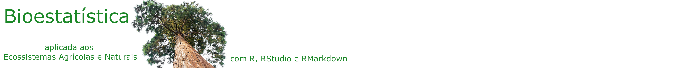

--- 
title: "Bioestatística aplicada aos ecossistemas agrícolas e naturais"
author: "João B. Tolentino Jr."
date: "`r Sys.Date()`"
description: " Livro texto da disciplina de Bioestatística do Programa de Pós-graduação em Ecossistemas Agrícolas e Naturais."
#cover-image: image/cover.jpg
#apple-touch-icon: image/cover.jpg
#favicon: image/favicon.ico
url: 'https\://joaobtj.github.io/biostat_ebook/'
github-repo: joaobtj/ebook_biostat
site: bookdown::bookdown_site
documentclass: book
bibliography: [references/book.bib, references/packages.bib, references/article.bib]
biblio-style: abnt
csl: abnt.csl
link-citations: yes
---

{width="0%"}


# Prefácio {-}

Este é um livro utilizado como texto-base para a disciplina de Bioestatística do Programa de Pós-Graduação em Ecossistemas Agrícolas e Naturais da Universidade Federal de Santa Catarina (UFSC) Campus de Curitibanos. 

## Sessão {-}


This version of the book was built with `r R.version.string` and the following packages:

```{r, echo = FALSE, results="asis"}
pkgs <- sessioninfo::package_info(dependencies = FALSE)
df <- tibble::tibble(
  package = pkgs$package,
  version = pkgs$ondiskversion,
  source = gsub("@", 
                "\\\\@", pkgs$source)
)
knitr::kable(df, format = "markdown")
```

 


